# Organization Bootstrap Workflows

## Overview

This document provides comprehensive Mermaid diagrams documenting the event-driven organization bootstrap processes for the A4C platform. Bootstrap workflows enable platform_owner users to create new provider and provider_partner organizations with proper Zitadel integration, role assignment, and audit trails.

## Table of Contents

1. [High-Level Bootstrap Flow](#high-level-bootstrap-flow)
2. [Provider Organization Bootstrap](#provider-organization-bootstrap)
3. [Provider Partner Bootstrap](#provider-partner-bootstrap)
4. [Error Handling and Compensation](#error-handling-and-compensation)
5. [Circuit Breaker States](#circuit-breaker-states)
6. [Cross-Tenant Access Grant Flow](#cross-tenant-access-grant-flow)

---

## High-Level Bootstrap Flow

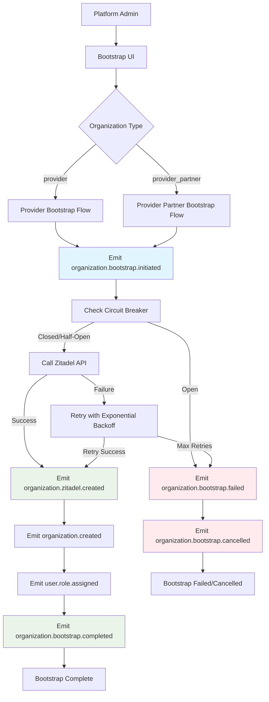

---

## Provider Organization Bootstrap

### Detailed Provider Bootstrap Sequence

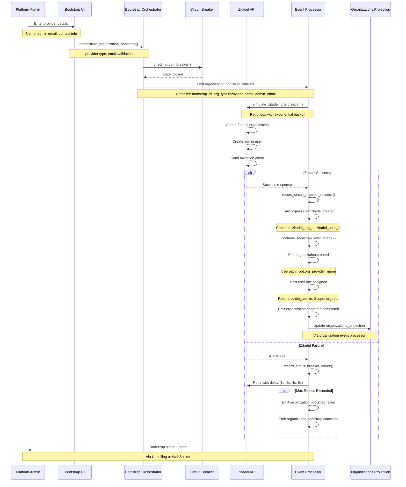

### Provider Bootstrap Event Flow

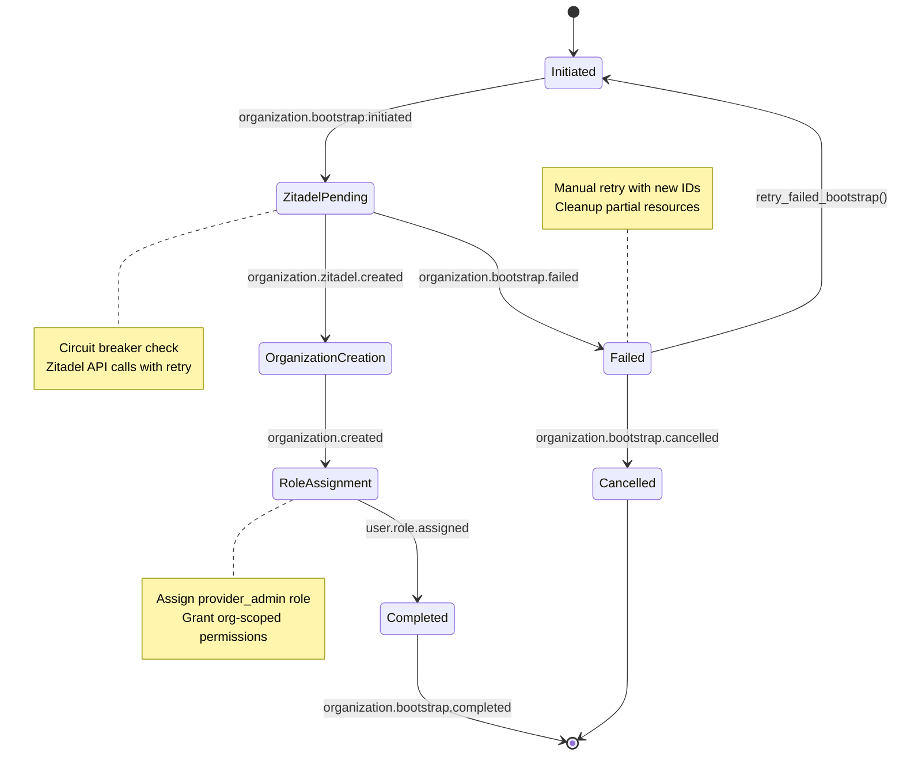

---

## Provider Partner Bootstrap

### Provider Partner Bootstrap Sequence

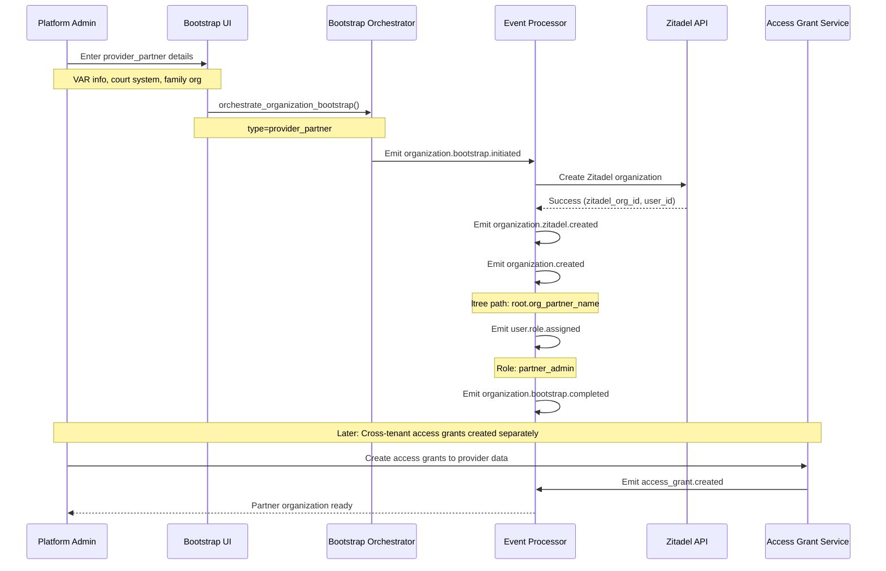

### Provider Partner Organization Types

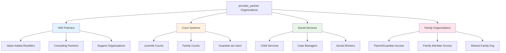

---

## Error Handling and Compensation

### Failure Scenarios and Recovery

```mermaid
graph TD
    A[Bootstrap Initiated] --> B{Circuit Breaker Check}
    B -->|Open| C[Immediate Failure]
    B -->|Closed| D[Zitadel API Call]
    
    D --> E{API Response}
    E -->|Success| F[Continue Bootstrap]
    E -->|Failure| G[Retry Logic]
    
    G --> H{Retry Count}
    H -->|< Max Retries| I[Exponential Backoff]
    H -->|>= Max Retries| J[Bootstrap Failed]
    
    I --> K[Wait: 1s, 2s, 4s, 8s]
    K --> D
    
    C --> L[Emit bootstrap.failed]
    J --> L
    
    L --> M{Partial Resources?}
    M -->|Yes| N[Emit bootstrap.cancelled]
    M -->|No| O[End - No Cleanup Needed]
    
    N --> P[Cleanup Partial Resources]
    P --> Q[Cleanup Completed]
    
    L --> R[Manual Retry Available]
    R --> S[retry_failed_bootstrap()]
    S --> A
    
    style C fill:#ffcdd2
    style J fill:#ffcdd2
    style L fill:#ffcdd2
    style F fill:#c8e6c9
    style Q fill:#c8e6c9
```

### Compensation Events

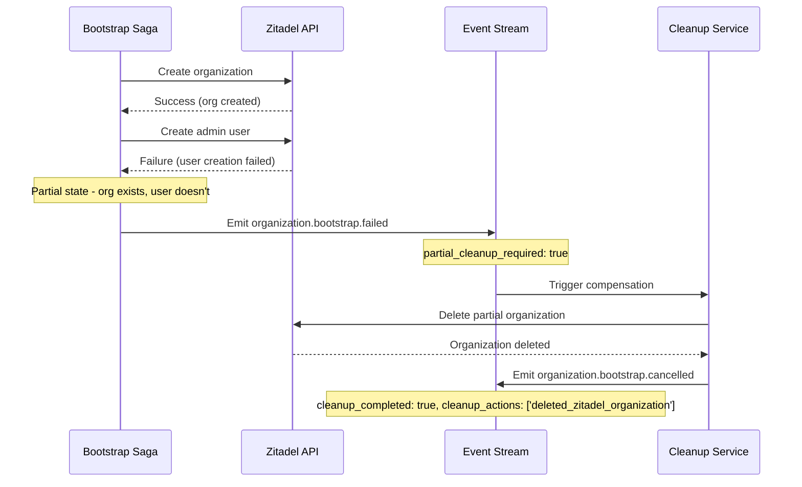

---

## Circuit Breaker States

### Circuit Breaker State Machine

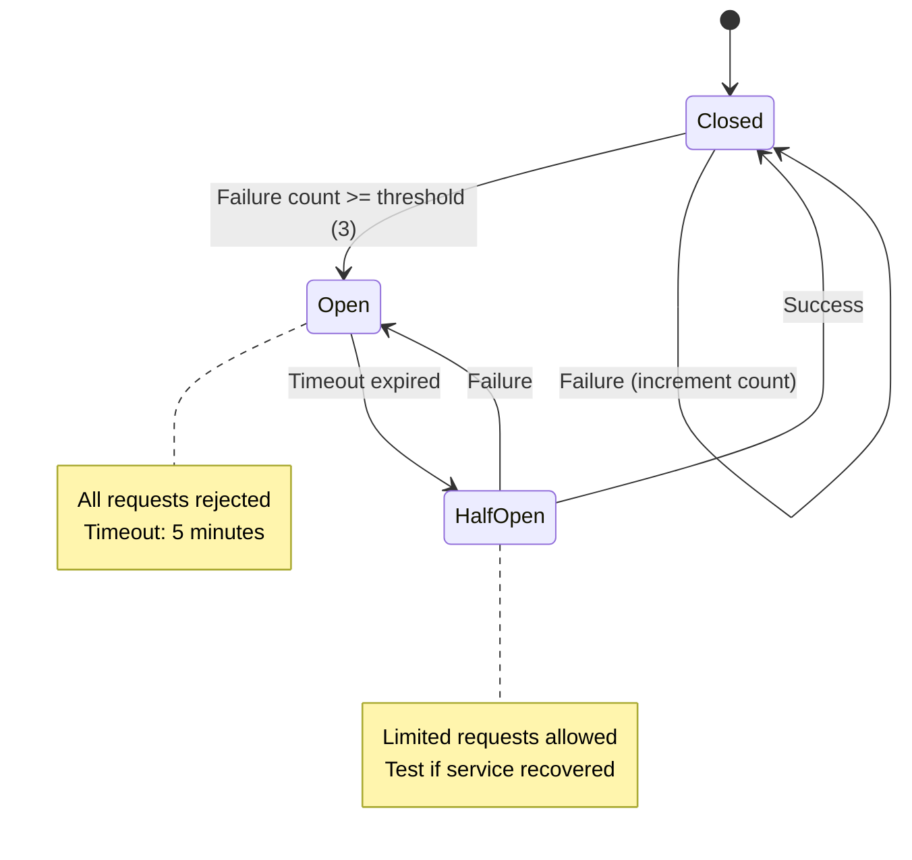

### Circuit Breaker Configuration

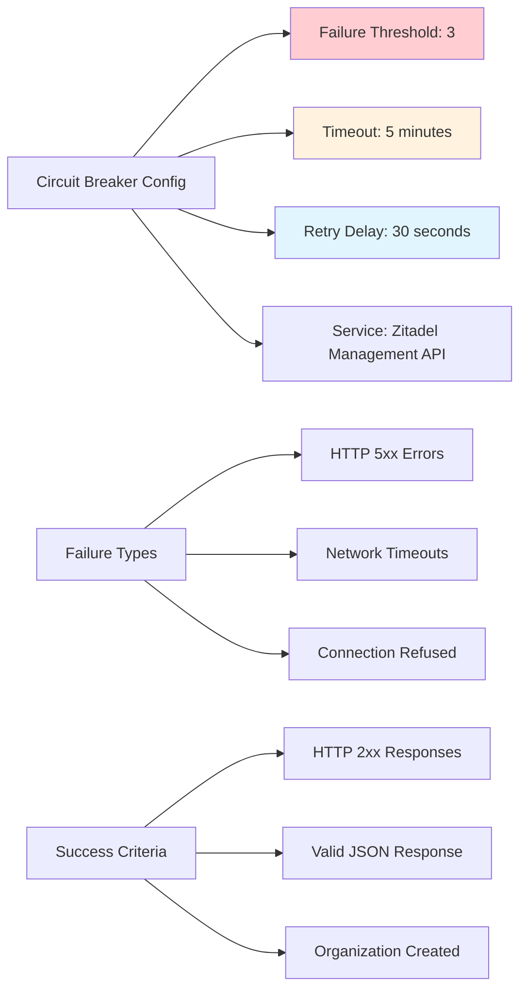

---

## Cross-Tenant Access Grant Flow

### Access Grant Creation for Provider Partners

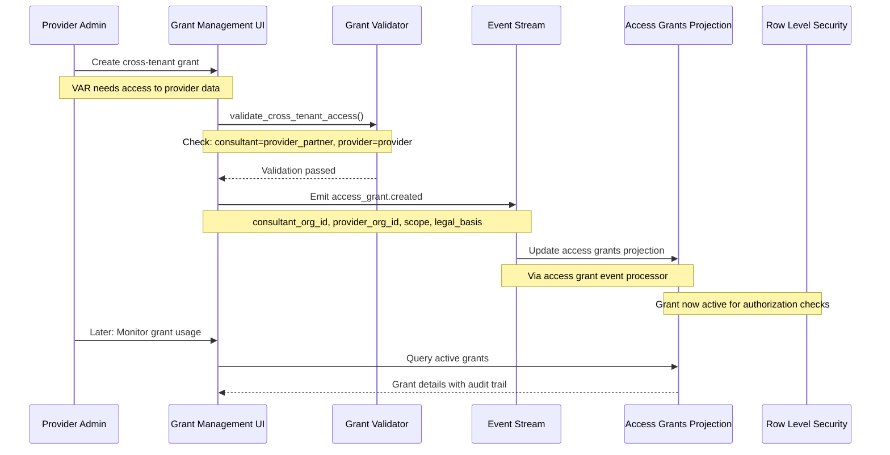

### Access Grant Lifecycle

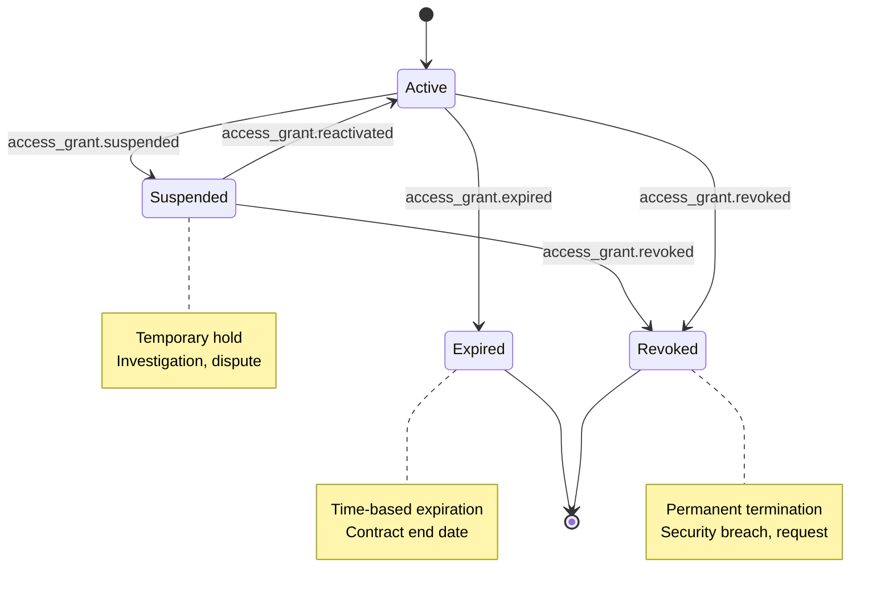

### Grant Authorization Check Flow

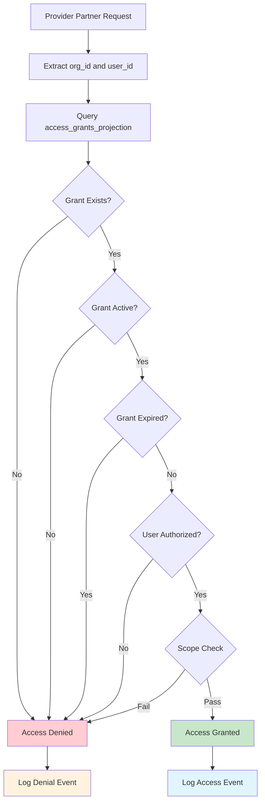

---

## Summary

This documentation provides comprehensive workflow diagrams for:

- **Bootstrap Orchestration**: Event-driven organization creation with Zitadel integration
- **Error Resilience**: Circuit breaker patterns and compensation event handling  
- **Cross-Tenant Access**: provider_partner access to provider data with full audit trails
- **CQRS Compliance**: All operations via events, projections never directly updated

The workflows ensure reliable organization bootstrap with proper error handling, retry logic, and comprehensive audit trails suitable for healthcare compliance requirements.