# Zitadel Bootstrap API Integration Flows

## Overview

Comprehensive documentation of Zitadel Management API integration patterns for organization bootstrap workflows. This covers HTTP API calls, error handling, retry logic, and circuit breaker patterns for reliable organization and user creation.

## Table of Contents

1. [Zitadel Management API Overview](#zitadel-management-api-overview)
2. [Authentication and Authorization](#authentication-and-authorization)
3. [Organization Creation Flow](#organization-creation-flow)
4. [User Creation and Invitation Flow](#user-creation-and-invitation-flow)
5. [Error Handling and Retry Patterns](#error-handling-and-retry-patterns)
6. [Circuit Breaker Implementation](#circuit-breaker-implementation)
7. [Webhook Integration](#webhook-integration)

---

## Zitadel Management API Overview

### API Base Configuration

```mermaid
graph LR
    A[A4C Bootstrap Service] --> B[Zitadel Instance]
    B --> C[analytics4change-zdswvg.us1.zitadel.cloud]
    
    A --> D[Management API]
    D --> E[/management/v1/orgs]
    D --> F[/management/v1/users]
    D --> G[/management/v1/grants]
    
    H[Authentication] --> I[Service Account JWT]
    H --> J[API Key/Secret]
    H --> K[OAuth2 Client Credentials]
    
    style C fill:#e3f2fd
    style E fill:#e8f5e8
    style F fill:#fff3e0
    style G fill:#fce4ec
```

### API Endpoint Mapping

```mermaid
graph TD
    A[Bootstrap Operations] --> B[Create Organization]
    A --> C[Create Admin User]
    A --> D[Assign Roles/Grants]
    A --> E[Send Invitations]
    
    B --> B1[POST /management/v1/orgs]
    C --> C1[POST /management/v1/orgs/{orgId}/users]
    D --> D1[POST /management/v1/users/{userId}/grants]
    E --> E1[POST /management/v1/users/{userId}/email/resend_code]
    
    F[Cleanup Operations] --> G[Delete Organization]
    F --> H[Delete User]
    
    G --> G1[DELETE /management/v1/orgs/{orgId}]
    H --> H1[DELETE /management/v1/users/{userId}]
    
    style B1 fill:#e3f2fd
    style C1 fill:#e8f5e8
    style D1 fill:#fff3e0
    style E1 fill:#fce4ec
    style G1 fill:#ffcdd2
    style H1 fill:#ffcdd2
```

---

## Authentication and Authorization

### Service Account Setup

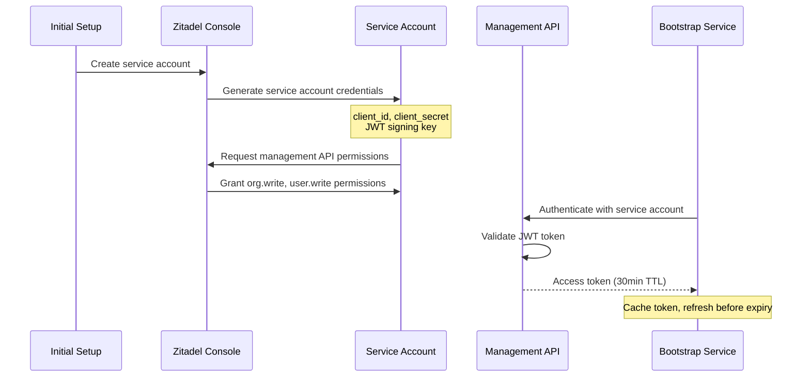

### API Authentication Flow

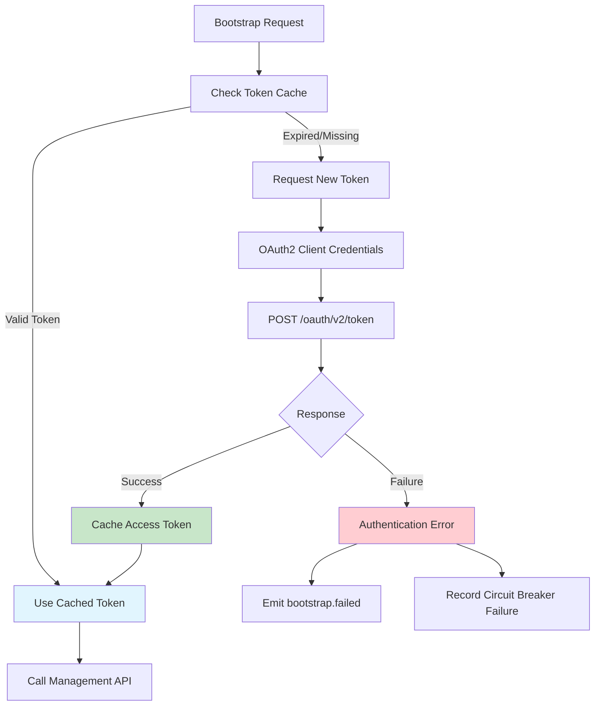

---

## Organization Creation Flow

### Create Organization API Call

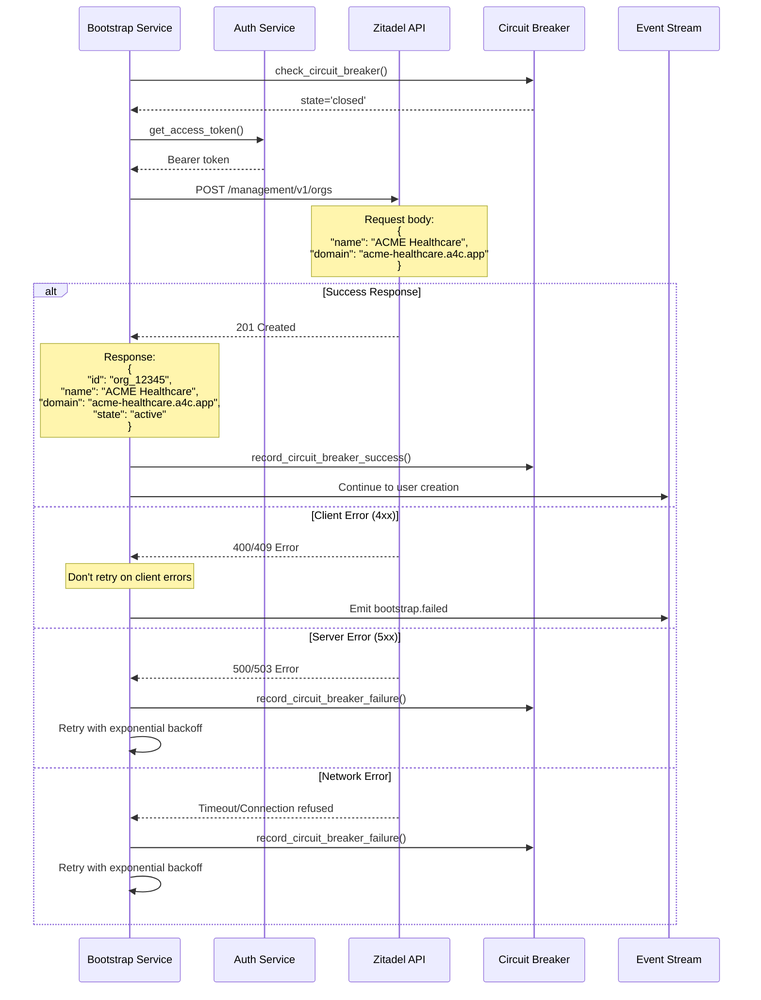

### Organization Creation Request/Response

```typescript
// Organization Creation Request
interface CreateOrganizationRequest {
  name: string;
  domain?: string;
  admin_email?: string;
  metadata?: {
    a4c_organization_id: string;
    organization_type: 'provider' | 'provider_partner';
    bootstrap_id: string;
  };
}

// Organization Creation Response
interface CreateOrganizationResponse {
  id: string;
  name: string;
  domain: string;
  state: 'active' | 'inactive';
  creation_date: string;
  change_date: string;
  sequence: number;
}
```

### Organization Validation Rules

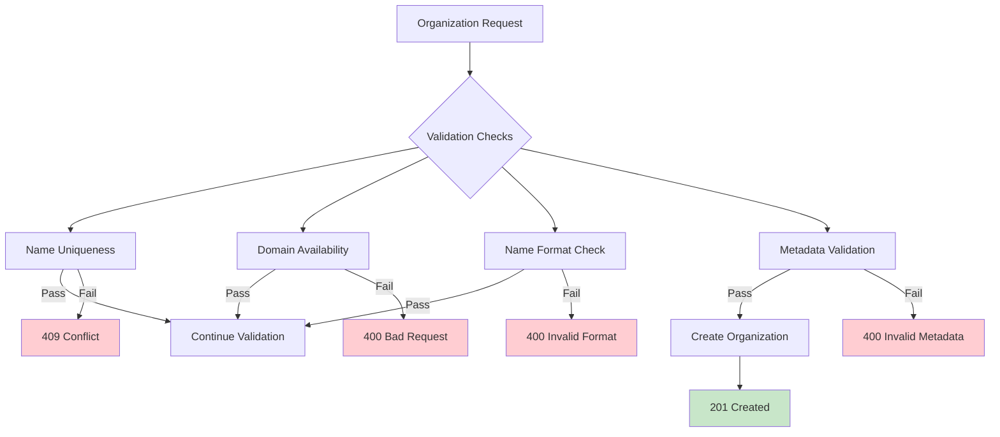

---

## User Creation and Invitation Flow

### Admin User Creation Sequence

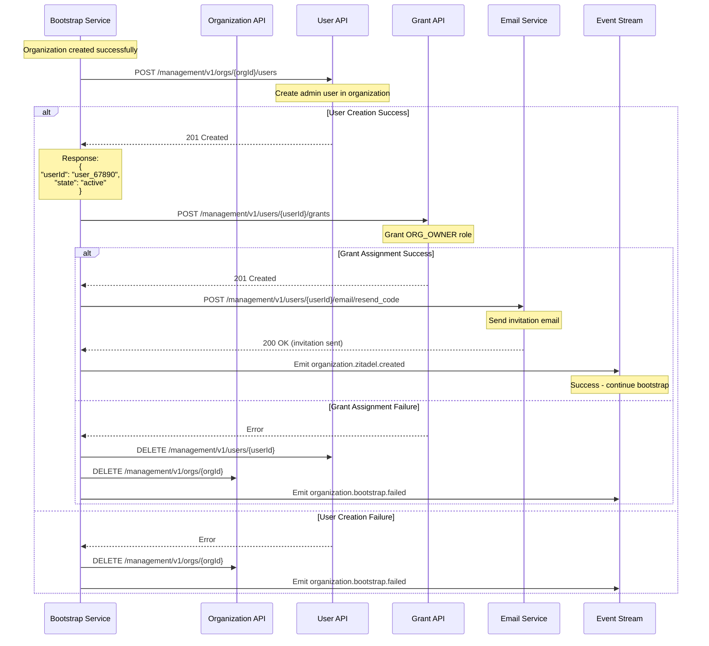

### User Creation Request/Response

```typescript
// User Creation Request
interface CreateUserRequest {
  user_name: string;
  profile: {
    first_name?: string;
    last_name?: string;
    nick_name?: string;
    display_name?: string;
    preferred_language?: string;
  };
  email: {
    email: string;
    is_email_verified?: boolean;
  };
  metadata?: {
    bootstrap_id: string;
    organization_role: 'provider_admin' | 'partner_admin';
  };
}

// User Creation Response
interface CreateUserResponse {
  user_id: string;
  details: {
    sequence: number;
    creation_date: string;
    change_date: string;
    resource_owner: string;
  };
}
```

### Role Grant Assignment

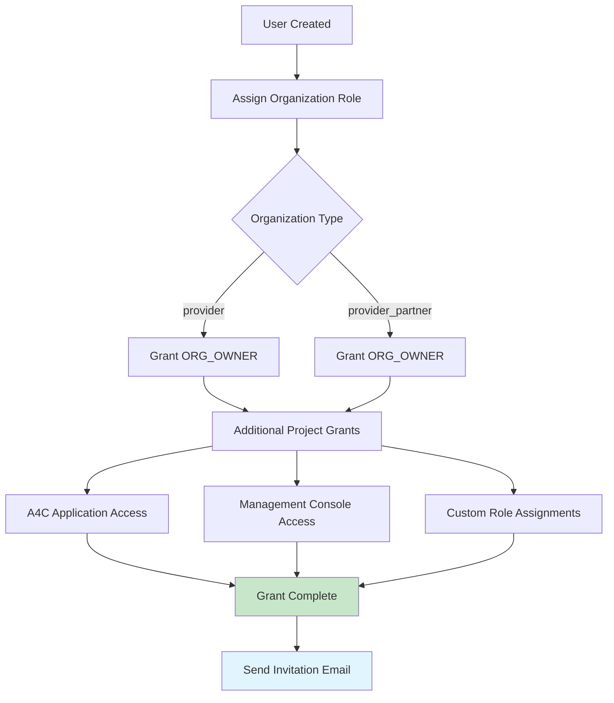

---

## Error Handling and Retry Patterns

### Exponential Backoff Implementation

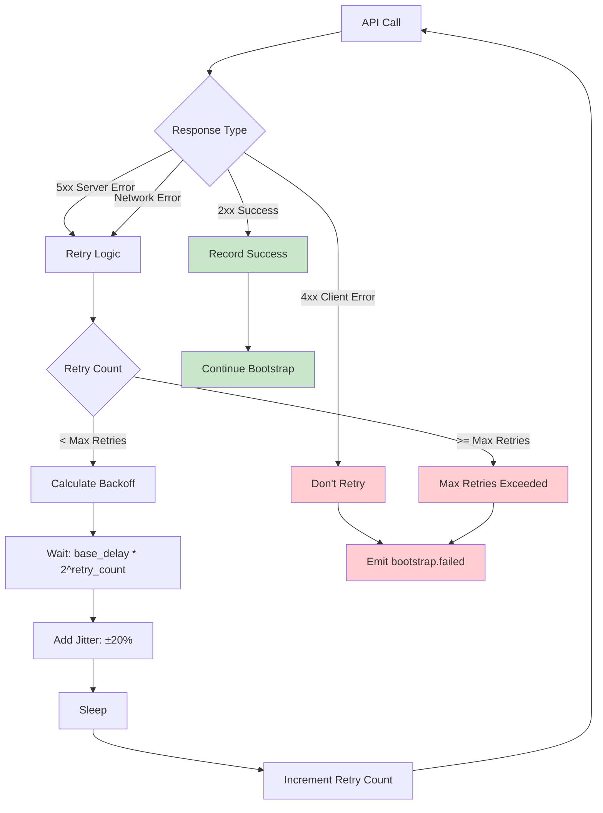

### Retry Configuration

```typescript
interface RetryConfig {
  maxRetries: number;        // 3
  baseDelayMs: number;       // 1000ms
  maxDelayMs: number;        // 8000ms
  jitterPercent: number;     // 20
  retryableStatus: number[]; // [500, 502, 503, 504]
}

// Backoff calculation
function calculateBackoff(retryCount: number, config: RetryConfig): number {
  const exponentialDelay = config.baseDelayMs * Math.pow(2, retryCount);
  const cappedDelay = Math.min(exponentialDelay, config.maxDelayMs);
  const jitter = cappedDelay * (config.jitterPercent / 100);
  const jitterAmount = (Math.random() - 0.5) * 2 * jitter;
  return Math.max(0, cappedDelay + jitterAmount);
}
```

### Error Classification and Handling

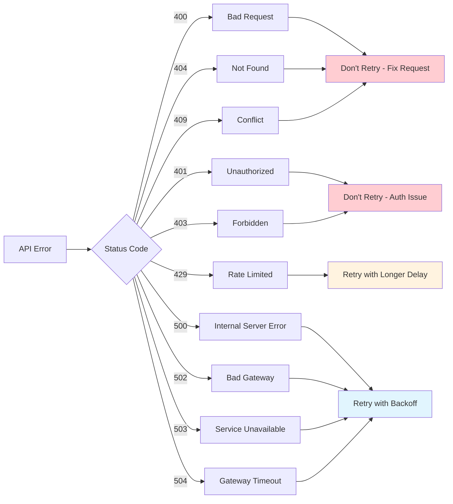

---

## Circuit Breaker Implementation

### Circuit Breaker State Transitions

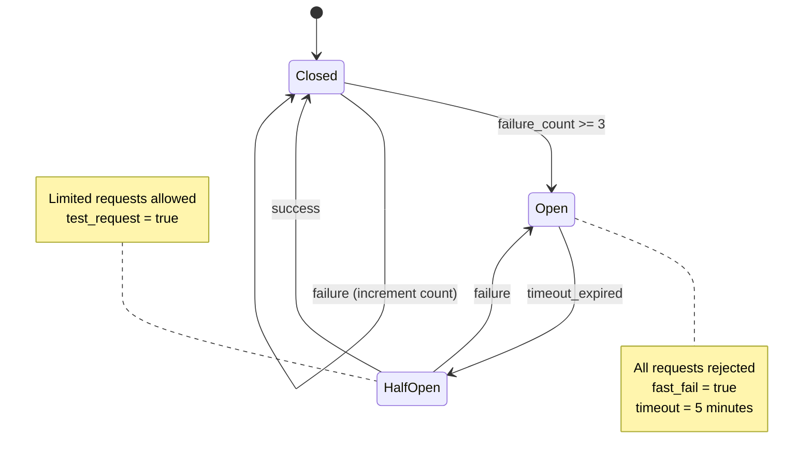

### Circuit Breaker Database Schema

```sql
-- Circuit breaker state tracking
CREATE TABLE zitadel_circuit_breaker (
  service_name TEXT PRIMARY KEY DEFAULT 'zitadel_management_api',
  state TEXT NOT NULL DEFAULT 'closed' CHECK (state IN ('closed', 'open', 'half_open')),
  failure_count INTEGER NOT NULL DEFAULT 0,
  last_failure_time TIMESTAMPTZ,
  next_retry_time TIMESTAMPTZ,
  last_success_time TIMESTAMPTZ,
  total_requests INTEGER DEFAULT 0,
  total_successes INTEGER DEFAULT 0,
  total_failures INTEGER DEFAULT 0,
  updated_at TIMESTAMPTZ NOT NULL DEFAULT NOW()
);
```

### Circuit Breaker Decision Logic

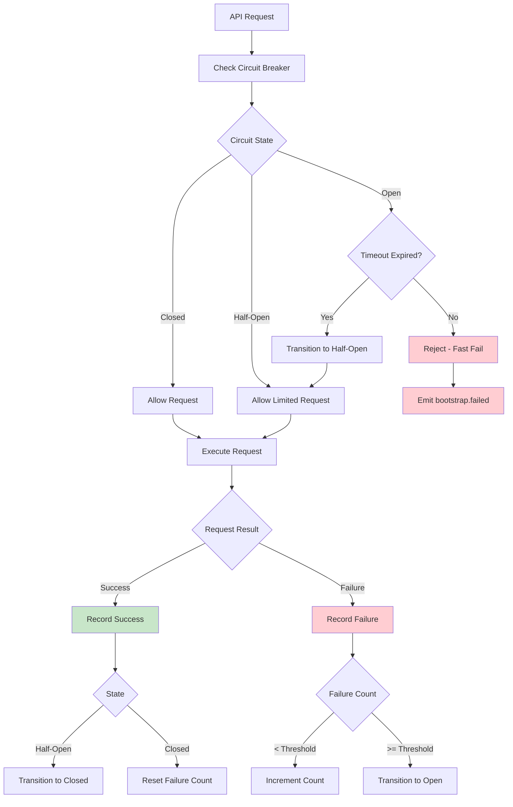

---

## Webhook Integration

### Zitadel to A4C Event Flow

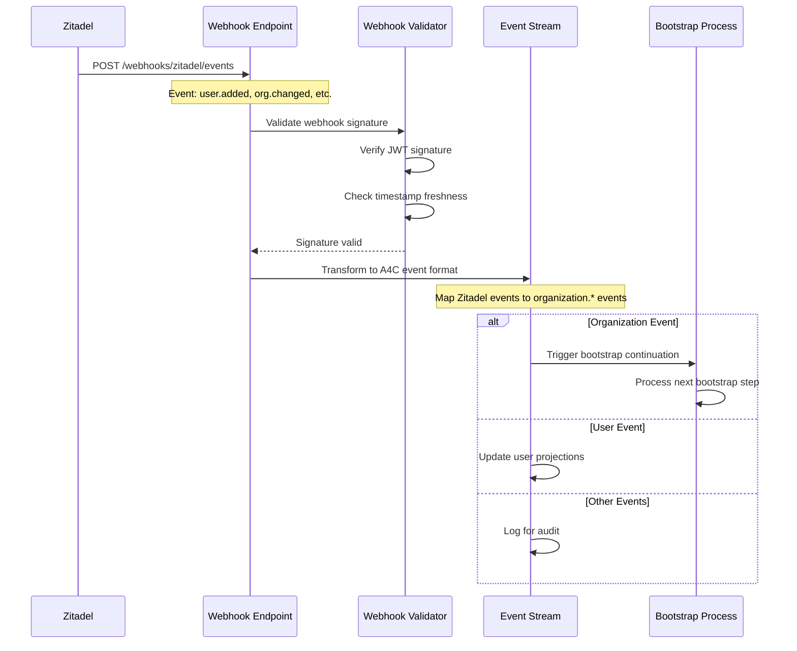

### Webhook Payload Processing

```typescript
interface ZitadelWebhookPayload {
  eventType: string;
  resourceOwner: string;
  aggregateId: string;
  aggregateType: string;
  sequence: number;
  creationDate: string;
  payload: {
    orgId?: string;
    userId?: string;
    email?: string;
    state?: string;
    [key: string]: any;
  };
}

// Webhook event mapping
const eventMapping = {
  'org.added': 'organization.zitadel.created',
  'user.added': 'user.zitadel.created',
  'user.deactivated': 'user.zitadel.deactivated',
  'org.removed': 'organization.zitadel.deleted'
};
```

### Webhook Security and Validation

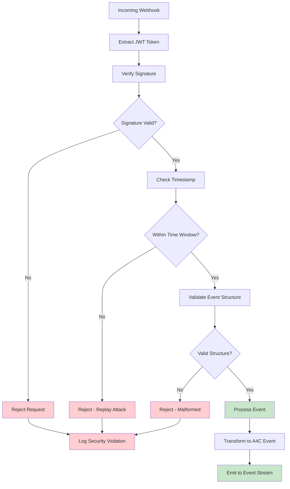

---

## Monitoring and Observability

### API Metrics Collection

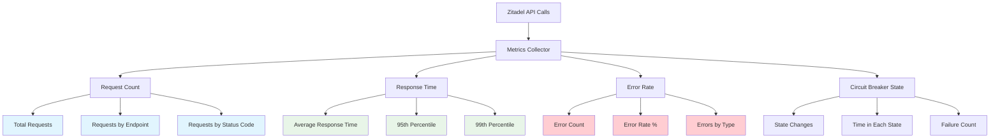

### Bootstrap Success/Failure Tracking

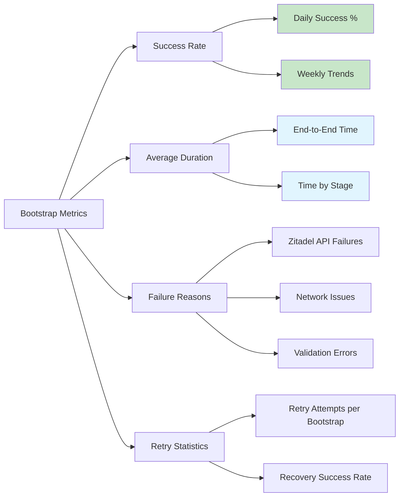

---

## Summary

The Zitadel bootstrap API integration provides:

1. **Reliable Organization Creation**: With comprehensive error handling and retry logic
2. **Circuit Breaker Protection**: Prevents cascading failures when Zitadel is unavailable
3. **Comprehensive Audit Trail**: Every API call and response logged for compliance
4. **Webhook Integration**: Real-time synchronization of Zitadel state changes
5. **Monitoring and Alerting**: Full observability into bootstrap success/failure rates

The integration is designed for production reliability with proper error recovery, rate limiting protection, and comprehensive logging for healthcare compliance requirements.