# Provider Partner Bootstrap Sequence

## Overview

Detailed sequence documentation for bootstrapping `type=provider_partner` organizations in the A4C platform. Provider partners include VAR organizations, court systems, social services, and family access organizations that need cross-tenant access to provider data.

## Provider Partner Characteristics

- **Organization Type**: `provider_partner`
- **Initial Role**: `partner_admin`
- **Permissions**: Partner-relevant permissions within their organization scope
- **Cross-Tenant Access**: Requires explicit grants to access provider data
- **Partner Types**: VAR, court systems, social services, family organizations

---

## Provider Partner Types and Use Cases

### Partner Organization Categories

```mermaid
graph TD
    A[provider_partner Organizations] --> B[VAR Partners]
    A --> C[Court Systems]  
    A --> D[Social Services]
    A --> E[Family Organizations]
    
    B --> B1[Value-Added Resellers]
    B --> B2[Consulting Partners]
    B --> B3[Support Organizations]
    B --> B4[Implementation Partners]
    
    C --> C1[Juvenile Courts]
    C --> C2[Family Courts]
    C --> C3[Guardian ad Litem]
    C --> C4[Court Administrators]
    
    D --> D1[Child Protective Services]
    D --> D2[Case Managers]
    D --> D3[Social Workers]
    D --> D4[Government Agencies]
    
    E --> E1[Parent/Guardian Access]
    E --> E2[Family Member Portal]
    E --> E3[Shared Family Organizations]
    E --> E4[Emergency Contacts]
    
    style B fill:#e3f2fd
    style C fill:#fff3e0
    style D fill:#e8f5e8
    style E fill:#fce4ec
```

### Business Profile Requirements by Type

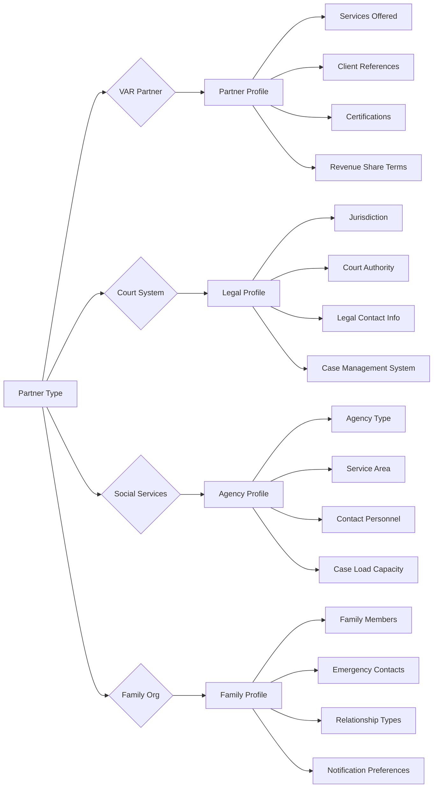

---

## Detailed Partner Bootstrap Flow

### Phase 1: Partner Type Selection and Validation

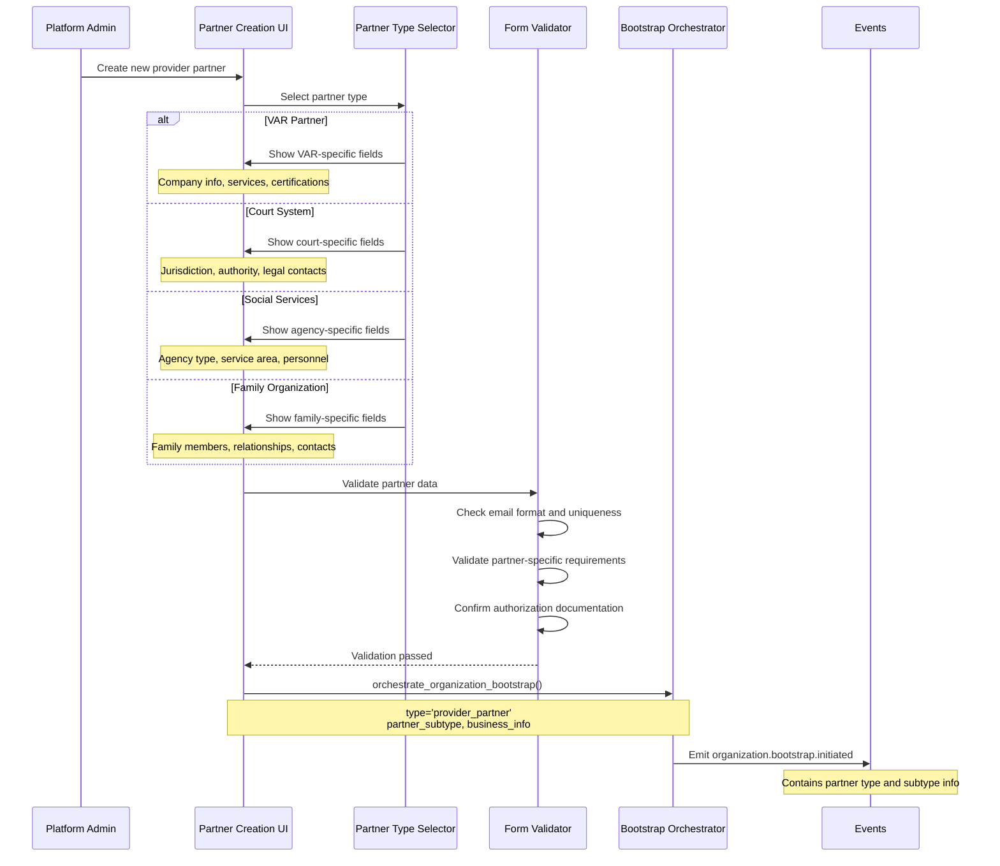

### Phase 2: Zitadel Organization Creation (Same as Provider)

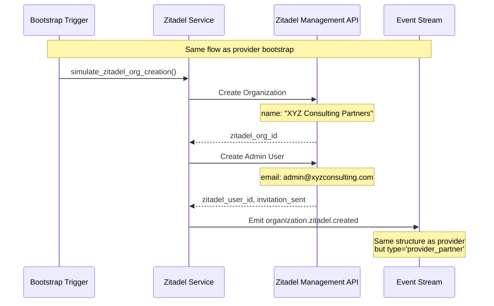

### Phase 3: Partner Organization Creation and Role Assignment

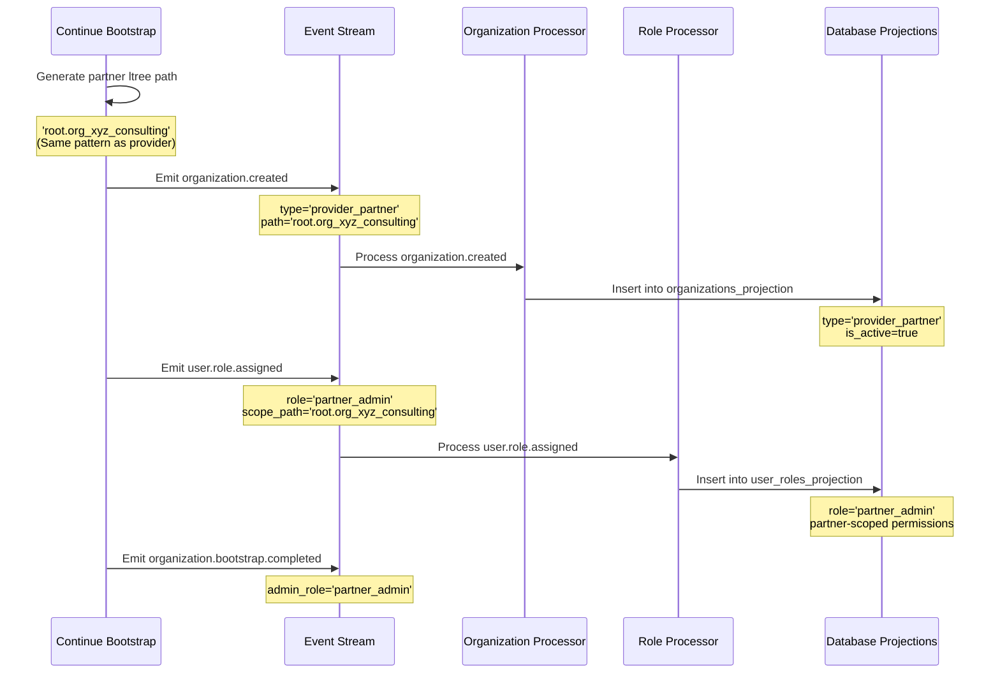

### Phase 4: Business Profile Creation

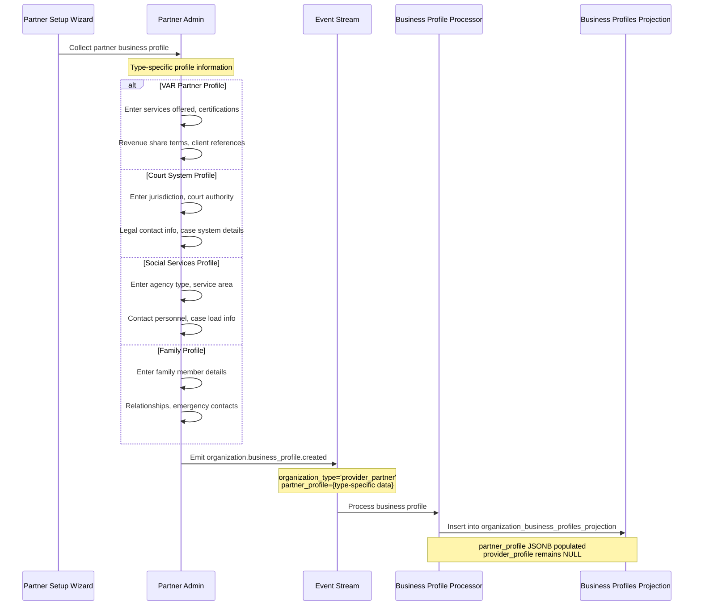

---

## Partner-Specific Permission Sets

### Partner Admin Role Permissions

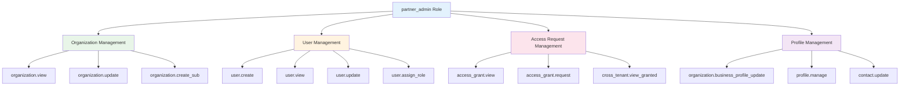

### Permission Differences from Provider Admin

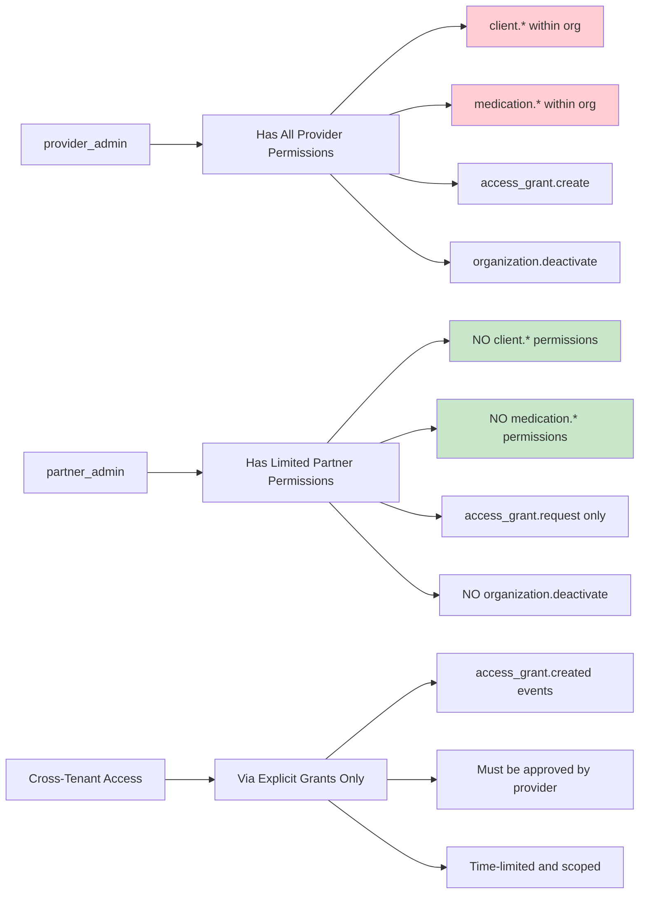

---

## Cross-Tenant Access Request Flow

### Access Grant Request Process

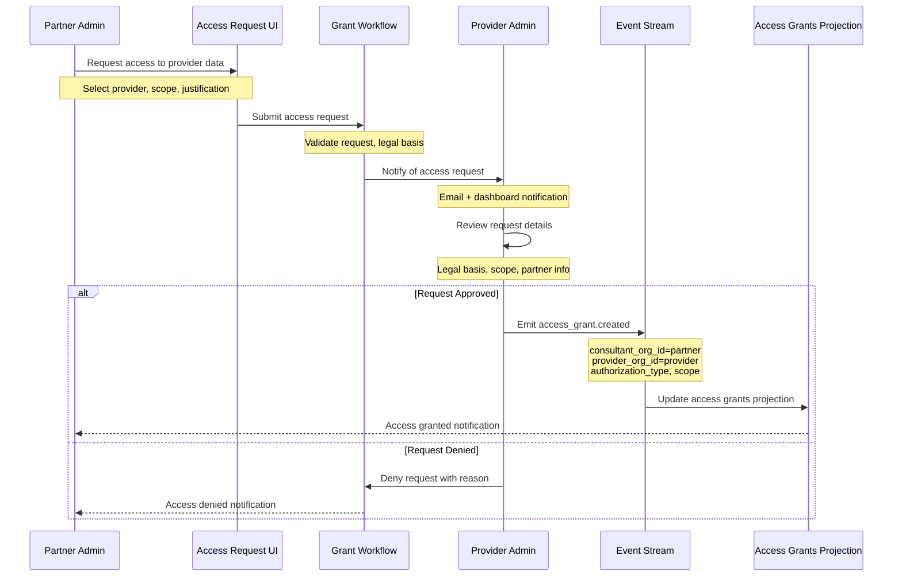

### VAR Partner Access Pattern

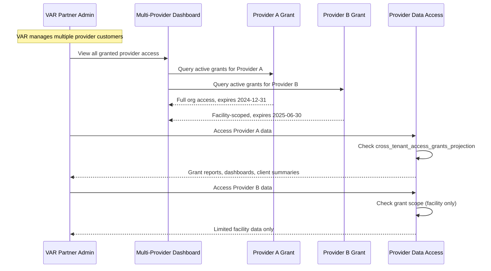

---

## Partner Type-Specific Workflows

### Court System Access Workflow

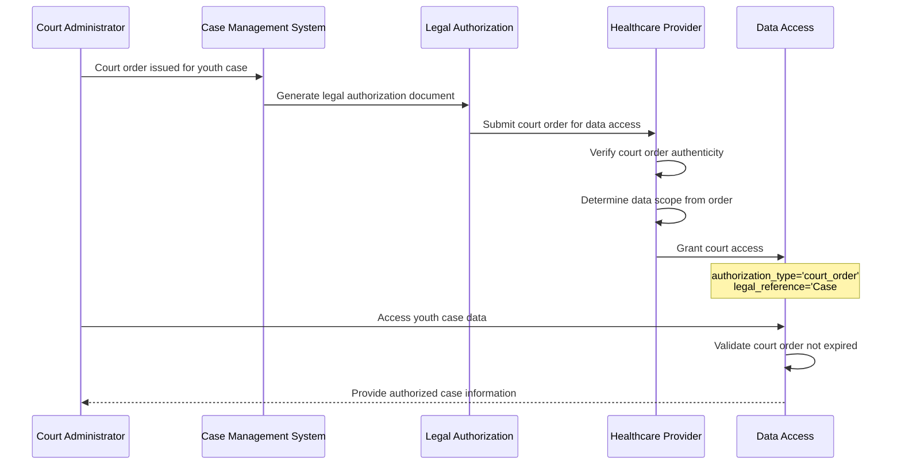

### Social Services Access Pattern

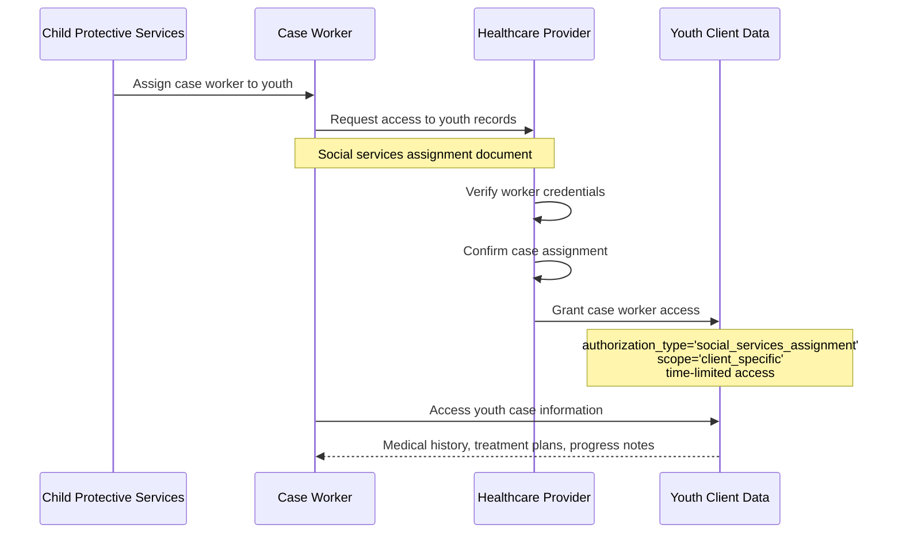

### Family Access Workflow

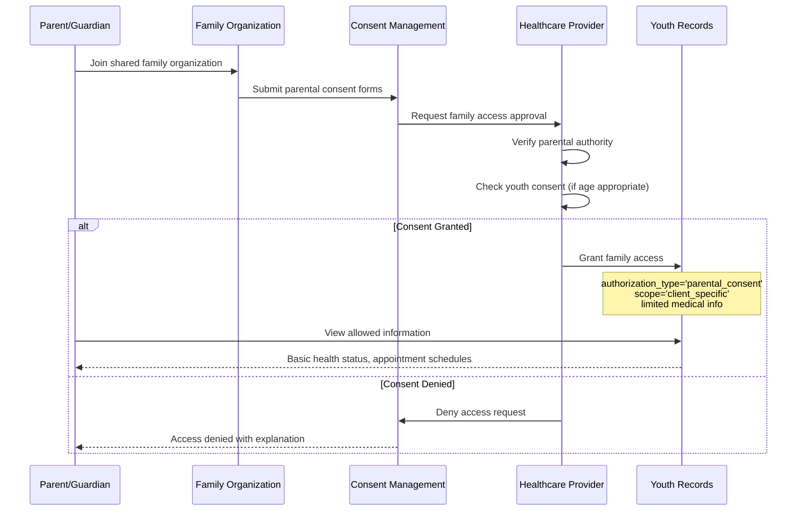

---

## Partner Dashboard and Monitoring

### VAR Partner Multi-Provider Dashboard

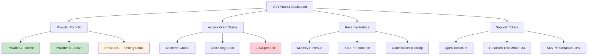

### Partner Access Audit Trail

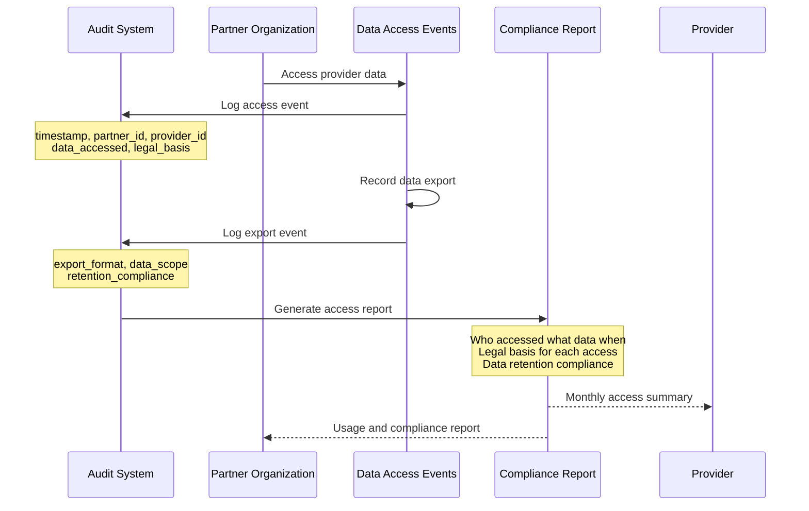

---

## Integration and API Access

### Partner API Endpoints

```mermaid
graph LR
    A[Partner API] --> B[/api/partner/dashboard]
    A --> C[/api/partner/access-grants]
    A --> D[/api/partner/providers]
    A --> E[/api/partner/requests]
    
    B --> F[Get portfolio summary]
    C --> G[List active grants]
    C --> H[Request new access]
    C --> I[View grant details]
    
    D --> J[List accessible providers]
    D --> K[Get provider profiles]
    
    E --> L[Submit access request]
    E --> M[Track request status]
    E --> N[Appeal denied request]
    
    style A fill:#e3f2fd
    style B fill:#e8f5e8
    style C fill:#fff3e0
    style D fill:#fce4ec
    style E fill:#f3e5f5
```

### Partner-Specific Data Views

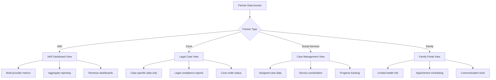

---

## Summary

Provider partner bootstrap involves:

1. **Type-Specific Setup**: Different forms and requirements based on partner type
2. **Standard Zitadel Flow**: Same organization creation process as providers
3. **Limited Permissions**: partner_admin role with restricted capabilities
4. **Business Profiles**: Type-specific partner profile information
5. **Cross-Tenant Access**: Via explicit grants from providers, not inherent access
6. **Audit and Compliance**: Full tracking of all cross-tenant data access

Key differences from provider bootstrap:
- **No inherent client/medication access** - must be explicitly granted
- **Request-based access model** - partners request, providers approve
- **Type-specific profiles** - VAR, court, social services, family variants
- **Limited organizational hierarchy** - typically flat structure within partner org