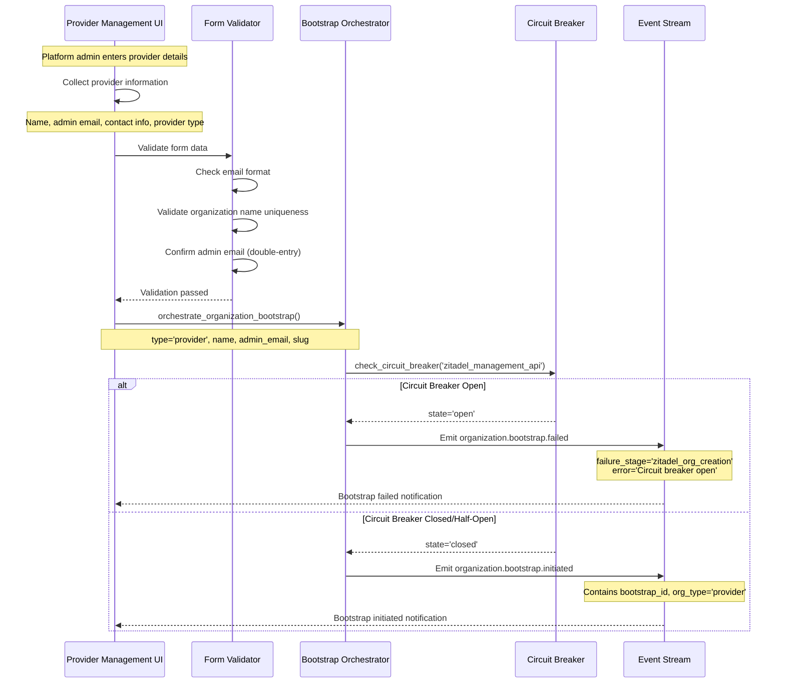
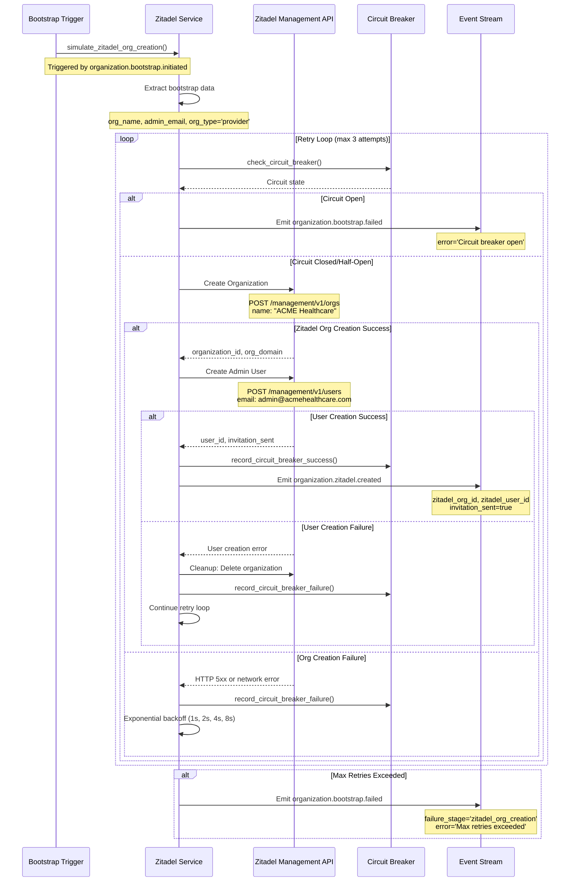
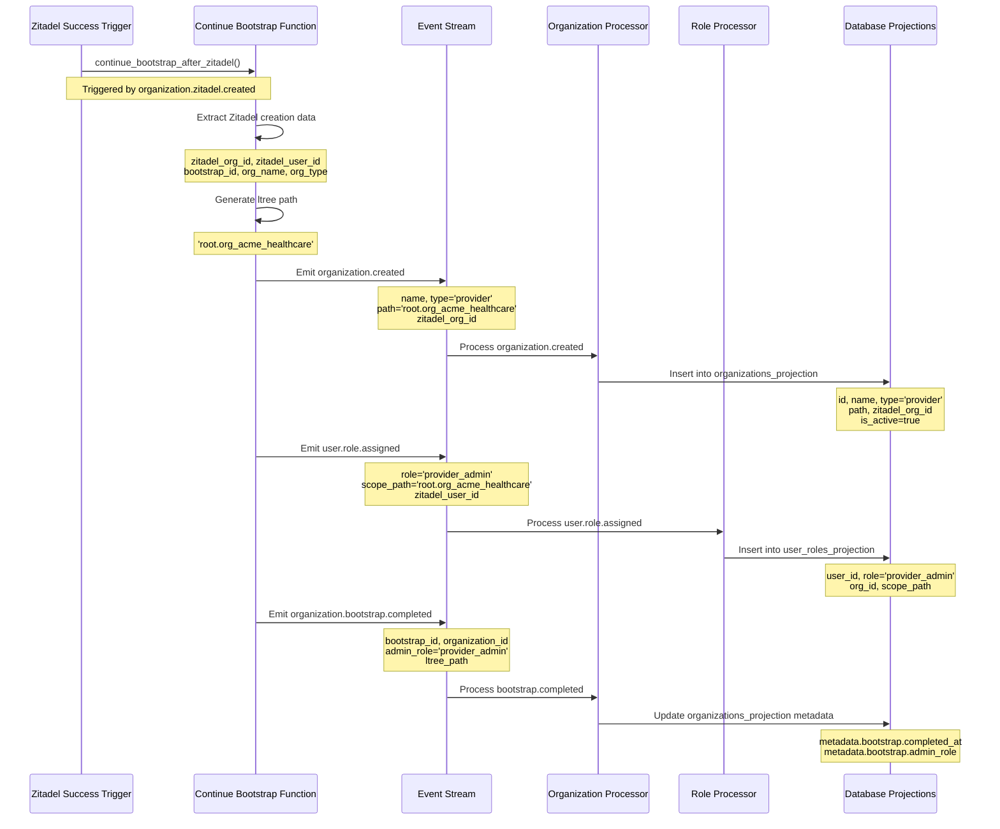
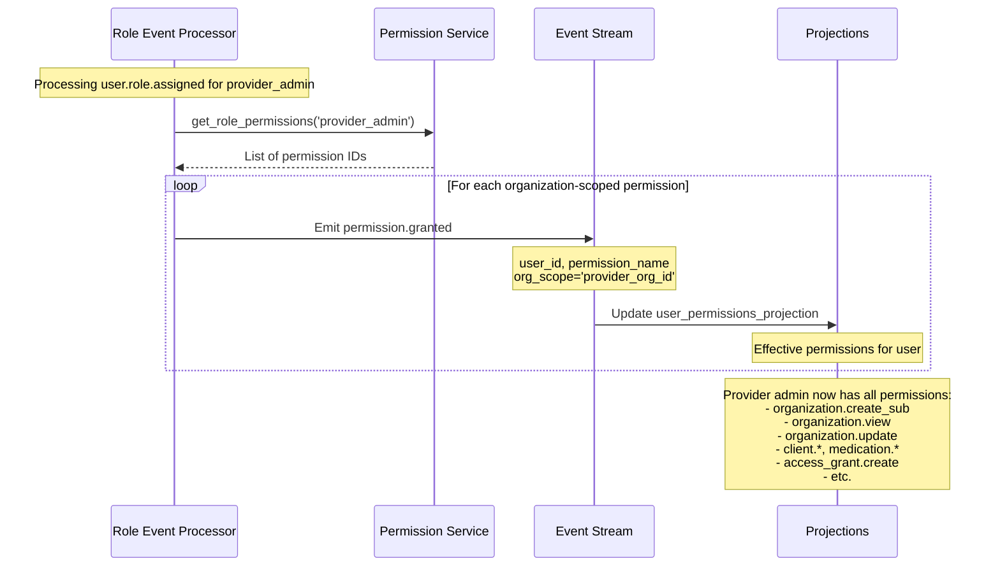
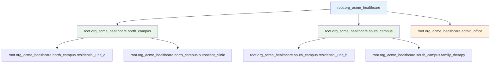
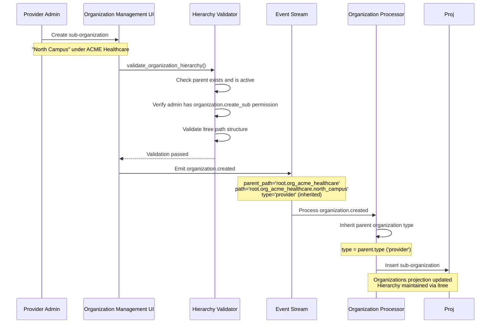
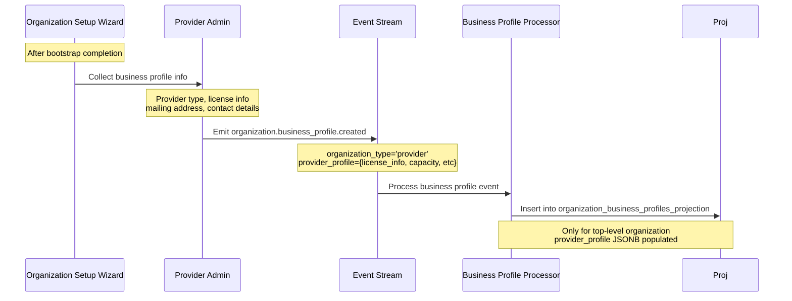
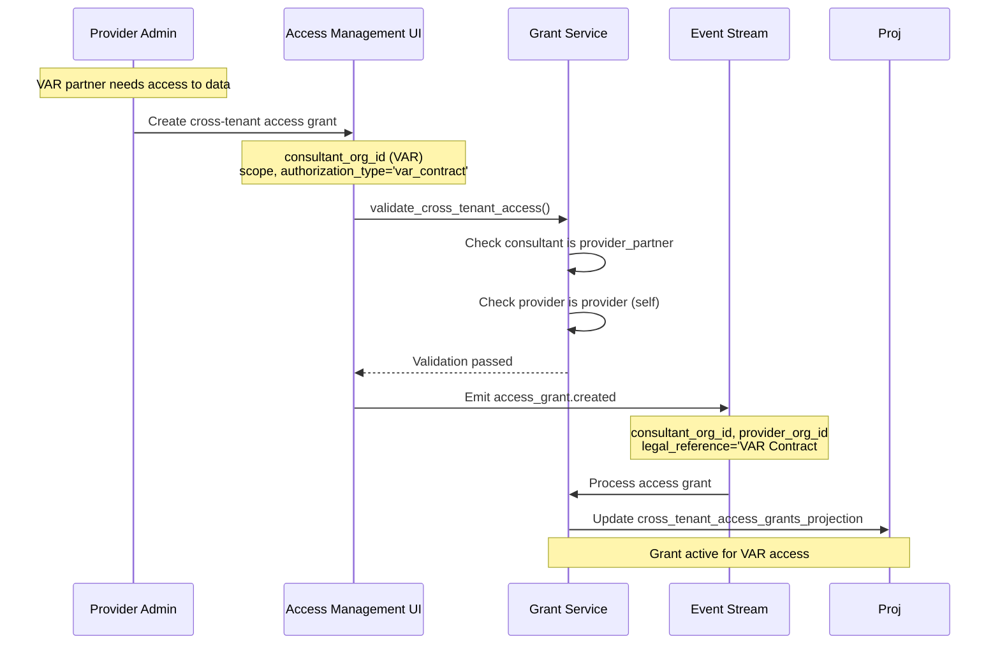
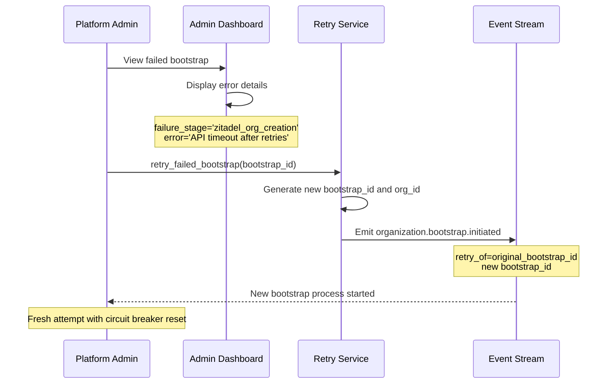
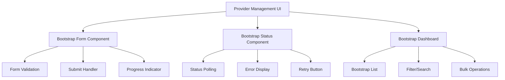

# Provider Organization Bootstrap Sequence

## Overview

Detailed sequence documentation for bootstrapping `type=provider` organizations in the A4C platform. Provider organizations are healthcare facilities that manage at-risk youth and need comprehensive organizational hierarchies.

## Provider Bootstrap Characteristics

- **Organization Type**: `provider`
- **Initial Role**: `provider_admin` 
- **Permissions**: All organization-scoped permissions within their hierarchy
- **Hierarchy**: Can create sub-organizations (facilities, programs, units)
- **Cross-Tenant**: Can grant access to provider_partner organizations

---

## Detailed Provider Bootstrap Flow

### Phase 1: Initiation and Validation



### Phase 2: Zitadel Organization Creation



### Phase 3: Organization Creation and Role Assignment



### Phase 4: Permission Initialization



---

## Provider Organization Structure

### Hierarchical Path Examples



### Provider Sub-Organization Creation Flow



---

## Provider-Specific Features

### Business Profile Creation



### Cross-Tenant Access Grant Creation



---

## Bootstrap Status Monitoring

### Status Dashboard Query

```mermaid
graph TD
    A[Bootstrap Dashboard] --> B[get_bootstrap_status()]
    A --> C[list_bootstrap_processes()]
    
    B --> D{Bootstrap Status}
    D --> E[initiated - Zitadel pending]
    D --> F[processing - Creating organization]
    D --> G[completed - Ready for use]
    D --> H[failed - Needs retry]
    
    C --> I[Recent Bootstrap List]
    I --> J[Provider: ACME Healthcare - Completed]
    I --> K[Provider: Sunshine Youth - Processing]
    I --> L[Provider Partner: XYZ Consulting - Failed]
    
    style G fill:#c8e6c9
    style H fill:#ffcdd2
```

### Manual Retry Process



---

## Integration Points

### Zitadel Management API Endpoints

```mermaid
graph LR
    A[Bootstrap Service] --> B[POST /management/v1/orgs]
    A --> C[POST /management/v1/users]
    A --> D[POST /management/v1/users/{id}/grants]
    
    B --> E[Create Organization]
    C --> F[Create Admin User]
    D --> G[Grant ORG_OWNER Role]
    
    H[API Responses] --> I[organization_id]
    H --> J[user_id]
    H --> K[invitation_link]
    
    style B fill:#e1f5fe
    style C fill:#e8f5e8
    style D fill:#fff3e0
```

### Frontend Integration



---

## Summary

Provider organization bootstrap involves:

1. **Validation**: Email, name uniqueness, circuit breaker check
2. **Zitadel Integration**: Organization and user creation with retry logic
3. **Organization Creation**: Event-driven hierarchy establishment
4. **Role Assignment**: provider_admin with full org-scoped permissions
5. **Business Profile**: Provider-specific metadata collection
6. **Access Management**: Ability to grant cross-tenant access to partners

The process is fully event-driven with comprehensive error handling, audit trails, and manual retry capabilities for maximum reliability.