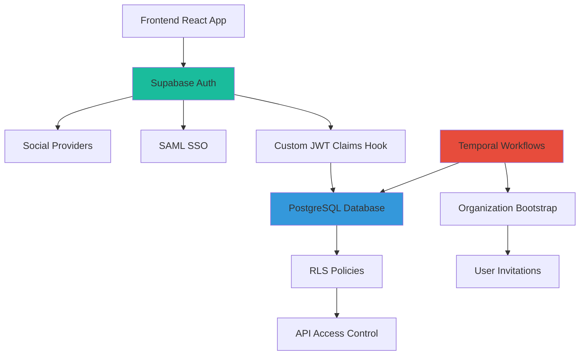
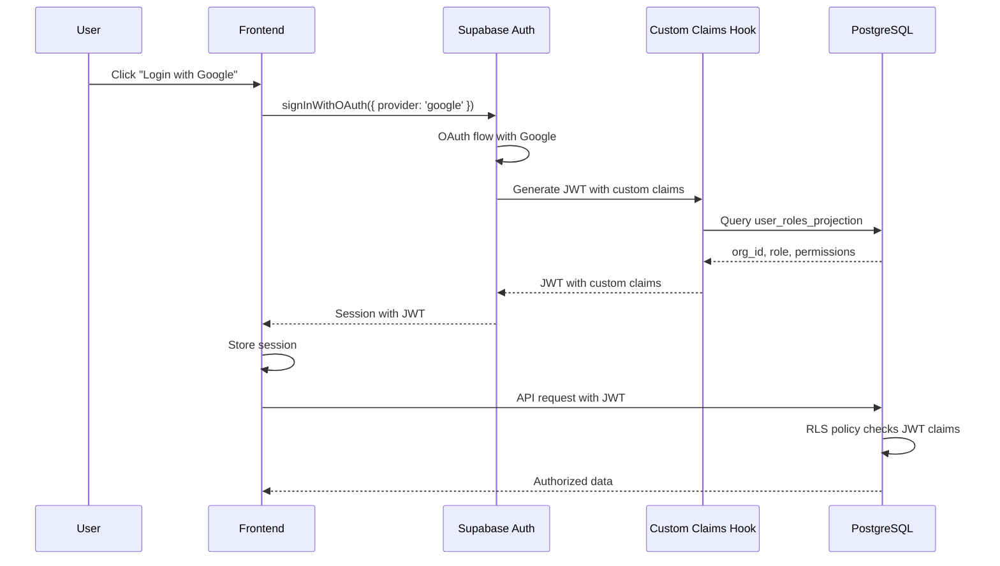

# Supabase Auth Integration Overview

**Status**: ✅ Primary authentication provider for A4C Platform
**Migration**: Zitadel → Supabase Auth (Completed 2025-10-27)
**Frontend**: Three-mode auth system implemented (mock/integration/production)

---

## Table of Contents

1. [Overview](#overview)
2. [Supabase Auth vs Zitadel](#supabase-auth-vs-zitadel)
3. [Architecture](#architecture)
4. [Social Login Configuration](#social-login-configuration)
5. [Authentication Flows](#authentication-flows)
6. [JWT Structure and Custom Claims](#jwt-structure-and-custom-claims)
7. [Session Management](#session-management)
8. [RLS Policy Integration](#rls-policy-integration)
9. [Multi-Tenant Considerations](#multi-tenant-considerations)

---

## Overview

Supabase Auth provides a unified authentication solution that integrates seamlessly with the Supabase PostgreSQL database, Edge Functions, and Row Level Security (RLS) policies.

**Key Benefits**:
- ✅ Single platform (Auth + Database + Backend)
- ✅ Native RLS integration
- ✅ Social login providers built-in
- ✅ Enterprise SSO (SAML 2.0) on Pro+ plans
- ✅ Custom JWT claims via database hooks
- ✅ No separate service to manage

---

## Supabase Auth vs Zitadel

| Feature | Zitadel | Supabase Auth | Impact |
|---------|---------|---------------|--------|
| **Organization Management API** | ✅ Native | ❌ Custom (DB records) | Build custom org management |
| **Social Login** | ✅ Basic | ✅ Extensive | Easier provider setup |
| **Enterprise SSO (SAML)** | ✅ Native | ✅ Native (CLI) | Similar capabilities |
| **Multi-tenant Isolation** | Auth-level (orgs) | App-level (RLS) | Higher RLS importance |
| **Custom JWT Claims** | Via Actions | Via DB Hooks | Different mechanism |
| **User Invitations** | ✅ API-driven | Custom build needed | Temporal workflow handles this |
| **Database Integration** | Separate | ✅ Native | Tighter integration |
| **Complexity** | Two services | One service | Simpler architecture |

### What You Gain
- ✅ **Unified platform**: Auth, database, Edge Functions in one service
- ✅ **Better social login**: More providers, easier configuration
- ✅ **Native RLS**: Direct JWT integration with database policies
- ✅ **Simplified architecture**: One service vs two

### What You Build
- 🛠️ **Organization management**: Via Temporal workflows + database records
- 🛠️ **User invitations**: Via Temporal workflows + custom tokens
- 🛠️ **Custom JWT claims**: Via PostgreSQL database hooks

---

## Architecture

### High-Level Integration



### Authentication Flow



---

## Social Login Configuration

Supabase supports extensive social login providers out of the box:

### Supported Providers
- Google
- GitHub
- GitLab
- Bitbucket
- Azure (Microsoft)
- Facebook
- Twitter
- Discord
- Slack
- Spotify
- Twitch
- Apple
- And more...

### Configuration Steps

1. **Navigate to Supabase Dashboard**
   - Project → Authentication → Providers

2. **Enable Provider**
   - Toggle provider (e.g., Google)
   - Enter Client ID and Client Secret from provider

3. **Configure Redirect URL**
   - Add to provider's OAuth configuration:
   ```
   https://<project-ref>.supabase.co/auth/v1/callback
   ```

4. **Frontend Integration**
   ```typescript
   import { createClient } from '@supabase/supabase-js'

   const supabase = createClient(
     process.env.VITE_SUPABASE_URL,
     process.env.VITE_SUPABASE_ANON_KEY
   )

   // Social login
   await supabase.auth.signInWithOAuth({
     provider: 'google',
     options: {
       redirectTo: 'https://app.firstovertheline.com/auth/callback'
     }
   })
   ```

---

## Authentication Flows

### 1. OAuth2 PKCE Flow (Social Login)

```typescript
// Frontend: Initiate OAuth flow
const { data, error } = await supabase.auth.signInWithOAuth({
  provider: 'google',
  options: {
    redirectTo: 'https://app.firstovertheline.com/auth/callback',
    scopes: 'email profile'
  }
})

// After redirect, Supabase automatically exchanges code for session
// Session stored in localStorage
```

### 2. Magic Link Flow

```typescript
const { data, error } = await supabase.auth.signInWithOtp({
  email: 'user@example.com',
  options: {
    emailRedirectTo: 'https://app.firstovertheline.com/auth/callback'
  }
})
```

### 3. Password-Based Flow

```typescript
// Sign up
const { data, error } = await supabase.auth.signUp({
  email: 'user@example.com',
  password: 'secure-password'
})

// Sign in
const { data, error } = await supabase.auth.signInWithPassword({
  email: 'user@example.com',
  password: 'secure-password'
})
```

### 4. Enterprise SSO (SAML 2.0)

See `enterprise-sso-guide.md` for detailed SAML configuration.

---

## JWT Structure and Custom Claims

### Default Supabase JWT

```json
{
  "sub": "user-uuid",
  "email": "user@example.com",
  "email_verified": true,
  "phone_verified": false,
  "role": "authenticated",
  "aal": "aal1",
  "session_id": "session-uuid",
  "iat": 1234567890,
  "exp": 1234571490
}
```

### Custom Claims (via Database Hook)

Custom claims are added via a PostgreSQL function. See `custom-claims-setup.md` for implementation.

**Enhanced JWT with custom claims**:

```json
{
  "sub": "user-uuid",
  "email": "user@example.com",
  "role": "authenticated",
  "org_id": "org-uuid",
  "user_role": "provider_admin",
  "permissions": ["medication.create", "client.view", "organization.manage"],
  "scope_path": "org_acme_healthcare",
  "iat": 1234567890,
  "exp": 1234571490
}
```

### Accessing Claims in RLS Policies

```sql
-- Check user's organization
CREATE POLICY "Users access own org data"
ON clients FOR SELECT
USING (
  org_id = (auth.jwt()->>'org_id')::uuid
);

-- Check user's role
CREATE POLICY "Admins can delete"
ON clients FOR DELETE
USING (
  (auth.jwt()->>'user_role') = 'provider_admin'
);

-- Check hierarchical scope
CREATE POLICY "Hierarchical access"
ON organizations FOR SELECT
USING (
  path <@ (auth.jwt()->>'scope_path')::ltree
);
```

---

## Session Management

### Session Storage

Supabase stores sessions in:
- **localStorage** (default): Persists across browser sessions
- **sessionStorage**: Cleared when browser tab closes
- **Cookies**: For SSR applications

### Session Configuration

```typescript
const supabase = createClient(supabaseUrl, supabaseAnonKey, {
  auth: {
    storage: window.localStorage,
    autoRefreshToken: true,
    persistSession: true,
    detectSessionInUrl: true
  }
})
```

### Session Refresh

Supabase automatically refreshes tokens before expiration. Manual refresh:

```typescript
const { data, error } = await supabase.auth.refreshSession()
```

### Session Timeout

Configure in Supabase Dashboard → Authentication → Policies:
- **JWT expiry**: Default 1 hour
- **Refresh token expiry**: Default never (or configure)
- **Inactivity timeout**: Configure session limits

---

## RLS Policy Integration

### JWT in RLS Policies

The `auth.jwt()` function provides access to JWT claims:

```sql
-- Get user ID
auth.uid()  -- Returns sub claim as UUID

-- Get user email
auth.email()  -- Returns email claim

-- Get custom claims
auth.jwt()->>'org_id'  -- Returns custom org_id claim
auth.jwt()->>'user_role'  -- Returns custom user_role claim
```

### Example RLS Policies

```sql
-- Multi-tenant data isolation
CREATE POLICY "Tenant isolation"
ON clients FOR ALL
USING (
  org_id = (auth.jwt()->>'org_id')::uuid
);

-- Role-based access
CREATE POLICY "Role-based access"
ON medications FOR INSERT
USING (
  'medication.create' = ANY(
    string_to_array(auth.jwt()->>'permissions', ',')
  )
);

-- Hierarchical scoping with ltree
CREATE POLICY "Hierarchical access"
ON organizations FOR SELECT
USING (
  path <@ (auth.jwt()->>'scope_path')::ltree
);
```

---

## Multi-Tenant Considerations

### Tenant Isolation Strategy

Since Supabase doesn't provide native organization management:

1. **Organizations = Database Records**
   - Stored in `organizations_projection` table
   - Created via Temporal workflows
   - Managed via event-driven architecture

2. **Tenancy via JWT Claims**
   - `org_id` added to JWT via custom claims hook
   - RLS policies enforce data isolation
   - Critical: Hook must be secure and accurate

3. **Subdomain-Based Tenancy**
   - Each organization gets subdomain: `{org}.firstovertheline.com`
   - DNS configured via Temporal workflow
   - Frontend determines org context from subdomain

### Security Considerations

**Critical**: RLS policies are your ONLY line of defense for multi-tenant isolation.

✅ **Best Practices**:
- **Always use RLS policies** on all tables with tenant data
- **Never trust client-side org_id** - always use JWT claim
- **Test RLS policies thoroughly** for data leakage
- **Audit RLS policy changes** via event log
- **Monitor failed RLS checks** for security incidents

❌ **Anti-Patterns**:
- Relying on application-level filtering (bypassed by direct SQL)
- Trusting org_id from client requests
- Missing RLS policies on sensitive tables

### Custom Claims Hook Security

The database hook that adds custom claims must be secure:

```sql
-- Created in PUBLIC schema (2025 Supabase restrictions prevent auth schema)
CREATE FUNCTION public.custom_access_token_hook(event jsonb)
RETURNS jsonb
LANGUAGE plpgsql
STABLE
AS $$
BEGIN
  -- CRITICAL: This function queries projection tables
  -- Must validate all inputs and prevent injection
  -- Errors in this function compromise multi-tenant isolation

  -- Implementation in custom-claims-setup.md
END;
$$;

-- Required permission grants
GRANT EXECUTE ON FUNCTION public.custom_access_token_hook TO supabase_auth_admin;
GRANT USAGE ON SCHEMA public TO supabase_auth_admin;
-- ... additional table grants
```

⚠️ **Deployment Note**: As of 2025, this function is created in `public` schema via SQL deployment (see `infrastructure/supabase/DEPLOY_TO_SUPABASE_STUDIO.sql`). After SQL deployment, register the hook via Supabase Dashboard → Authentication → Hooks → Custom Access Token. See `custom-claims-setup.md` for detailed instructions.

---

## Implementation Status

### ✅ Completed
1. **Frontend Auth Architecture**: Three-mode authentication system (mock/integration/production)
   - See `frontend-auth-architecture.md` for implementation details
2. **Provider Interface Pattern**: Dependency injection with `IAuthProvider`
3. **Mock Development Mode**: Instant authentication for rapid UI development
4. **Integration Testing Mode**: Real OAuth flows for auth feature testing
5. **Production Mode**: Real Supabase Auth with social login
6. **Database Schema Deployment**: Event-driven RBAC schema deployed (2025-10-27)
   - ✅ Users table (Supabase Auth UUID-based)
   - ✅ Organizations projection (removed Zitadel references)
   - ✅ Permissions & roles projections
   - ✅ RLS policies using JWT claims
   - ✅ All Zitadel dependencies removed

### 🚧 In Progress
1. **Custom Claims Setup**: JWT hook function (requires Dashboard deployment)
   - ⚠️ Cannot be deployed via SQL (auth schema permissions)
   - Manual Dashboard step required: Authentication > Hooks
   - See `custom-claims-setup.md` for complete instructions

### 📋 Planned
1. **Enterprise SSO**: SAML 2.0 configuration (3-6 month timeline, see `enterprise-sso-guide.md`)
2. **Organization Management**: Temporal workflow for org provisioning (see `.plans/temporal-integration/`)
3. **User Invitation System**: Replace Zitadel invitation flow with custom implementation

---

## Related Documentation

- **Frontend Implementation**: `.plans/supabase-auth-integration/frontend-auth-architecture.md` ✅
- **Custom Claims**: `.plans/supabase-auth-integration/custom-claims-setup.md`
- **Enterprise SSO**: `.plans/supabase-auth-integration/enterprise-sso-guide.md`
- **Temporal Workflows**: `.plans/temporal-integration/`
- **RBAC Architecture**: `.plans/rbac-permissions/architecture.md`
- **Multi-Tenant Architecture**: `.plans/auth-integration/tenants-as-organization-thoughts.md`

---

**Document Version**: 1.1
**Last Updated**: 2025-10-27
**Status**: Frontend Implementation Complete
