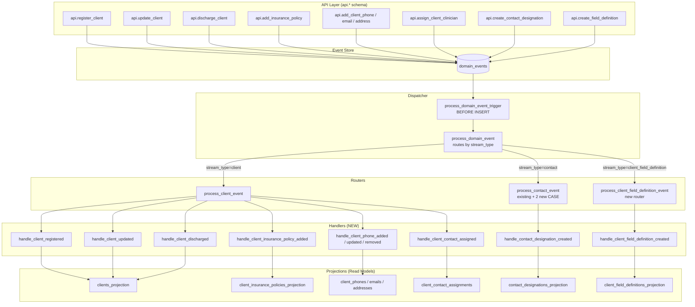

# Client Management Applet — Schema Relationship Diagrams

**Last Updated**: 2026-03-20
**Purpose**: Visual representation of the proposed client management schema, all internal relationships, and connection points to the existing A4C database.

> **Documentation Source**: This file serves as a **partial source for new documentation** upon plan execution. When Phase 2-3 migrations are applied, the following documentation artifacts should be derived from these diagrams per `documentation/AGENT-GUIDELINES.md`:
> - Table reference docs in `documentation/infrastructure/reference/database/tables/` (one per new table)
> - Architecture doc in `documentation/architecture/data/` covering the client data model
> - Updates to `documentation/AGENT-INDEX.md` with client-related keywords
> - Updates to `documentation/README.md` table of contents

---

## Overview

**New tables**: 10 (9 projection/data + 1 reference)
**Modified tables**: 2 (`contacts_projection` adds `user_id` FK, `user_client_assignments_projection` adds FK to `clients_projection`)
**Existing tables referenced**: 6 (via FK or join path)

---

## Entity Relationship Diagram

```mermaid
erDiagram
    %% ===============================================
    %% NEW TABLES (Client Management Applet)
    %% ===============================================

    clients_projection {
        uuid id PK
        uuid organization_id FK "-> organizations_projection"
        uuid organization_unit_id FK "-> organization_units_projection"
        text status "active | inactive"
        text data_source "manual | api | import"
        %% --- Demographics (Step 1) ---
        text first_name "NOT NULL"
        text last_name "NOT NULL"
        text middle_name "nullable"
        text preferred_name "nullable"
        date date_of_birth "NOT NULL"
        text gender "NOT NULL - Male | Female"
        text gender_identity "nullable, free text"
        text pronouns "nullable, org-configurable dropdown"
        text race__array "text[] - OMB multi-select, configurable_presence"
        text ethnicity "nullable, OMB single-select, configurable_presence"
        text primary_language "nullable, configurable_presence"
        text secondary_language "nullable, configurable_presence"
        boolean interpreter_needed "nullable, configurable_presence"
        text marital_status "nullable"
        text citizenship_status "nullable"
        text photo_url "nullable"
        text mrn "nullable - org-assigned Medical Record Number"
        text external_id "nullable - for imports"
        text drivers_license "nullable"
        %% --- Referral (Step 4) ---
        text referral_source_type "enum: self, parent_guardian, therapist, school, court, hospital, agency, insurance, other"
        text referral_organization "nullable"
        date referral_date "nullable"
        text reason_for_referral "nullable"
        %% --- Admission (Step 5) ---
        date admission_date "NOT NULL"
        text admission_type "nullable - planned | emergency | transfer | readmission"
        text level_of_care "nullable"
        integer expected_length_of_stay "nullable, days"
        text initial_risk_level "nullable"
        text discharge_plan_status "nullable - not_started | in_progress | complete"
        %% --- Insurance IDs (Step 6) ---
        text medicaid_id "nullable, configurable_presence"
        text medicare_id "nullable, configurable_presence"
        %% --- Clinical Profile (Step 7) ---
        jsonb primary_diagnosis "nullable - ICD-10 {code, description}"
        jsonb secondary_diagnoses "nullable - ICD-10 array"
        jsonb dsm5_diagnoses "nullable - DSM-5 array"
        text presenting_problem "nullable"
        text suicide_risk_status "nullable"
        text violence_risk_status "nullable"
        boolean trauma_history_indicator "nullable"
        text substance_use_history "nullable"
        text developmental_history "nullable"
        text previous_treatment_history "nullable"
        %% --- Medical (Step 8) ---
        jsonb allergies "NOT NULL - {nka, items: [{name, allergy_type, severity}]}"
        jsonb medical_conditions "NOT NULL - {nkmc, items: [{code, description, is_chronic}]}"
        text immunization_status "nullable"
        text dietary_restrictions "nullable"
        text special_medical_needs "nullable"
        %% --- Legal (Step 9) ---
        text legal_custody_status "nullable"
        boolean court_ordered_placement "nullable"
        text financial_guarantor_type "nullable"
        text court_case_number "nullable"
        text state_agency "nullable - configurable label"
        text legal_status "nullable - voluntary | court_ordered | guardianship"
        boolean mandated_reporting_status "nullable"
        boolean protective_services_involvement "nullable"
        boolean safety_plan_required "nullable"
        %% --- Discharge (Step 10) ---
        date discharge_date "nullable - mandatory at discharge"
        text discharge_reason "nullable - mandatory at discharge"
        text discharge_type "nullable - planned | ama | transfer | runaway"
        jsonb discharge_diagnosis "nullable - ICD-10 array"
        text discharge_placement "nullable"
        %% --- Education ---
        text education_status "nullable, configurable_presence"
        text grade_level "nullable, configurable_presence"
        boolean iep_status "nullable, configurable_presence"
        %% --- Custom + Audit ---
        jsonb custom_fields "DEFAULT '{}' - org-defined via field registry"
        timestamptz created_at "NOT NULL"
        timestamptz updated_at "NOT NULL"
        uuid created_by FK "-> users"
        uuid updated_by FK "-> users"
    }

    client_phones {
        uuid id PK
        uuid client_id FK "-> clients_projection"
        uuid organization_id FK "-> organizations_projection (RLS)"
        text type "mobile | home | work | other"
        text number "NOT NULL"
        boolean is_primary "default false"
        timestamptz created_at "NOT NULL"
        timestamptz updated_at "NOT NULL"
    }

    client_emails {
        uuid id PK
        uuid client_id FK "-> clients_projection"
        uuid organization_id FK "-> organizations_projection (RLS)"
        text type "personal | school | work | other"
        text email "NOT NULL"
        boolean is_primary "default false"
        timestamptz created_at "NOT NULL"
        timestamptz updated_at "NOT NULL"
    }

    client_addresses {
        uuid id PK
        uuid client_id FK "-> clients_projection"
        uuid organization_id FK "-> organizations_projection (RLS)"
        text type "home | mailing | previous | other"
        text street1 "NOT NULL"
        text street2 "nullable"
        text city "NOT NULL"
        text state "NOT NULL"
        text zip_code "NOT NULL"
        text country "default 'US'"
        boolean is_primary "default false"
        timestamptz created_at "NOT NULL"
        timestamptz updated_at "NOT NULL"
    }

    client_insurance_policies_projection {
        uuid id PK
        uuid client_id FK "-> clients_projection"
        uuid organization_id FK "-> organizations_projection (RLS)"
        text policy_type "primary | secondary | medicaid | medicare"
        text payer_name "NOT NULL"
        text payer_id "nullable"
        text plan_name "nullable"
        text member_id "nullable"
        text group_number "nullable"
        text subscriber_name "nullable"
        date subscriber_dob "nullable"
        text subscriber_relationship "nullable"
        date coverage_start_date "nullable"
        date coverage_end_date "nullable"
        boolean authorization_required "nullable"
        boolean is_active "default true"
        timestamptz created_at "NOT NULL"
        timestamptz updated_at "NOT NULL"
    }

    client_funding_sources_projection {
        uuid id PK
        uuid client_id FK "-> clients_projection"
        uuid organization_id FK "-> organizations_projection (RLS)"
        text funding_source_key "NOT NULL - e.g. external_funding_source_1"
        text source_name "nullable"
        text source_id "nullable"
        numeric amount "nullable"
        date start_date "nullable"
        date end_date "nullable"
        text notes "nullable"
        jsonb custom_fields "DEFAULT '{}' - non-standard fields"
        boolean is_active "default true"
        timestamptz created_at "NOT NULL"
        timestamptz updated_at "NOT NULL"
    }

    contact_designations_projection {
        uuid id PK
        uuid contact_id FK "-> contacts_projection"
        text designation "CHECK 12 values"
        uuid organization_id FK "-> organizations_projection"
        boolean is_active "default true"
        timestamptz created_at "NOT NULL"
        timestamptz updated_at "nullable"
    }

    client_contact_assignments {
        uuid id PK
        uuid client_id FK "-> clients_projection"
        uuid contact_id FK "-> contacts_projection"
        uuid contact_designation_id FK "-> contact_designations_projection"
        uuid organization_id FK "-> organizations_projection (RLS)"
        boolean is_active "default true"
        timestamptz assigned_at "NOT NULL"
        uuid assigned_by FK "-> users"
        text notes "nullable"
        timestamptz created_at "NOT NULL"
        timestamptz updated_at "nullable"
    }

    client_field_definitions_projection {
        uuid id PK
        uuid organization_id FK "-> organizations_projection"
        uuid category_id FK "-> client_field_categories"
        text field_key "semantic key - never custom_field_1"
        text display_name "NOT NULL"
        text field_type "text | number | date | enum | multi_enum | boolean"
        boolean is_required "default false"
        jsonb validation_rules "min/max, pattern, etc."
        boolean is_dimension "exposes in Cube.js for this org"
        integer sort_order "UI ordering"
        text configurable_label "nullable - org rename for designations/state_agency"
        text conforming_dimension_mapping "nullable - canonical key for cross-org analytics"
        boolean is_active "default true"
        timestamptz created_at "NOT NULL"
        timestamptz updated_at "NOT NULL"
    }

    client_field_categories {
        uuid id PK
        uuid organization_id FK "-> organizations_projection (NULL = app-owner)"
        text name "NOT NULL"
        text slug "NOT NULL"
        integer sort_order "UI ordering"
        timestamptz created_at "NOT NULL"
    }

    client_reference_values {
        uuid id PK
        text category "language"
        text code "ISO 639 code"
        text display_name "NOT NULL"
        integer sort_order "nullable"
        boolean is_active "default true"
    }

    %% ===============================================
    %% EXISTING TABLES (referenced by client management)
    %% ===============================================

    organizations_projection {
        uuid id PK
        text name "NOT NULL"
        text display_name "NOT NULL"
        text type "platform_owner | provider | provider_partner"
        ltree path "hierarchical path"
        boolean is_active
        jsonb direct_care_settings "feature flags for client mgmt"
        timestamptz deleted_at "soft delete"
    }

    organization_units_projection {
        uuid id PK
        uuid organization_id FK "-> organizations_projection"
        text name "NOT NULL"
        ltree path "hierarchy path"
        ltree parent_path
        integer depth
        boolean is_active
        timestamptz deleted_at "soft delete"
    }

    contacts_projection {
        uuid id PK
        uuid organization_id FK "-> organizations_projection"
        text label
        text type "a4c_admin | billing | technical | emergency | stakeholder"
        text first_name
        text last_name
        text email
        text title
        text department
        boolean is_primary
        boolean is_active
        uuid user_id FK "-> users (NEW - nullable, links internal users)"
        jsonb metadata
        timestamptz created_at
        timestamptz updated_at
        timestamptz deleted_at
    }

    users {
        uuid id PK "matches auth.users.id"
        text email
        text name
        uuid current_organization_id FK
        uuid_array accessible_organizations
        boolean is_active
        timestamptz created_at
        timestamptz updated_at
    }

    user_client_assignments_projection {
        uuid id PK
        uuid user_id FK "-> users"
        uuid client_id FK "-> clients_projection (NEW FK)"
        uuid organization_id FK "-> organizations_projection"
        timestamptz assigned_at
        timestamptz assigned_until "nullable"
        boolean is_active
        uuid assigned_by FK "-> users"
        text notes
        uuid last_event_id FK "-> domain_events"
    }

    domain_events {
        uuid id PK
        bigserial sequence_number "global ordering"
        uuid stream_id "entity ID"
        text stream_type "client | client_field_definition | contact | etc."
        integer stream_version "optimistic concurrency"
        text event_type "e.g. client.registered"
        jsonb event_data "full payload"
        jsonb event_metadata "user_id, correlation_id, trace context"
        timestamptz created_at
        timestamptz processed_at
        text processing_error
    }

    medication_history {
        uuid id PK
        uuid organization_id FK
        uuid client_id FK "-> clients_projection (future)"
        uuid medication_id FK
        text status "active | completed | discontinued | on_hold"
        date prescription_date
        date start_date
        date end_date
    }

    dosage_info {
        uuid id PK
        uuid organization_id FK
        uuid medication_history_id FK "-> medication_history"
        uuid client_id FK "denormalized"
        timestamptz scheduled_datetime
        text status "scheduled | administered | skipped | refused | missed"
        uuid administered_by FK "-> users"
    }

    %% ===============================================
    %% RELATIONSHIPS
    %% ===============================================

    %% --- Core tenant isolation ---
    organizations_projection ||--o{ clients_projection : "org_id (RLS)"
    organizations_projection ||--o{ organization_units_projection : "org_id"
    organization_units_projection ||--o{ clients_projection : "unit placement"

    %% --- Client-owned contact info (Option B) ---
    clients_projection ||--o{ client_phones : "client_id"
    clients_projection ||--o{ client_emails : "client_id"
    clients_projection ||--o{ client_addresses : "client_id"

    %% --- Insurance sub-entity ---
    clients_projection ||--o{ client_insurance_policies_projection : "client_id"

    %% --- Funding sources sub-entity ---
    clients_projection ||--o{ client_funding_sources_projection : "client_id"

    %% --- 4NF Contact-Designation model ---
    contacts_projection ||--o{ contact_designations_projection : "contact_id"
    contact_designations_projection ||--o{ client_contact_assignments : "designation_id"
    clients_projection ||--o{ client_contact_assignments : "client_id"
    contacts_projection ||--o{ client_contact_assignments : "contact_id"
    users ||--o| contacts_projection : "user_id (lazy link)"

    %% --- Field registry ---
    client_field_categories ||--o{ client_field_definitions_projection : "category_id"
    organizations_projection ||--o{ client_field_definitions_projection : "org_id"
    organizations_projection ||--o{ client_field_categories : "org_id (nullable)"

    %% --- Staff assignments (existing, gets new FK) ---
    users ||--o{ user_client_assignments_projection : "user_id"
    clients_projection ||--o{ user_client_assignments_projection : "client_id (NEW FK)"

    %% --- Medication domain (existing, references clients) ---
    clients_projection ||--o{ medication_history : "client_id"
    medication_history ||--o{ dosage_info : "medication_history_id"
    clients_projection ||--o{ dosage_info : "client_id (denormalized)"

    %% --- Audit trail ---
    users ||--o{ clients_projection : "created_by / updated_by"
    users ||--o{ client_contact_assignments : "assigned_by"

    %% --- Event sourcing ---
    domain_events ||--o{ clients_projection : "stream_type=client events"
    domain_events ||--o{ client_insurance_policies_projection : "sub-entity events"
    domain_events ||--o{ contact_designations_projection : "contact.designation.* events"
    domain_events ||--o{ client_contact_assignments : "client.contact.* events"
    domain_events ||--o{ client_field_definitions_projection : "stream_type=client_field_definition"
    domain_events ||--o{ client_phones : "client.phone.* events"
    domain_events ||--o{ client_emails : "client.email.* events"
    domain_events ||--o{ client_addresses : "client.address.* events"
    domain_events ||--o{ client_funding_sources_projection : "client.funding_source.* events"
```



---

## Event Flow Diagram



---

## Table Inventory Summary

### New Tables (11)

| Table | Stream Type | Event Count | Purpose |
|-------|------------|-------------|---------|
| `clients_projection` | `client` | 8 lifecycle events | Core client record (~50 typed columns + custom_fields JSONB) |
| `client_phones` | `client` (sub-entity) | 3 events | Client's own phone numbers |
| `client_emails` | `client` (sub-entity) | 3 events | Client's own email addresses |
| `client_addresses` | `client` (sub-entity) | 3 events | Client's own addresses |
| `client_insurance_policies_projection` | `client` (sub-entity) | 3 events | Insurance/payer records per client |
| `client_funding_sources_projection` | `client` (sub-entity) | 3 events | Dynamic external funding sources (Decision 76) |
| `contact_designations_projection` | `contact` (sub-entity) | 2 events | Clinical designation per contact per org |
| `client_contact_assignments` | `client` (sub-entity) | 2 events | 4NF junction: client + contact + designation |
| `client_field_definitions_projection` | `client_field_definition` | 3 events | Org-configurable field registry |
| `client_field_categories` | N/A (config) | 0 events | Fixed + org-defined field categories |
| `client_reference_values` | N/A (config, global) | 0 events | Language master list (ISO 639), no org_id |

### Modified Tables (2)

| Table | Change |
|-------|--------|
| `contacts_projection` | Add `user_id uuid NULL FK -> users` (links internal system users to contact records) |
| `user_client_assignments_projection` | Add FK constraint on `client_id -> clients_projection(id)` |

### Existing Tables Referenced (6)

| Table | Relationship |
|-------|-------------|
| `organizations_projection` | Parent org for RLS + `direct_care_settings` feature flags |
| `organization_units_projection` | Client unit placement |
| `contacts_projection` | Unified "people" dimension for clinical assignments |
| `users` | Audit (created_by/updated_by), staff assignments, contact linking |
| `domain_events` | Event store - all state changes flow through here |
| `medication_history` / `dosage_info` | Existing clinical tables that reference `client_id` |

---

## Designation CHECK Constraint Values (12)

```
clinician, therapist, psychiatrist, behavioral_analyst, case_worker,
guardian, emergency_contact, program_manager, primary_care_physician,
prescriber, probation_officer, caseworker
```

All 12 have configurable display labels (org can rename) with conforming dimension mapping (canonical key stays for cross-org Cube.js analytics). Labels stored in `client_field_definitions_projection`.

---

## RLS Policy Pattern

All new tables follow the same RLS pattern:
- **SELECT**: `organization_id = get_current_org_id()` + `has_effective_permission('client.view')`
- **INSERT**: `organization_id = get_current_org_id()` + `has_effective_permission('client.create')`
- **UPDATE**: `organization_id = get_current_org_id()` + `has_effective_permission('client.update')`
- **DELETE**: `organization_id = get_current_org_id()` + `has_effective_permission('client.delete')`
- **Platform admin override**: `has_platform_privilege()` on all operations

Config tables (`client_field_categories`, `client_reference_values`) use read-only policies for authenticated users + write policies for admin roles.

---

## Documentation Artifacts to Generate (Post-Implementation)

Per `documentation/AGENT-GUIDELINES.md`, the following docs should be created using this file as a source:

| Artifact | Location | Source Sections |
|----------|----------|----------------|
| `clients_projection.md` | `documentation/infrastructure/reference/database/tables/` | ER diagram (clients_projection entity), Table Inventory |
| `client_phones.md` | same | ER diagram (client_phones entity) |
| `client_emails.md` | same | ER diagram (client_emails entity) |
| `client_addresses.md` | same | ER diagram (client_addresses entity) |
| `client_insurance_policies_projection.md` | same | ER diagram (insurance entity) |
| `contact_designations_projection.md` | same | ER diagram + Designation CHECK values |
| `client_contact_assignments.md` | same | ER diagram (assignments entity) |
| `client_field_definitions_projection.md` | same | ER diagram (field definitions entity) |
| `client_field_categories.md` | same | ER diagram (categories entity) |
| `client_reference_values.md` | same | ER diagram (reference values entity) |
| Client data model architecture | `documentation/architecture/data/` | Both diagrams + full inventory |
| AGENT-INDEX.md updates | `documentation/AGENT-INDEX.md` | All table names + keywords |
| contacts_projection.md update | existing doc | Modified Tables section |
| user_client_assignments_projection.md update | existing doc | Modified Tables section |
