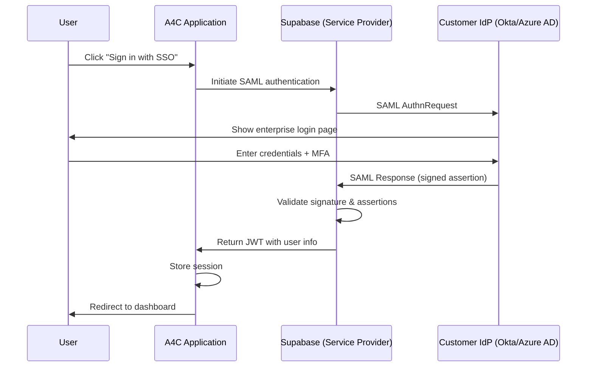

# Supabase Auth - Enterprise SSO (SAML 2.0) Guide
> [!WARNING]
> **This feature is not yet implemented.** This document describes planned functionality that has not been built. Implementation timeline and approach are subject to change based on business priorities.


**Status**: 📅 Planned for implementation (3-6 months)
**Priority**: High - Required for enterprise healthcare customers
**Prerequisites**: Supabase Pro plan or higher

---

## Table of Contents

1. [Overview](#overview)
2. [SAML 2.0 Basics](#saml-20-basics)
3. [Supabase SAML Configuration](#supabase-saml-configuration)
4. [Identity Provider Setup](#identity-provider-setup)
5. [Organization-Specific SSO](#organization-specific-sso)
6. [Testing and Validation](#testing-and-validation)
7. [Production Deployment](#production-deployment)
8. [Troubleshooting](#troubleshooting)

---

## Overview

Enterprise SSO enables organizations to authenticate users through their existing identity providers (Okta, Azure AD, OneLogin, etc.) using SAML 2.0 protocol.

**Why Enterprise SSO**:
- 🏢 **Customer requirement**: Healthcare enterprises require SSO integration
- 🔐 **Security**: Centralized authentication, MFA enforcement, audit trails
- 📊 **Compliance**: HIPAA, SOC 2 often mandate SSO capabilities
- 🎯 **User experience**: Single sign-on across all applications

**Supabase SAML Support**:
- ✅ Available on **Pro plan and higher**
- ✅ Configured via **Supabase CLI** (not dashboard UI)
- ✅ Supports standard SAML 2.0 identity providers
- ✅ Per-organization SSO configuration (multi-tenant)

---

## SAML 2.0 Basics

### Authentication Flow



### Key SAML Concepts

| Term | Description |
|------|-------------|
| **Service Provider (SP)** | Your application (Supabase in this case) |
| **Identity Provider (IdP)** | Customer's authentication system (Okta, Azure AD) |
| **SAML Assertion** | XML document with user identity and attributes |
| **SSO URL** | Endpoint where IdP sends SAML responses |
| **Entity ID** | Unique identifier for SP and IdP |
| **Certificate** | X.509 cert for signing/verifying SAML messages |

---

## Supabase SAML Configuration

### Prerequisites

1. **Supabase Pro Plan**
   - SAML is **not available** on Free plan
   - Upgrade: Supabase Dashboard → Settings → Billing

2. **Supabase CLI Installed**
   ```bash
   npm install -g supabase
   supabase login
   ```

3. **Project Reference ID**
   ```bash
   # Get from dashboard URL or:
   supabase projects list
   ```

### Step 1: Configure SAML Provider

Create SAML configuration file:

```yaml
# saml-config.yaml
provider: okta  # or azure, onelogin, generic
entity_id: https://your-company.okta.com
sso_url: https://your-company.okta.com/app/abc123/sso/saml
certificate: |
  -----BEGIN CERTIFICATE-----
  MIIDpDCCAoygAwIBAgIGAXoJf...
  -----END CERTIFICATE-----

# Optional: Attribute mapping
attribute_mapping:
  email: http://schemas.xmlsoap.org/ws/2005/05/identity/claims/emailaddress
  name: http://schemas.xmlsoap.org/ws/2005/05/identity/claims/name

# Optional: Enable Just-In-Time provisioning
jit_provisioning: true
```

### Step 2: Apply Configuration via CLI

```bash
# Set SAML configuration
supabase saml set \
  --project-ref YOUR_PROJECT_REF \
  --config saml-config.yaml

# Verify configuration
supabase saml list --project-ref YOUR_PROJECT_REF
```

### Step 3: Get Service Provider Metadata

Supabase provides SP metadata for IdP configuration:

```bash
# Get metadata URL
supabase saml metadata --project-ref YOUR_PROJECT_REF

# Output example:
# https://YOUR_PROJECT_REF.supabase.co/auth/v1/saml/metadata
```

Download metadata XML or note these values:
- **Entity ID**: `https://YOUR_PROJECT_REF.supabase.co/auth/v1/saml/metadata`
- **ACS URL**: `https://YOUR_PROJECT_REF.supabase.co/auth/v1/saml/acs`
- **Single Logout URL**: `https://YOUR_PROJECT_REF.supabase.co/auth/v1/saml/slo`

---

## Identity Provider Setup

### Okta Configuration

1. **Create SAML 2.0 Application**
   - Okta Admin → Applications → Create App Integration
   - Sign-in method: SAML 2.0

2. **General Settings**
   - App name: A4C Analytics Platform
   - App logo: (optional)

3. **SAML Settings**
   ```
   Single sign-on URL: https://YOUR_PROJECT_REF.supabase.co/auth/v1/saml/acs
   Audience URI (SP Entity ID): https://YOUR_PROJECT_REF.supabase.co/auth/v1/saml/metadata
   Name ID format: EmailAddress
   Application username: Email
   ```

4. **Attribute Statements**
   | Name | Value |
   |------|-------|
   | email | user.email |
   | firstName | user.firstName |
   | lastName | user.lastName |
   | name | user.displayName |

5. **Group Attribute Statements** (optional)
   | Name | Filter | Value |
   |------|--------|-------|
   | groups | Matches regex | .* | Groups |

6. **Download Certificate**
   - SAML Signing Certificates → Download X.509 certificate
   - Use in Supabase SAML config

7. **Get SSO URL**
   - Sign On tab → View Setup Instructions
   - Copy "Identity Provider Single Sign-On URL"

---

### Azure AD Configuration

1. **Create Enterprise Application**
   - Azure Portal → Azure Active Directory → Enterprise applications
   - New application → Create your own application
   - Name: A4C Analytics Platform
   - Integrate any other application (Non-gallery)

2. **Set up Single Sign-On**
   - Single sign-on → SAML

3. **Basic SAML Configuration**
   ```
   Identifier (Entity ID): https://YOUR_PROJECT_REF.supabase.co/auth/v1/saml/metadata
   Reply URL (ACS URL): https://YOUR_PROJECT_REF.supabase.co/auth/v1/saml/acs
   Sign on URL: https://app.firstovertheline.com/auth/sso
   Relay State: (leave empty)
   Logout URL: https://YOUR_PROJECT_REF.supabase.co/auth/v1/saml/slo
   ```

4. **Attributes & Claims**
   | Claim name | Source attribute |
   |------------|------------------|
   | email | user.mail |
   | givenname | user.givenname |
   | surname | user.surname |
   | name | user.displayname |

5. **SAML Certificates**
   - Download Certificate (Base64)
   - Copy Federation Metadata URL

6. **Get SSO URLs**
   - Copy "Login URL" and "Azure AD Identifier"

---

### OneLogin Configuration

1. **Add Application**
   - Applications → Add App
   - Search: "SAML Custom Connector (Advanced)"

2. **Application Details**
   - Display Name: A4C Analytics Platform
   - Save

3. **Configuration Tab**
   ```
   ACS (Consumer) URL: https://YOUR_PROJECT_REF.supabase.co/auth/v1/saml/acs
   ACS (Consumer) URL Validator: https://YOUR_PROJECT_REF\.supabase\.co/auth/v1/saml/acs
   Audience (EntityID): https://YOUR_PROJECT_REF.supabase.co/auth/v1/saml/metadata
   SAML signature element: Response
   ```

4. **Parameters Tab**
   | Parameter | Value |
   |-----------|-------|
   | Email | Email |
   | FirstName | First Name |
   | LastName | Last Name |

5. **SSO Tab**
   - Copy "SAML 2.0 Endpoint (HTTP)"
   - Download X.509 certificate

---

## Organization-Specific SSO

Since A4C is multi-tenant, each **organization** can have its own SSO configuration.

### Database Schema

```sql
-- Already defined in CQRS projections
CREATE TABLE organization_sso_config (
  config_id uuid PRIMARY KEY DEFAULT gen_random_uuid(),
  org_id uuid NOT NULL REFERENCES organizations_projection(org_id),
  provider_type text NOT NULL CHECK (provider_type IN ('okta', 'azure', 'onelogin', 'generic')),
  entity_id text NOT NULL,
  sso_url text NOT NULL,
  certificate text NOT NULL,
  attribute_mapping jsonb DEFAULT '{}'::jsonb,
  is_active boolean DEFAULT true,
  created_at timestamptz DEFAULT now(),
  updated_at timestamptz DEFAULT now(),

  UNIQUE (org_id, provider_type)
);

-- Trigger to update updated_at
CREATE TRIGGER update_organization_sso_config_updated_at
  BEFORE UPDATE ON organization_sso_config
  FOR EACH ROW
  EXECUTE FUNCTION update_updated_at_column();
```

### SSO Configuration Workflow

**Workflow**: `ConfigureOrganizationSSOWorkflow` (Temporal)

1. **Customer provides SSO details**
   - Enterprise customer submits IdP metadata
   - Support team validates and extracts configuration

2. **Temporal workflow creates SSO config**
   ```typescript
   // Activity: Configure SSO for organization
   async function configureOrganizationSSO(params: {
     orgId: string
     providerType: 'okta' | 'azure' | 'onelogin' | 'generic'
     entityId: string
     ssoUrl: string
     certificate: string
     attributeMapping?: Record<string, string>
   }): Promise<void> {
     // Emit event: OrganizationSSOConfigured
     await emitDomainEvent({
       event_type: 'OrganizationSSOConfigured',
       aggregate_type: 'Organization',
       aggregate_id: params.orgId,
       event_data: {
         provider_type: params.providerType,
         entity_id: params.entityId,
         sso_url: params.ssoUrl,
         // Certificate stored encrypted
         certificate_fingerprint: hashCertificate(params.certificate)
       }
     })

     // Configure via Supabase CLI or API
     await supabaseSAMLConfig.set({
       projectRef: SUPABASE_PROJECT_REF,
       domain: getOrganizationDomain(params.orgId), // org.firstovertheline.com
       config: {
         provider: params.providerType,
         entity_id: params.entityId,
         sso_url: params.ssoUrl,
         certificate: params.certificate,
         attribute_mapping: params.attributeMapping
       }
     })
   }
   ```

3. **Event handler updates projection**
   ```sql
   -- Event handler for OrganizationSSOConfigured
   INSERT INTO organization_sso_config (
     org_id,
     provider_type,
     entity_id,
     sso_url,
     certificate,
     attribute_mapping
   )
   VALUES (...)
   ON CONFLICT (org_id, provider_type) DO UPDATE
   SET ...;
   ```

4. **User authentication flow**
   - User navigates to `https://acme-healthcare.firstovertheline.com/auth/sso`
   - Frontend determines org from subdomain
   - Frontend redirects to Supabase SSO endpoint with org hint
   - Supabase routes to correct IdP based on org

---

## Testing and Validation

### Test SSO Flow (Staging Environment)

1. **Create Test Organization**
   ```bash
   # Use Temporal workflow or direct SQL for testing
   INSERT INTO organizations_projection (org_id, name, path, domain)
   VALUES (
     gen_random_uuid(),
     'Test SSO Organization',
     'test_sso_org'::ltree,
     'test-sso.staging.firstovertheline.com'
   );
   ```

2. **Configure SSO for Test Org**
   - Set up test application in IdP (Okta/Azure sandbox)
   - Run SSO configuration workflow
   - Verify `organization_sso_config` record created

3. **Initiate SSO Authentication**
   ```typescript
   // Frontend: Initiate SSO flow
   const { data, error } = await supabase.auth.signInWithSSO({
     domain: 'test-sso.staging.firstovertheline.com'
   })

   if (data?.url) {
     // Redirect user to IdP login page
     window.location.href = data.url
   }
   ```

4. **Validate SAML Response**
   - Check Supabase logs for SAML assertion validation
   - Verify user created in `auth.users`
   - Verify custom claims added to JWT (org_id, permissions)

5. **Test User Provisioning**
   - First-time login: User should be auto-provisioned
   - Check `user_roles_projection` for org membership
   - Verify default role assigned (e.g., `organization_member`)

---

### Validation Checklist

- [ ] SAML configuration applied via Supabase CLI
- [ ] IdP application created with correct ACS URL and Entity ID
- [ ] Test user can authenticate via SSO
- [ ] JWT contains custom claims (org_id, permissions)
- [ ] User record created in `auth.users`
- [ ] User assigned to correct organization in `user_roles_projection`
- [ ] RLS policies enforce org_id isolation
- [ ] Single Logout (SLO) works correctly
- [ ] IdP certificate expiration monitoring configured
- [ ] Error handling for invalid SAML responses

---

## Production Deployment

### Deployment Workflow

1. **Customer Onboarding**
   - Enterprise customer signs contract
   - Support team collects SSO requirements

2. **SSO Configuration Request**
   - Customer provides IdP metadata (XML or manual values)
   - Support team validates configuration

3. **Temporal Workflow Execution**
   ```bash
   # Trigger via Temporal API or internal admin tool
   POST /api/admin/organizations/{org_id}/configure-sso
   {
     "provider_type": "okta",
     "entity_id": "https://customer.okta.com",
     "sso_url": "https://customer.okta.com/app/abc123/sso/saml",
     "certificate": "-----BEGIN CERTIFICATE-----\n..."
   }
   ```

4. **Verification**
   - Support team tests SSO with customer's test account
   - Customer validates SSO works in staging environment

5. **Production Cutover**
   - Enable SSO in production
   - Communicate to customer's IT team
   - Monitor authentication logs for errors

6. **Documentation**
   - Provide customer with user guide
   - Document in internal runbook

---

### Certificate Renewal Process

IdP certificates typically expire every 1-3 years.

**Monitoring**:
```sql
-- Query to check certificate expiration
SELECT
  org_id,
  provider_type,
  extract_certificate_expiry(certificate) AS expires_at,
  extract_certificate_expiry(certificate) - now() AS days_until_expiry
FROM organization_sso_config
WHERE is_active = true
  AND extract_certificate_expiry(certificate) < now() + interval '30 days'
ORDER BY expires_at;
```

**Renewal Workflow**:
1. Alert sent 30 days before expiration
2. Support team contacts customer
3. Customer provides new certificate
4. Temporal workflow updates SSO configuration
5. Test SSO flow with new certificate
6. Old certificate remains valid until expiration (for rollback)

---

## Troubleshooting

### Issue: SAML Response Validation Failed

**Symptoms**: User redirected from IdP but authentication fails

**Common Causes**:
- Certificate mismatch (wrong cert in Supabase config)
- Clock skew (IdP and Supabase time difference > 3 minutes)
- Invalid signature (SAML response tampered or corrupted)
- Incorrect ACS URL in IdP configuration

**Diagnosis**:
```bash
# Check Supabase logs
supabase logs --project-ref YOUR_PROJECT_REF --type api | grep SAML

# Decode SAML response (capture from browser network tab)
echo "BASE64_SAML_RESPONSE" | base64 -d | xmllint --format -
```

**Solutions**:
1. Verify certificate matches IdP's current signing cert
2. Check server time synchronization (NTP)
3. Re-download IdP metadata and update configuration
4. Verify ACS URL exactly matches in IdP settings

---

### Issue: User Not Provisioned After SSO

**Symptoms**: SSO succeeds but user not created or assigned to organization

**Diagnosis**:
```sql
-- Check if user exists
SELECT * FROM auth.users WHERE email = 'user@customer.com';

-- Check organization assignment
SELECT * FROM user_roles_projection WHERE user_id = 'user-uuid';

-- Check SAML attribute mapping
SELECT attribute_mapping FROM organization_sso_config WHERE org_id = 'org-uuid';
```

**Solutions**:
1. Verify `jit_provisioning: true` in SAML config
2. Check SAML attribute mapping (email field must be present)
3. Ensure organization exists in `organizations_projection`
4. Check custom claims hook (may be failing silently)
5. Verify domain matching logic for multi-tenant SSO

---

### Issue: Infinite Redirect Loop

**Symptoms**: User redirected between app and IdP repeatedly

**Common Causes**:
- Incorrect Relay State configuration
- Session cookie issues (SameSite, domain mismatch)
- IdP requires additional parameters not provided

**Solutions**:
1. Clear browser cookies and try again
2. Check `SameSite` cookie attribute (should be `None` or `Lax`)
3. Verify Relay State is correctly passed through flow
4. Check IdP logs for error messages

---

### Issue: SSO Works But Custom Claims Missing

**Symptoms**: Authentication succeeds but JWT lacks `org_id`, `permissions`

**Diagnosis**:
```sql
-- Check if custom claims hook is registered
SELECT * FROM auth.hooks WHERE hook_name = 'custom_access_token_hook';

-- Test claims generation for user
SELECT auth.get_user_claims('user-uuid');

-- Check if user assigned to organization
SELECT * FROM user_roles_projection WHERE user_id = 'user-uuid' AND is_active = true;
```

**Solutions**:
1. Ensure custom claims hook is deployed and registered (see `custom-claims-setup.md`)
2. Verify user has active organization assignment
3. Check hook function logs for errors
4. Force token refresh: `supabase.auth.refreshSession()`

---

### Issue: Certificate Expired

**Symptoms**: SSO suddenly stops working, error about invalid signature

**Diagnosis**:
```sql
-- Check certificate expiration
SELECT
  org_id,
  provider_type,
  certificate,
  extract_certificate_expiry(certificate) AS expires_at
FROM organization_sso_config
WHERE org_id = 'affected-org-uuid';
```

**Solutions**:
1. Contact customer to provide updated certificate
2. Download new certificate from IdP
3. Update SAML configuration via Temporal workflow
4. Test SSO flow immediately after update

---

## Security Best Practices

1. **Certificate Storage**
   - Store IdP certificates encrypted in database
   - Restrict access to `organization_sso_config` table
   - Never log certificates in plain text

2. **Certificate Validation**
   - Always verify SAML response signature
   - Reject unsigned assertions
   - Check certificate expiration before validating

3. **Attribute Mapping**
   - Validate all attributes from IdP before using
   - Sanitize attribute values (prevent injection)
   - Never trust group memberships without validation

4. **Audience Restriction**
   - Ensure SAML assertions include correct audience
   - Reject assertions intended for different applications

5. **Replay Protection**
   - Check `NotBefore` and `NotOnOrAfter` timestamps
   - Maintain list of recently used assertion IDs (optional)

6. **Single Logout**
   - Implement SLO to properly terminate sessions
   - Clear all application sessions when SLO received
   - Notify IdP when user logs out from application

---

## Monitoring and Observability

### Key Metrics

Track these metrics for SSO health:

```typescript
// Metrics to collect
const ssoMetrics = {
  'sso.authentication.attempts': counter,
  'sso.authentication.successes': counter,
  'sso.authentication.failures': counter,
  'sso.saml_validation.duration_ms': histogram,
  'sso.certificate.days_until_expiry': gauge,
  'sso.jit_provisioning.successes': counter,
  'sso.jit_provisioning.failures': counter
}
```

### Alerting Rules

```yaml
# Example alerting thresholds
alerts:
  - name: SSO Authentication Failure Rate High
    condition: sso.authentication.failures / sso.authentication.attempts > 0.1
    duration: 5m
    severity: warning

  - name: SSO Certificate Expiring Soon
    condition: sso.certificate.days_until_expiry < 30
    severity: warning

  - name: SSO Certificate Expired
    condition: sso.certificate.days_until_expiry < 0
    severity: critical
```

---

## Related Documentation

- **Supabase Auth Overview**: `.plans/supabase-auth-integration/overview.md`
- **Custom JWT Claims**: `.plans/supabase-auth-integration/custom-claims-setup.md`
- **Organization Onboarding**: `.plans/temporal-integration/organization-onboarding-workflow.md`
- **RBAC Architecture**: `.plans/rbac-permissions/architecture.md`

---

**Document Version**: 1.0
**Last Updated**: 2025-10-24
**Status**: Ready for Implementation (Timeline: 3-6 months)
