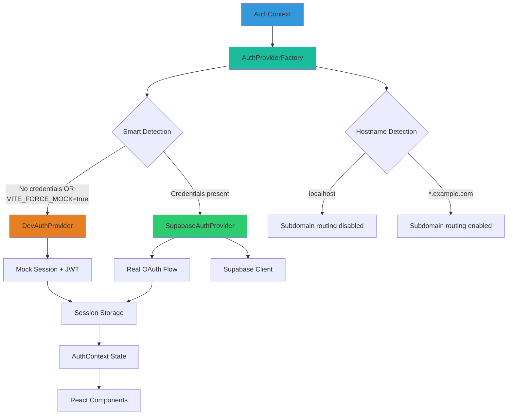
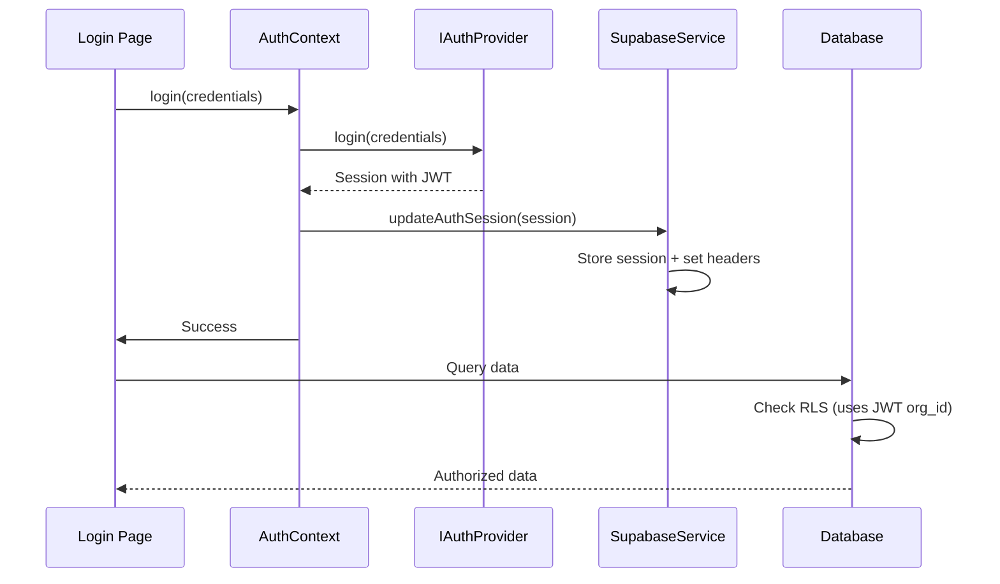

<!-- TL;DR-START -->
## TL;DR

**Summary**: Smart detection authentication system using dependency injection with `IAuthProvider` interface. Auth mode is auto-detected: credentials present = real Supabase auth, credentials missing = mock auth. Subdomain routing disabled on localhost.

**When to read**:
- Setting up local development authentication
- Adding new OAuth providers
- Testing permission-based UI components
- Understanding JWT custom claims (`org_id`, `permissions`, `user_role`, `scope_path`)

**Prerequisites**: Familiarity with React context, JWT tokens

**Key topics**: `authentication`, `oauth`, `jwt`, `mock-auth`, `supabase-auth`, `dependency-injection`, `smart-detection`

**Estimated read time**: 15 minutes
<!-- TL;DR-END -->

# Frontend Authentication Architecture

**Status**: ✅ Implemented
**Component**: React Frontend
**Migration**: Zitadel → Supabase Auth (Complete)

---

## Table of Contents

1. [Overview](#overview)
2. [Architecture Principles](#architecture-principles)
3. [Smart Detection Authentication System](#smart-detection-authentication-system)
4. [Provider Interface Pattern](#provider-interface-pattern)
5. [Implementation Details](#implementation-details)
6. [Session Management](#session-management)
7. [Organization Context](#organization-context)
8. [Testing Strategy](#testing-strategy)
9. [Migration Notes](#migration-notes)

---

## Overview

The frontend authentication system uses a **dependency injection pattern** with **smart detection** to automatically determine the authentication mode based on runtime conditions.

### Key Features

- ✅ **Interface-based design**: All auth providers implement `IAuthProvider`
- ✅ **Smart detection**: Auth mode auto-detected from credentials and hostname
- ✅ **Two modes**: Mock (no credentials) and Real (Supabase credentials present)
- ✅ **Complete JWT claims**: Mock mode includes full RBAC/RLS structure
- ✅ **Localhost awareness**: Subdomain routing disabled on localhost
- ✅ **Single escape hatch**: `VITE_FORCE_MOCK=true` to force mock mode

### Architecture Diagram



---

## Architecture Principles

### 1. Dependency Injection

All authentication is accessed through the `IAuthProvider` interface, never concrete implementations.

```typescript
// ✅ GOOD - Uses interface
const authProvider = getAuthProvider();
const user = await authProvider.getUser();

// ❌ BAD - Direct dependency on implementation
import { SupabaseAuthProvider } from './SupabaseAuthProvider';
const provider = new SupabaseAuthProvider();
```

### 2. Single Responsibility

Each provider handles **only** authentication concerns:
- DevAuthProvider: Instant mock authentication
- SupabaseAuthProvider: Real OAuth and session management
- AuthProviderFactory: Provider selection and singleton management

### 3. Consistent Session Model

Both providers return the same `Session` type with complete JWT claims structure:

```typescript
interface Session {
  access_token: string;
  refresh_token?: string;
  user: User;
  claims: JWTClaims;  // Always present, even in mock mode
}
```

---

## Smart Detection Authentication System

### How It Works

Authentication mode is **automatically detected** at runtime—no mode variable required:

```typescript
// frontend/src/config/deployment.config.ts
function detectEnvironment(): RuntimeEnvironment {
  return {
    hasSupabaseCredentials: !!import.meta.env.VITE_SUPABASE_URL,
    isLocalhost: isLocalhost(),
    isProductionBuild: import.meta.env.PROD === true,
    forceMock: import.meta.env.VITE_FORCE_MOCK === 'true',
  };
}

// Auth mode: real if credentials present AND not forcing mock
const useRealServices = env.hasSupabaseCredentials && !env.forceMock;
```

### Detection Matrix

| Scenario | Credentials | Hostname | Result |
|----------|-------------|----------|--------|
| `npm run dev` | Present | localhost | Real auth, NO subdomain redirect |
| `npm run dev` | Missing | localhost | Mock auth, NO subdomain redirect |
| `npm run dev:mock` | Present | localhost | Mock auth (forced), NO subdomain redirect |
| Production build | Present | *.example.com | Real auth, subdomain redirect enabled |

### Mode Comparison

| Feature | Mock Mode | Real Mode |
|---------|-----------|-----------|
| **Provider** | DevAuthProvider | SupabaseAuthProvider |
| **OAuth Flow** | ❌ Instant | ✅ Real |
| **JWT Claims** | ✅ Full Mock | ✅ Real from DB |
| **Network Calls** | ❌ None | ✅ Real |
| **Login Speed** | Instant | 2-5 seconds |
| **Use Case** | UI development | Auth testing & Production |
| **Database** | ❌ No RLS enforcement | ✅ RLS enforced |
| **Triggered by** | No credentials OR `VITE_FORCE_MOCK=true` | Credentials present |

### Mock Mode (No Credentials)

**Purpose**: Rapid UI iteration without authentication delays

**npm script**:
```bash
npm run dev        # Auto-detects mock mode (no credentials)
npm run dev:mock   # Forces mock mode even with credentials
```

**Behavior**:
- ✅ Instant login (no network calls)
- ✅ Any email/password accepted
- ✅ OAuth buttons work instantly
- ✅ Complete JWT claims for RLS testing
- ✅ Customizable test user profiles
- ⚠️ No real authentication validation
- ⚠️ Database RLS not enforced (mock org_id used)

**Configuration** (`.env.local`—without Supabase credentials):
```bash
# No VITE_SUPABASE_URL → auto-detects mock mode

# Optional: Customize mock user
VITE_DEV_USER_EMAIL=dev@example.com
VITE_DEV_USER_ROLE=provider_admin
VITE_DEV_ORG_ID=dev-org-uuid
VITE_DEV_SCOPE_PATH=org_dev_organization

# Or use predefined profiles
VITE_DEV_PROFILE=super_admin  # or provider_admin, clinician, viewer
```

**Visual Indicator**: Mock mode shows banner in UI:
```
ℹ️ Mock Authentication Mode
Using instant authentication for development.
Any credentials will work.
```

### Real Mode (Credentials Present)

**Purpose**: Test full authentication stack locally, or production use

**npm script**:
```bash
npm run dev        # Auto-detects real mode (credentials present)
npm run build      # Production build
npm run preview    # Test production build locally
```

**Behavior**:
- ✅ Real OAuth redirects (Google, GitHub, etc.)
- ✅ Real JWT tokens from Supabase
- ✅ Custom claims from database hook
- ✅ RLS policies enforced
- ✅ Organization switching with JWT refresh
- ✅ Stays on localhost (no subdomain redirect in development)
- ⚠️ Requires OAuth provider configuration

**Configuration** (`.env.local`—with Supabase credentials):
```bash
# Presence of credentials → auto-detects real mode
VITE_SUPABASE_URL=https://your-project.supabase.co
VITE_SUPABASE_ANON_KEY=your-anon-key
VITE_BACKEND_API_URL=https://api-a4c.firstovertheline.com
VITE_DEBUG_MOBX=false
```

---

## Provider Interface Pattern

### IAuthProvider Interface

All authentication providers implement this contract:

**Location**: `src/services/auth/IAuthProvider.ts`

```typescript
export interface IAuthProvider {
  // Authentication
  login(credentials: LoginCredentials): Promise<Session>;
  loginWithOAuth(provider: OAuthProvider, options?: OAuthOptions): Promise<Session | void>;
  logout(): Promise<void>;

  // Session Management
  getSession(): Promise<Session | null>;
  getUser(): Promise<User | null>;
  refreshSession(): Promise<Session>;

  // Authorization
  hasPermission(permission: string): Promise<PermissionCheckResult>;
  hasRole(role: string): Promise<boolean>;

  // Organization
  switchOrganization(orgId: string): Promise<Session>;

  // OAuth Callback
  handleOAuthCallback(callbackUrl: string): Promise<Session>;

  // Lifecycle
  initialize(): Promise<void>;
  isInitialized(): boolean;
}
```

### Type Definitions

**Location**: `src/types/auth.types.ts`

```typescript
export type UserRole =
  | 'super_admin'
  | 'provider_admin'
  | 'clinician'
  | 'nurse'
  | 'viewer';

export interface JWTClaims {
  sub: string;                    // User UUID
  email: string;
  org_id: string;                 // Organization UUID
  user_role: UserRole;
  permissions: Permission[];       // Array of permission strings
  scope_path: string;             // ltree path for hierarchical scope
  iat?: number;
  exp?: number;
}

export interface Session {
  access_token: string;
  refresh_token?: string;
  user: User;
  claims: JWTClaims;
}

export interface User {
  id: string;
  email: string;
  name: string;
  picture?: string;
  metadata?: Record<string, any>;
}
```

---

## Implementation Details

### File Structure

```
src/
├── services/
│   └── auth/
│       ├── IAuthProvider.ts              # Interface definition
│       ├── DevAuthProvider.ts            # Mock provider
│       ├── SupabaseAuthProvider.ts       # Real provider
│       ├── AuthProviderFactory.ts        # Singleton factory
│       └── supabase.service.ts           # Supabase client
├── config/
│   └── dev-auth.config.ts                # Mock user profiles
├── contexts/
│   └── AuthContext.tsx                   # React context
├── types/
│   └── auth.types.ts                     # Shared types
└── pages/
    └── auth/
        ├── LoginPage.tsx                 # Login UI
        └── AuthCallback.tsx              # OAuth callback handler
```

### DevAuthProvider (Mock Mode)

**Location**: `src/services/auth/DevAuthProvider.ts`

**Key Features**:
- Instant authentication (no async delays)
- Complete JWT claims structure for RLS testing
- Predefined user profiles (super_admin, provider_admin, etc.)
- Customizable via environment variables
- Permission checking works identically to production

**Implementation Highlights**:

```typescript
export class DevAuthProvider implements IAuthProvider {
  private currentSession: Session | null = null;
  private config: DevAuthConfig;

  async login(credentials: LoginCredentials): Promise<Session> {
    // Instant login - any credentials accepted
    this.currentSession = createMockSession(this.config.profile);
    return this.currentSession;
  }

  async loginWithOAuth(provider: OAuthProvider): Promise<Session> {
    // No actual OAuth - instant mock session
    return createMockSession(this.config.profile);
  }

  async hasPermission(permission: string): Promise<PermissionCheckResult> {
    const hasPermission = this.currentSession?.claims.permissions
      .includes(permission) ?? false;
    return { hasPermission };
  }

  async switchOrganization(orgId: string): Promise<Session> {
    // Update mock session with new org
    this.currentSession = createMockSession({
      ...this.config.profile,
      org_id: orgId,
    });
    return this.currentSession;
  }
}
```

### SupabaseAuthProvider (Real Mode)

**Location**: `src/services/auth/SupabaseAuthProvider.ts`

**Key Features**:
- Real OAuth flows with redirect
- JWT decoding to extract custom claims
- Session refresh handling
- Organization switching triggers JWT refresh
- Permission checking via JWT claims

**Implementation Highlights**:

```typescript
export class SupabaseAuthProvider implements IAuthProvider {
  private client: SupabaseClient;
  private currentSession: Session | null = null;

  async loginWithOAuth(
    provider: OAuthProvider,
    options?: OAuthOptions
  ): Promise<Session | void> {
    // Initiates real OAuth redirect
    await this.client.auth.signInWithOAuth({
      provider,
      options: {
        redirectTo: options?.redirectTo || `${window.location.origin}/auth/callback`,
        scopes: options?.scopes,
      },
    });
    // Browser redirects - no return value
  }

  async handleOAuthCallback(callbackUrl: string): Promise<Session> {
    // Supabase automatically exchanges code for session
    const { data, error } = await this.client.auth.getSession();
    if (error || !data.session) throw error || new Error('No session');

    return this.convertSupabaseSession(data.session);
  }

  private convertSupabaseSession(supabaseSession: SupabaseSession): Session {
    const claims = this.decodeJWT(supabaseSession.access_token);

    return {
      access_token: supabaseSession.access_token,
      refresh_token: supabaseSession.refresh_token,
      user: {
        id: supabaseSession.user.id,
        email: supabaseSession.user.email!,
        name: supabaseSession.user.user_metadata.name || supabaseSession.user.email!,
        picture: supabaseSession.user.user_metadata.avatar_url,
      },
      claims,
    };
  }

  private decodeJWT(token: string): JWTClaims {
    const payload = JSON.parse(atob(token.split('.')[1]));

    return {
      sub: payload.sub,
      email: payload.email,
      org_id: payload.org_id,
      user_role: payload.user_role,
      permissions: payload.permissions || [],
      scope_path: payload.scope_path,
      iat: payload.iat,
      exp: payload.exp,
    };
  }

  async switchOrganization(orgId: string): Promise<Session> {
    // Trigger session refresh to get new JWT with updated org_id
    const { data, error } = await this.client.auth.refreshSession();
    if (error || !data.session) throw error || new Error('Refresh failed');

    return this.convertSupabaseSession(data.session);
  }
}
```

### AuthProviderFactory

**Location**: `src/services/auth/AuthProviderFactory.ts`

**Purpose**: Single point of provider selection and singleton management

```typescript
let authProviderInstance: IAuthProvider | null = null;

export function createAuthProvider(): IAuthProvider {
  const provider = import.meta.env.VITE_AUTH_PROVIDER ||
    (import.meta.env.PROD ? 'supabase' : 'mock');

  switch (provider) {
    case 'mock':
      return new DevAuthProvider(getDevAuthConfig());

    case 'supabase':
      return new SupabaseAuthProvider({
        supabaseUrl: import.meta.env.VITE_SUPABASE_URL!,
        supabaseAnonKey: import.meta.env.VITE_SUPABASE_ANON_KEY!,
      });

    default:
      throw new Error(`Unknown auth provider: ${provider}`);
  }
}

export function getAuthProvider(): IAuthProvider {
  if (!authProviderInstance) {
    authProviderInstance = createAuthProvider();
  }
  return authProviderInstance;
}

export function getAuthProviderType(): 'mock' | 'supabase' {
  return import.meta.env.VITE_AUTH_PROVIDER ||
    (import.meta.env.PROD ? 'supabase' : 'mock');
}

export function isMockAuth(): boolean {
  return getAuthProviderType() === 'mock';
}
```

### AuthContext Integration

**Location**: `src/contexts/AuthContext.tsx`

```typescript
export const AuthProvider: React.FC<AuthProviderProps> = ({
  children,
  authProvider: injectedProvider
}) => {
  // Use injected provider (for testing) or singleton
  const authProvider = injectedProvider || getAuthProvider();

  const login = async (credentials: LoginCredentials): Promise<void> => {
    setAuthState({ ...authState, loading: true });

    const session = await authProvider.login(credentials);

    // Update Supabase service with session
    await supabaseService.updateAuthSession(session);

    setAuthState({
      isAuthenticated: true,
      user: session.user,
      session,
      loading: false,
      error: null,
    });
  };

  const hasPermission = async (permission: string): Promise<boolean> => {
    const result = await authProvider.hasPermission(permission);
    return result.hasPermission;
  };

  const switchOrganization = async (orgId: string): Promise<void> => {
    const session = await authProvider.switchOrganization(orgId);
    await supabaseService.updateAuthSession(session);

    setAuthState({
      ...authState,
      session,
    });
  };

  // ... more methods
};
```

### Mock User Configuration

**Location**: `src/config/dev-auth.config.ts`

Provides predefined user profiles for common testing scenarios:

```typescript
export const PREDEFINED_PROFILES: Record<string, DevUserProfile> = {
  super_admin: {
    id: 'super-admin-uuid',
    email: 'superadmin@example.com',
    name: 'Super Admin',
    role: 'super_admin',
    org_id: 'platform-org-uuid',
    org_name: 'Platform Administration',
    scope_path: 'org_platform',
    permissions: getAllPermissions(),
  },

  provider_admin: {
    id: 'provider-admin-uuid',
    email: 'admin@acmehealthcare.com',
    name: 'Provider Admin',
    role: 'provider_admin',
    org_id: 'acme-org-uuid',
    org_name: 'Acme Healthcare',
    scope_path: 'org_acme_healthcare',
    permissions: getProviderAdminPermissions(),
  },

  clinician: {
    id: 'clinician-uuid',
    email: 'doctor@acmehealthcare.com',
    name: 'Dr. Smith',
    role: 'clinician',
    org_id: 'acme-org-uuid',
    org_name: 'Acme Healthcare',
    scope_path: 'org_acme_healthcare.facility_a',
    permissions: getClinicianPermissions(),
  },

  viewer: {
    id: 'viewer-uuid',
    email: 'viewer@acmehealthcare.com',
    name: 'Read Only User',
    role: 'viewer',
    org_id: 'acme-org-uuid',
    org_name: 'Acme Healthcare',
    scope_path: 'org_acme_healthcare',
    permissions: getViewerPermissions(),
  },
};

export function createMockSession(profile: DevUserProfile): Session {
  return {
    access_token: `mock_token_${profile.id}`,
    user: {
      id: profile.id,
      email: profile.email,
      name: profile.name,
    },
    claims: {
      sub: profile.id,
      email: profile.email,
      org_id: profile.org_id,
      user_role: profile.role,
      permissions: profile.permissions,
      scope_path: profile.scope_path,
      iat: Date.now() / 1000,
      exp: Date.now() / 1000 + 3600,
    },
  };
}
```

---

## Session Management

### Session Storage

Both providers store sessions consistently:

```typescript
class SupabaseService {
  private currentSession: Session | null = null;

  async updateAuthSession(session: Session | null): Promise<void> {
    this.currentSession = session;

    if (session?.access_token) {
      // Update Supabase client headers
      (this.client as any).rest.headers = {
        Authorization: `Bearer ${session.access_token}`,
        'X-Organization-Id': session.claims.org_id,
        'X-User-Role': session.claims.user_role,
      };
    }
  }
}
```

### Session Lifecycle



### Session Refresh

Supabase Auth automatically refreshes tokens:

```typescript
// Configured in SupabaseAuthProvider constructor
const client = createClient(url, key, {
  auth: {
    autoRefreshToken: true,        // Refresh before expiry
    persistSession: true,           // Store in localStorage
    detectSessionInUrl: true,       // Handle OAuth callback
  },
});

// Manual refresh
const session = await authProvider.refreshSession();
await supabaseService.updateAuthSession(session);
```

### Session Access in Services

> **⚠️ CRITICAL: Always Use `client.auth.getSession()`**
>
> When services need session data (especially `org_id` for RLS queries), they must retrieve the session
> directly from Supabase's auth client. **Never rely on manually cached sessions** - this has caused
> critical bugs where services returned empty results because the cache was never populated.

**Correct Pattern for Service Classes:**

```typescript
// ✅ CORRECT: Retrieve session from Supabase client
async getUsersPaginated(): Promise<PaginatedResult<UserListItem>> {
  const client = supabaseService.getClient();

  // Always get session from Supabase - it manages auth state automatically
  const { data: { session } } = await client.auth.getSession();
  if (!session) {
    log.error('No authenticated session');
    return { items: [], totalCount: 0 };
  }

  // Decode JWT to extract custom claims
  const claims = this.decodeJWT(session.access_token);
  if (!claims.org_id) {
    log.error('No organization context');
    return { items: [], totalCount: 0 };
  }

  // Use claims.org_id for organization-scoped queries
}
```

**JWT Claims Decoding Helper:**

Every service that needs JWT claims should include this helper method:

```typescript
interface DecodedJWTClaims {
  org_id?: string;
  user_role?: string;
  permissions?: string[];
  sub?: string;
}

private decodeJWT(token: string): DecodedJWTClaims {
  try {
    const payload = token.split('.')[1];
    const decoded = JSON.parse(globalThis.atob(payload));
    return {
      org_id: decoded.org_id,
      user_role: decoded.user_role,
      permissions: decoded.permissions || [],
      sub: decoded.sub,
    };
  } catch {
    return {};
  }
}
```

**Why This Pattern is Required:**

1. **Supabase manages session state automatically** - After login, the client has the session
2. **Manual caches require explicit population** - If `updateAuthSession()` is never called, the cache stays null
3. **Silent failures** - Services using empty caches return empty arrays instead of erroring
4. **Consistency** - All services should use the same pattern for predictable behavior

**Anti-Pattern (Do NOT Use):**

```typescript
// ❌ WRONG: Manual session cache - will fail silently
const session = supabaseService.getCurrentSession();  // Returns NULL!
if (!session?.claims.org_id) {
  return { items: [] };  // Silent failure
}
```

---

## Organization Context

### Organization Service Integration

**Location**: `src/services/organization/ProductionOrganizationService.ts`

```typescript
export class ProductionOrganizationService implements IOrganizationService {
  async getCurrentOrganizationId(): Promise<string> {
    const client = supabaseService.getClient();

    // Get session directly from Supabase client
    const { data: { session } } = await client.auth.getSession();
    if (!session) {
      throw new Error('No authenticated user - cannot determine organization context');
    }

    // Decode JWT to get org_id
    const claims = this.decodeJWT(session.access_token);
    if (!claims.org_id) {
      throw new Error('User has no organization context');
    }

    return claims.org_id;
  }
}
```

### Using Organization Context in Components

```typescript
const MedicationList: React.FC = () => {
  const { session } = useAuth();
  const [medications, setMedications] = useState([]);

  useEffect(() => {
    const loadMedications = async () => {
      // RLS automatically filters by session.claims.org_id
      const data = await supabaseService.query('medications')
        .select('*')
        .execute();

      setMedications(data);
    };

    loadMedications();
  }, [session?.claims.org_id]);

  return (
    <div>
      <h2>Organization: {session?.claims.org_id}</h2>
      {medications.map(med => <MedicationCard key={med.id} {...med} />)}
    </div>
  );
};
```

---

## Testing Strategy

### Unit Testing with Mock Provider

```typescript
import { render, screen } from '@testing-library/react';
import { AuthProvider } from '@/contexts/AuthContext';
import { DevAuthProvider } from '@/services/auth/DevAuthProvider';
import { PREDEFINED_PROFILES } from '@/config/dev-auth.config';

describe('Protected Component', () => {
  it('renders for authenticated user', async () => {
    const mockProvider = new DevAuthProvider({
      profile: PREDEFINED_PROFILES.provider_admin,
    });

    render(
      <AuthProvider authProvider={mockProvider}>
        <ProtectedComponent />
      </AuthProvider>
    );

    expect(screen.getByText('Welcome, Provider Admin')).toBeInTheDocument();
  });
});
```

### E2E Testing with Playwright

```typescript
import { test, expect } from '@playwright/test';

test.describe('Authentication Flow', () => {
  test('mock mode allows instant login', async ({ page }) => {
    // Start in mock mode
    await page.goto('http://localhost:5173');

    // Mock auth banner should be visible
    await expect(page.getByText('Mock Authentication Mode')).toBeVisible();

    // Any credentials work
    await page.fill('#email', 'test@example.com');
    await page.fill('#password', 'any-password');
    await page.click('button[type="submit"]');

    // Should redirect to clients page instantly
    await expect(page).toHaveURL(/\/clients/);
  });

  test('integration mode requires real OAuth', async ({ page }) => {
    // Set integration mode via environment
    // npm run test:e2e:integration

    await page.goto('http://localhost:5173');

    // No mock banner
    await expect(page.getByText('Mock Authentication Mode')).not.toBeVisible();

    // Click Google OAuth
    await page.click('button:has-text("Continue with Google")');

    // Should redirect to Google OAuth page
    await expect(page).toHaveURL(/accounts.google.com/);
  });
});
```

### Permission Testing

```typescript
describe('Permission Checks', () => {
  it('allows admin to create medications', async () => {
    const adminProvider = new DevAuthProvider({
      profile: PREDEFINED_PROFILES.provider_admin,
    });

    const hasPermission = await adminProvider.hasPermission('medication.create');
    expect(hasPermission.hasPermission).toBe(true);
  });

  it('blocks viewer from creating medications', async () => {
    const viewerProvider = new DevAuthProvider({
      profile: PREDEFINED_PROFILES.viewer,
    });

    const hasPermission = await viewerProvider.hasPermission('medication.create');
    expect(hasPermission.hasPermission).toBe(false);
  });
});
```

---

## Migration Notes

### Zitadel → Supabase Auth Migration

**Completed**: 2025-10-27

#### Files Removed
- `src/services/auth/zitadel.service.ts`
- `src/hooks/useZitadelAdmin.tsx`
- `src/hooks/useZitadelManagementRole.tsx`
- `src/pages/admin/BootstrapPage.tsx`
- `src/services/bootstrap/zitadel-bootstrap.service.ts`
- `src/services/providers/zitadel-provider.service.ts`

#### Dependencies Removed
- `@zitadel/react`
- `oidc-client-ts`

#### Key Changes
1. **AuthCallback.tsx**: Now uses `IAuthProvider` interface instead of `zitadelService`
2. **ProductionOrganizationService.ts**: Uses auth provider instead of Zitadel service
3. **MedicationManagementViewModel.ts**: Replaced `zitadelService.getUser()` with auth provider
4. **ProviderFormViewModel.ts**: Removed Zitadel organization creation

#### Breaking Changes
- Bootstrap page removed (role management moved to database)
- Organization creation workflow needs Temporal implementation
- User invitation system requires new implementation

#### Migration Path for Existing Code
```typescript
// OLD: Zitadel Service
import { zitadelService } from '@/services/auth/zitadel.service';
const user = await zitadelService.getUser();

// NEW: Auth Provider
import { getAuthProvider } from '@/services/auth/AuthProviderFactory';
const authProvider = getAuthProvider();
const user = await authProvider.getUser();
```

---

## Related Documentation

### Authentication & Authorization
- **Custom Claims Setup**: [../authentication/custom-claims-setup.md](./custom-claims-setup.md) - JWT custom claims configuration
- **Enterprise SSO Guide**: [../authentication/enterprise-sso-guide.md](./enterprise-sso-guide.md) - SAML 2.0 integration (aspirational)
- **RBAC Architecture**: [../authorization/rbac-architecture.md](../authorization/rbac-architecture.md) - Role-based access control
- **RBAC Implementation**: [../authorization/rbac-implementation-guide.md](../authorization/rbac-implementation-guide.md) - Permission system details

### Multi-Tenancy & Data
- **Multi-Tenancy Architecture**: [../data/multi-tenancy-architecture.md](../data/multi-tenancy-architecture.md) - Organization isolation with RLS
- **Event Sourcing Overview**: [../data/event-sourcing-overview.md](../data/event-sourcing-overview.md) - CQRS and domain events

### Infrastructure & Configuration
- **Supabase Auth Setup**: [../../infrastructure/guides/supabase/JWT-CLAIMS-SETUP.md](../../infrastructure/guides/supabase/JWT-CLAIMS-SETUP.md) - Database hooks
- **Environment Variables**: [../../infrastructure/operations/configuration/ENVIRONMENT_VARIABLES.md](../../infrastructure/operations/configuration/ENVIRONMENT_VARIABLES.md) - Configuration reference

### Frontend Implementation
- **Frontend CLAUDE.md**: [../../../frontend/CLAUDE.md](../../../frontend/CLAUDE.md) - Development guidelines
- **Frontend Getting Started**: [../../frontend/getting-started/overview.md](../../frontend/getting-started/overview.md) - Setup and onboarding

---

**Document Version**: 1.0
**Last Updated**: 2025-10-27
**Status**: Implementation Complete
