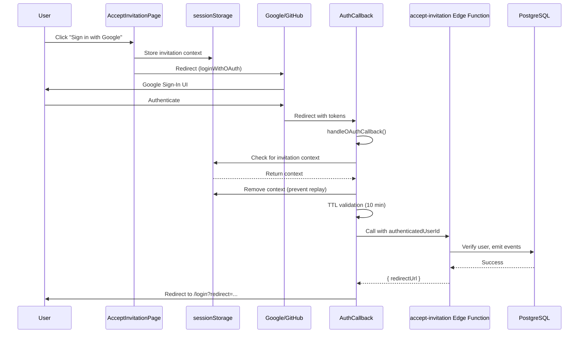

<!-- TL;DR-START -->
## TL;DR

**Summary**: OAuth flow for accepting organization invitations. Users click OAuth button, context is stored in sessionStorage, OAuth redirect occurs, AuthCallback detects context and completes invitation acceptance via Edge Function.

**When to read**:
- Implementing OAuth for invitation acceptance
- Debugging "OAuth acceptance not yet implemented" error
- Understanding invitation flow with authenticated users
- Adding support for new OAuth providers

**Prerequisites**: [Frontend Auth Architecture](frontend-auth-architecture.md), familiarity with OAuth redirect flows

**Key topics**: `oauth`, `invitation`, `authentication`, `sessionStorage`, `edge-function`, `accept-invitation`

**Estimated read time**: 10 minutes
<!-- TL;DR-END -->

# OAuth Invitation Acceptance

**Status**: ✅ Implemented
**Component**: Frontend + Edge Functions
**Implemented**: 2026-01-09

---

## Table of Contents

1. [Overview](#overview)
2. [Flow Diagram](#flow-diagram)
3. [Implementation Details](#implementation-details)
4. [Storage Abstraction](#storage-abstraction)
5. [AuthCallback Processing](#authcallback-processing)
6. [Error Handling](#error-handling)
7. [Tracing Strategy](#tracing-strategy)
8. [Testing](#testing)

---

## Overview

When users accept an organization invitation via OAuth (Google, GitHub, etc.), the flow is:

1. User clicks OAuth provider button on `AcceptInvitationPage`
2. Invitation context is stored in sessionStorage
3. OAuth redirect to provider (Google, etc.)
4. User authenticates with provider
5. Redirect back to `/auth/callback`
6. `AuthCallback` detects invitation context
7. `AuthCallback` calls `accept-invitation` Edge Function with authenticated user
8. Redirect to login with organization subdomain URL

### Why Not Direct Edge Function Call?

OAuth requires a browser redirect flow. The Edge Function cannot initiate OAuth - only the browser can. The previous implementation returned a 501 error because it tried to call the Edge Function directly for OAuth.

### Key Design Decisions

| Decision | Rationale |
|----------|-----------|
| Store context in sessionStorage | Survives OAuth redirect, cleared on tab close |
| TTL validation (10 min) | Prevents stale context from being processed |
| No X-Correlation-ID header | Backend uses stored `invitation.correlation_id` for business transaction continuity |
| Platform-agnostic storage | Supports future mobile implementations (React Native) |

---

## Flow Diagram



---

## Implementation Details

### AcceptInvitationPage + ViewModel

The ViewModel stores invitation context and initiates OAuth:

```typescript
// InvitationAcceptanceViewModel.ts
async acceptWithOAuth(provider: OAuthProvider, authProvider: IAuthProvider): Promise<void> {
  const storage = getAuthContextStorage();

  // Store context BEFORE OAuth redirect
  const invitationContext: InvitationAuthContext = {
    token: this.token,
    email: this.email,
    flow: 'invitation_acceptance',
    authMethod: { type: 'oauth', provider },
    platform: detectPlatform(),
    createdAt: Date.now(),  // For TTL validation
  };

  await storage.setItem('invitation_acceptance_context', JSON.stringify(invitationContext));

  // Initiate OAuth redirect - page will be unloaded
  await authProvider.loginWithOAuth(provider, {
    redirectTo: getCallbackUrl(platform),
  });
}
```

### InvitationAuthContext Type

```typescript
// types/auth.types.ts
export interface InvitationAuthContext {
  token: string;               // Invitation token from URL
  email: string;               // User's email
  flow: 'invitation_acceptance';
  authMethod: AuthMethod;      // { type: 'oauth', provider: 'google' }
  platform: 'web' | 'ios' | 'android';
  createdAt: number;           // Timestamp for TTL validation
}
```

### AuthMethod Discriminated Union

```typescript
export type AuthMethod =
  | { type: 'email_password' }
  | { type: 'oauth'; provider: OAuthProvider }
  | { type: 'sso'; config: SSOConfig };

export type OAuthProvider =
  | 'google'
  | 'github'
  | 'facebook'
  | 'apple'
  | 'azure'
  | 'okta'
  | 'keycloak';
```

---

## Storage Abstraction

The storage abstraction supports web and future mobile platforms:

```typescript
// services/storage/AuthContextStorage.ts
export interface IAuthContextStorage {
  setItem(key: string, value: string): Promise<void>;
  getItem(key: string): Promise<string | null>;
  removeItem(key: string): Promise<void>;
}

// Web implementation
export class WebAuthContextStorage implements IAuthContextStorage {
  async setItem(key: string, value: string): Promise<void> {
    sessionStorage.setItem(key, value);
  }
  // ...
}

// Mobile placeholder (React Native)
export class MobileAuthContextStorage implements IAuthContextStorage {
  async setItem(key: string, value: string): Promise<void> {
    // TODO: Use expo-secure-store or @react-native-async-storage
    throw new Error('Mobile storage not yet implemented');
  }
  // ...
}
```

### Platform Detection

```typescript
// utils/platform.ts
export function detectPlatform(): Platform {
  if (typeof navigator !== 'undefined' && navigator.product === 'ReactNative') {
    return 'ios'; // Or 'android' based on RN Platform
  }
  return 'web';
}

export function getCallbackUrl(platform?: Platform): string {
  const p = platform || detectPlatform();
  switch (p) {
    case 'web':
      return `${window.location.origin}/auth/callback`;
    case 'ios':
    case 'android':
      return 'a4c://auth/callback';  // Deep link scheme
  }
}
```

---

## AuthCallback Processing

After OAuth completes, `AuthCallback` detects and processes invitation context:

```typescript
// AuthCallback.tsx - processCallback()
const storage = getAuthContextStorage();
const invitationContextStr = await storage.getItem(INVITATION_CONTEXT_KEY);

if (invitationContextStr) {
  // Clear immediately to prevent replay attacks
  await storage.removeItem(INVITATION_CONTEXT_KEY);

  const invitationContext = JSON.parse(invitationContextStr);

  // TTL check (10 minutes)
  const age = Date.now() - invitationContext.createdAt;
  if (age > CONTEXT_TTL_MS) {
    setError({ message: 'Session expired. Please try again.' });
    return;
  }

  if (invitationContext.flow === 'invitation_acceptance') {
    const result = await completeOAuthInvitationAcceptance(invitationContext);
    // Handle result...
  }
}
```

### Edge Function Call

```typescript
async function completeOAuthInvitationAcceptance(
  context: InvitationAuthContext
): Promise<InvitationAcceptanceResult> {
  const client = supabaseService.getClient();
  const { data: { session } } = await client.auth.getSession();

  // Generate tracing headers (NOT correlation ID)
  const { header: traceparent, traceId, spanId } = generateTraceparent();
  const sessionId = await getSessionId();

  const headers: Record<string, string> = {
    traceparent,
    // NOTE: Do NOT include X-Correlation-ID
    // Backend reuses invitation.correlation_id for business continuity
  };

  if (sessionId) {
    headers['X-Session-ID'] = sessionId;
  }

  const { data, error } = await client.functions.invoke('accept-invitation', {
    body: {
      token: context.token,
      credentials: {
        email: session.user.email,
        authMethod: context.authMethod,
        authenticatedUserId: session.user.id,  // Pre-authenticated!
      },
      platform: context.platform,
    },
    headers,
  });

  // Handle response...
}
```

---

## Error Handling

### Error Display with Correlation ID

Errors are displayed using `ErrorWithCorrelation` component for support tickets:

```tsx
if (error) {
  return (
    <ErrorWithCorrelation
      title="Authentication Failed"
      message={error.message}
      correlationId={error.correlationId}
      traceId={error.traceId}
      onDismiss={() => navigate('/login')}
    />
  );
}
```

### Error Scenarios

| Scenario | Error Message | Resolution |
|----------|---------------|------------|
| Context expired (>10 min) | "Session expired" | Restart invitation acceptance |
| Email mismatch | "Google account doesn't match invitation" | Use correct account |
| No authenticated session | "No authenticated session" | OAuth failed, retry |
| Invitation already accepted | "Already accepted" | Login normally |
| Invitation expired | "Invitation expired" | Request new invitation |

---

## Tracing Strategy

### Headers Sent to Edge Function

| Header | Purpose | Source |
|--------|---------|--------|
| `traceparent` | W3C distributed tracing | Generated per request |
| `X-Session-ID` | User auth session | From JWT claims |

### Headers NOT Sent

| Header | Reason |
|--------|--------|
| `X-Correlation-ID` | Backend uses stored `invitation.correlation_id` |

This ensures the entire invitation lifecycle (create → resend → accept) shares the same `correlation_id` for querying:

```sql
SELECT event_type, created_at FROM domain_events
WHERE correlation_id = 'abc-123'::uuid ORDER BY created_at;
-- user.invited → invitation.resent → invitation.accepted (same ID)
```

---

## Testing

### Manual Testing Checklist

- [ ] New user accepts invitation via Google OAuth (web)
- [ ] Existing user (other org) joins new org via OAuth
- [ ] Email mismatch shows clear error with provider name
- [ ] Email/password still works (no regression)
- [ ] Context expires after 10 minutes (shows error)
- [ ] Events include `auth_provider` and `platform` fields

### Test Scenarios

```typescript
// E2E test example
test('OAuth invitation acceptance', async ({ page }) => {
  // 1. Navigate to invitation URL
  await page.goto('/accept-invitation?token=test-token');

  // 2. Select Google OAuth
  await page.click('button:has-text("Google")');

  // 3. Complete OAuth (mocked in test)
  // ...

  // 4. Verify redirect to login with subdomain URL
  await expect(page).toHaveURL(/\/login\?redirect=/);
});
```

---

## Related Documentation

- [Frontend Auth Architecture](frontend-auth-architecture.md) - Overall auth system
- [Event Metadata Schema](../../workflows/reference/event-metadata-schema.md) - Correlation ID strategy
- [Accept Invitation Edge Function](../../infrastructure/reference/edge-functions/accept-invitation.md) - Backend implementation
- [Supabase Auth Overview](supabase-auth-overview.md) - Supabase Auth configuration
