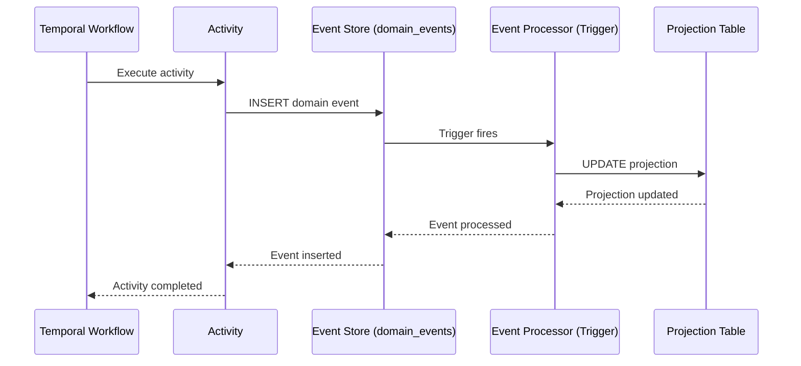

# Temporal.io Integration Overview

**Status**: ✅ Operational (Deployed 2025-10-17)
**Purpose**: Durable workflow orchestration for A4C Platform
**Architecture Pattern**: Workflow-First with Event-Driven Activities

---

## Table of Contents

1. [Overview](#overview)
2. [Why Temporal for A4C](#why-temporal-for-a4c)
3. [Operational Infrastructure](#operational-infrastructure)
4. [Architecture Patterns](#architecture-patterns)
5. [Key Workflows](#key-workflows)
6. [Event-Driven Integration](#event-driven-integration)
7. [Development Workflow](#development-workflow)
8. [Monitoring and Observability](#monitoring-and-observability)

---

## Overview

Temporal.io is a durable workflow orchestration platform that manages complex, long-running business processes with built-in reliability, retries, and observability.

**What Temporal Provides**:
- ✅ **Durable execution**: Workflows survive process crashes and restarts
- ✅ **Automatic retries**: Configurable retry policies for failed activities
- ✅ **Saga pattern**: Built-in compensation for partial failures
- ✅ **Observability**: Complete execution history and workflow replay
- ✅ **Timers and delays**: Durable timers for long-running waits (DNS propagation, email delays)
- ✅ **Versioning**: Safe workflow updates without breaking in-flight executions

**Use Cases in A4C**:
- Organization onboarding and bootstrap
- DNS subdomain provisioning (async with Cloudflare API)
- User invitation workflows
- SSO configuration (future)
- Data migration workflows (future)
- Scheduled reports and data exports (future)

---

## Why Temporal for A4C

### Problem: Complex Asynchronous Workflows

Traditional approaches to organization onboarding:

```typescript
// ❌ ANTI-PATTERN: Brittle async orchestration
async function bootstrapOrganization(orgData) {
  // Step 1: Create org record
  const org = await db.insert('organizations', orgData)

  // Step 2: Configure DNS (async, may take 10+ minutes)
  const dns = await cloudflare.createSubdomain(org.domain)
  // What if this fails after 5 minutes? Partial state!

  // Step 3: Send invitations
  await sendInvitations(org.id, orgData.users)
  // What if process crashes here? Lost progress!

  return org
}
```

**Problems**:
- 🔥 No built-in retries (must implement manually)
- 🔥 Lost progress on crashes (must track state in DB)
- 🔥 Difficult to compensate partial failures (manual rollback logic)
- 🔥 No visibility into execution state (must add logging)
- 🔥 Timeouts hard to manage (DNS propagation takes 5-30 minutes)

### Solution: Temporal Workflow-First Pattern

```typescript
// ✅ CORRECT: Durable Temporal workflow
export async function OrganizationBootstrapWorkflow(
  params: OrganizationBootstrapParams
): Promise<OrganizationBootstrapResult> {

  // Step 1: Create organization via event
  const orgId = await activities.createOrganizationActivity(params.orgData)

  // Step 2: Configure DNS (automatic retries, survives crashes)
  const dnsConfig = await activities.configureDNSActivity({
    orgId,
    subdomain: params.subdomain
  })

  // Wait for DNS propagation (durable timer, survives restarts)
  await sleep('5 minutes')

  // Step 3: Verify DNS propagation (retries until success or timeout)
  await activities.verifyDNSActivity({ domain: dnsConfig.fqdn })

  // Step 4: Send user invitations
  const invitations = await activities.sendInvitationsActivity({
    orgId,
    users: params.users
  })

  return { orgId, dnsConfig, invitations }
}
```

**Benefits**:
- ✅ Automatic retries with exponential backoff
- ✅ Workflow survives process crashes/restarts
- ✅ Durable timers for DNS propagation waits
- ✅ Complete execution history for debugging
- ✅ Easy compensation via Saga pattern
- ✅ Built-in observability (Temporal Web UI)

---

## Operational Infrastructure

### Deployment Details

**Cluster**: Kubernetes (k3s)
**Namespace**: `temporal`
**Deployed**: 2025-10-17 (6+ days uptime)
**Configuration**: Kubernetes manifests (see `infrastructure/k8s/temporal/`)

### Connection Information

| Component | Address | Purpose |
|-----------|---------|---------|
| **Temporal Frontend** | `temporal-frontend.temporal.svc.cluster.local:7233` | gRPC API for workers and clients |
| **Temporal Web UI** | `temporal-web:8080` (port-forward) | Workflow execution visualization |
| **Namespace** | `default` | Logical isolation for workflows |
| **Task Queue** | `bootstrap` | Primary queue for organization workflows |

### Access Temporal Web UI

```bash
# Port-forward to access Web UI locally
kubectl port-forward -n temporal svc/temporal-web 8080:8080

# Open in browser
open http://localhost:8080
```

**Web UI Features**:
- View running workflows
- Inspect workflow history and events
- Replay workflows for debugging
- Query workflow state
- Terminate stuck workflows

### Port-Forward Temporal Frontend (for local development)

```bash
# Allow local workers to connect to cluster
kubectl port-forward -n temporal svc/temporal-frontend 7233:7233

# Workers connect to localhost:7233 instead of cluster address
```

---

## Architecture Patterns

### Workflow-First Pattern

**Pattern**: Workflows orchestrate all steps; activities perform side effects and emit events.


**Key Principles**:
1. **Workflows = Orchestration**
   - Workflows decide WHAT to do and WHEN
   - Workflows are deterministic (pure logic, no side effects)
   - Workflows survive restarts and replays

2. **Activities = Side Effects**
   - Activities perform I/O: API calls, database writes, external services
   - Activities are retryable (idempotent design)
   - Activities emit domain events for state changes

3. **Events = Source of Truth**
   - All state changes recorded as immutable events
   - Projections built from event stream
   - CQRS: Commands via workflows, queries via projections

### Event-Driven Activities

Every activity that changes state emits a domain event:

```typescript
// Activity implementation
export async function createOrganizationActivity(
  params: CreateOrganizationParams
): Promise<string> {
  const orgId = generateUUID()

  // Emit domain event
  await emitDomainEvent({
    event_type: 'OrganizationCreated',
    aggregate_type: 'Organization',
    aggregate_id: orgId,
    event_data: {
      name: params.name,
      type: params.type,
      path: params.path,
      domain: params.domain
    },
    metadata: {
      workflow_id: getWorkflowId(),
      workflow_run_id: getWorkflowRunId()
    }
  })

  return orgId
}
```

**Event Processing**:
```sql
-- Event processor updates projection
-- Triggered automatically by event insertion
CREATE OR REPLACE FUNCTION process_organization_created()
RETURNS TRIGGER AS $$
BEGIN
  INSERT INTO organizations_projection (
    org_id,
    name,
    type,
    path,
    domain,
    created_at
  )
  SELECT
    (NEW.event_data->>'org_id')::uuid,
    NEW.event_data->>'name',
    NEW.event_data->>'type',
    (NEW.event_data->>'path')::ltree,
    NEW.event_data->>'domain',
    NEW.created_at
  WHERE NEW.event_type = 'OrganizationCreated';

  RETURN NEW;
END;
$$ LANGUAGE plpgsql;
```

### Saga Pattern for Compensation

Temporal supports compensation for partial failures:

```typescript
export async function OrganizationBootstrapWorkflow(params) {
  let orgId: string | null = null
  let dnsConfigured = false

  try {
    // Step 1: Create organization
    orgId = await activities.createOrganizationActivity(params)

    // Step 2: Configure DNS
    await activities.configureDNSActivity({ orgId, subdomain: params.subdomain })
    dnsConfigured = true

    // Step 3: Send invitations
    await activities.sendInvitationsActivity({ orgId, users: params.users })

    return { orgId, success: true }

  } catch (error) {
    // Compensation: Rollback completed steps
    if (dnsConfigured) {
      await activities.removeDNSActivity({ orgId })
    }

    if (orgId) {
      await activities.deactivateOrganizationActivity({ orgId })
    }

    throw error // Re-throw for Temporal to handle
  }
}
```

**Temporal automatically**:
- Retries activities with exponential backoff
- Records compensation steps in workflow history
- Replays workflow from last checkpoint on crash

---

## Key Workflows

### 1. OrganizationBootstrapWorkflow

**Purpose**: Bootstrap new provider or partner organizations

**Trigger**: Manual (via admin API) or automated (after customer signup)

**Steps**:
1. Create organization record (emit `OrganizationCreated` event)
2. Configure DNS subdomain via Cloudflare API (emit `DNSConfigured` event)
3. Wait for DNS propagation (durable timer: 5-30 minutes)
4. Verify DNS resolution
5. Generate user invitations (emit `UserInvited` events)
6. Send invitation emails
7. Mark organization as active

**Duration**: 10-40 minutes (depends on DNS propagation)

**Activities**:
- `createOrganizationActivity`
- `configureDNSActivity`
- `verifyDNSActivity`
- `generateInvitationsActivity`
- `sendInvitationEmailsActivity`

**Error Handling**:
- DNS configuration failures: Retry with exponential backoff (max 3 attempts)
- DNS verification timeout: Alert support team, manual intervention
- Email delivery failures: Retry individual emails, log failures

**Detailed Documentation**: See `organization-onboarding-workflow.md`

---

### 2. UserInvitationWorkflow (Future)

**Purpose**: Manage user invitation lifecycle

**Trigger**: `UserInvited` event or manual invitation

**Steps**:
1. Generate secure invitation token
2. Store invitation in `user_invitations_projection`
3. Send invitation email
4. Wait for acceptance or timeout (7 days)
5. If timeout: Send reminder email (optional)
6. If accepted: Provision user account

**Duration**: Up to 7 days (with reminders)

---

### 3. SSOConfigurationWorkflow (Future)

**Purpose**: Configure enterprise SSO for organization

**Trigger**: Support team via admin tool

**Steps**:
1. Validate IdP metadata
2. Extract certificate and SSO URL
3. Configure Supabase SAML provider
4. Test SSO flow with test account
5. Activate SSO for organization
6. Notify customer via email

**Duration**: 5-15 minutes

---

## Event-Driven Integration

### Workflow → Event → Projection Flow



### Event Store Schema

All events are stored in `domain_events` table:

```sql
CREATE TABLE domain_events (
  event_id uuid PRIMARY KEY DEFAULT gen_random_uuid(),
  event_type text NOT NULL,
  aggregate_type text NOT NULL,
  aggregate_id text NOT NULL,
  event_data jsonb NOT NULL,
  metadata jsonb DEFAULT '{}'::jsonb,
  created_at timestamptz DEFAULT now(),
  created_by uuid REFERENCES auth.users(id)
);

-- Index for event replay and projections
CREATE INDEX idx_domain_events_aggregate ON domain_events(aggregate_type, aggregate_id, created_at);
CREATE INDEX idx_domain_events_type ON domain_events(event_type, created_at);
```

### Workflow Metadata in Events

All events emitted by activities include workflow context:

```typescript
// Activity automatically adds workflow metadata
async function emitDomainEvent(event: DomainEvent) {
  const workflowInfo = {
    workflow_id: Context.current().info.workflowId,
    workflow_run_id: Context.current().info.runId,
    workflow_type: Context.current().info.workflowType
  }

  await supabase.from('domain_events').insert({
    ...event,
    metadata: {
      ...event.metadata,
      ...workflowInfo
    }
  })
}
```

**Benefits**:
- Trace state changes back to originating workflow
- Audit trail for compliance (HIPAA 7-year retention)
- Debug workflow behavior via event history

---

## Development Workflow

### Local Development Setup

1. **Install Dependencies**
   ```bash
   cd workflows/
   npm install
   ```

2. **Port-Forward Temporal Frontend**
   ```bash
   kubectl port-forward -n temporal svc/temporal-frontend 7233:7233
   ```

3. **Run Worker Locally**
   ```bash
   TEMPORAL_ADDRESS=localhost:7233 npm run worker
   ```

4. **Trigger Workflow via Client**
   ```bash
   # Option 1: Via Temporal CLI
   temporal workflow start \
     --type OrganizationBootstrapWorkflow \
     --task-queue bootstrap \
     --input '{"orgData": {...}}'

   # Option 2: Via Node.js client
   npm run trigger-workflow
   ```

### Testing Strategy

**1. Unit Tests for Activities**
```typescript
// Test activity logic independently
describe('createOrganizationActivity', () => {
  it('should emit OrganizationCreated event', async () => {
    const params = { name: 'Test Org', type: 'provider' }
    const orgId = await createOrganizationActivity(params)

    const event = await supabase
      .from('domain_events')
      .select('*')
      .eq('aggregate_id', orgId)
      .eq('event_type', 'OrganizationCreated')
      .single()

    expect(event).toBeDefined()
    expect(event.event_data.name).toBe('Test Org')
  })
})
```

**2. Workflow Replay Tests**
```typescript
// Test workflow determinism and error handling
describe('OrganizationBootstrapWorkflow', () => {
  it('should complete successfully with valid params', async () => {
    const result = await testWorkflow(OrganizationBootstrapWorkflow, {
      orgData: { name: 'Test', type: 'provider' },
      subdomain: 'test-org'
    })

    expect(result.success).toBe(true)
    expect(result.orgId).toBeDefined()
  })

  it('should compensate on DNS configuration failure', async () => {
    // Mock DNS activity to fail
    mockActivity('configureDNSActivity', () => {
      throw new Error('DNS API unavailable')
    })

    await expect(
      testWorkflow(OrganizationBootstrapWorkflow, params)
    ).rejects.toThrow('DNS API unavailable')

    // Verify compensation activity called
    expect(mockActivity).toHaveBeenCalledWith('deactivateOrganizationActivity')
  })
})
```

**3. Integration Tests (Staging Environment)**
```bash
# Run full workflow in staging
npm run test:integration -- --env=staging
```

### Debugging Workflows

**Via Temporal Web UI**:
1. Port-forward: `kubectl port-forward -n temporal svc/temporal-web 8080:8080`
2. Open http://localhost:8080
3. Search for workflow by ID or type
4. View execution history: See all activities, timers, events
5. Replay workflow: Test with modified code

**Via Temporal CLI**:
```bash
# Describe workflow execution
temporal workflow describe --workflow-id <workflow-id>

# Show workflow execution history
temporal workflow show --workflow-id <workflow-id>

# Query workflow state
temporal workflow query --workflow-id <workflow-id> --query-type getState
```

---

## Monitoring and Observability

### Key Metrics

Track these metrics for workflow health:

```typescript
const workflowMetrics = {
  // Workflow execution
  'workflow.started': counter,
  'workflow.completed': counter,
  'workflow.failed': counter,
  'workflow.duration_seconds': histogram,

  // Activity execution
  'activity.executed': counter,
  'activity.failed': counter,
  'activity.retry_count': histogram,
  'activity.duration_seconds': histogram,

  // Business metrics
  'organization.bootstrap.completed': counter,
  'organization.bootstrap.duration_minutes': histogram,
  'dns.propagation.duration_minutes': histogram,
  'invitations.sent': counter
}
```

### Alerting Rules

```yaml
alerts:
  - name: Workflow Failure Rate High
    condition: workflow.failed / workflow.started > 0.1
    duration: 5m
    severity: warning

  - name: DNS Configuration Failures
    condition: activity.failed{activity="configureDNSActivity"} > 5
    duration: 10m
    severity: critical

  - name: Workflow Duration Excessive
    condition: workflow.duration_seconds > 3600  # 1 hour
    severity: warning
```

### Temporal Web UI Monitoring

**Dashboard Views**:
- **Workflows**: See all running, completed, failed workflows
- **Task Queues**: Monitor queue backlogs and worker health
- **Workflow History**: Detailed event timeline for debugging
- **Search**: Query workflows by attributes (org_id, user_id, etc.)

**Example Queries**:
```
WorkflowType = "OrganizationBootstrapWorkflow" AND ExecutionStatus = "Running"
WorkflowType = "OrganizationBootstrapWorkflow" AND CloseTime > "2025-10-20T00:00:00Z"
```

---

## Scaling Considerations

### Worker Scaling

Workers can scale horizontally for increased throughput:

```yaml
# infrastructure/k8s/temporal/worker-deployment.yaml
apiVersion: apps/v1
kind: Deployment
metadata:
  name: temporal-worker
spec:
  replicas: 3  # Scale based on workload
  template:
    spec:
      containers:
      - name: worker
        image: a4c-temporal-worker:v1.0.0
        env:
        - name: TEMPORAL_ADDRESS
          value: temporal-frontend.temporal.svc.cluster.local:7233
        - name: TEMPORAL_TASK_QUEUE
          value: bootstrap
        resources:
          requests:
            cpu: 100m
            memory: 256Mi
          limits:
            cpu: 500m
            memory: 512Mi
```

**Scaling Guidelines**:
- **Light workload** (< 10 workflows/hour): 1-2 workers
- **Medium workload** (10-100 workflows/hour): 3-5 workers
- **Heavy workload** (> 100 workflows/hour): 5+ workers

### Task Queue Partitioning

For different workflow types, use separate task queues:

```typescript
// Worker 1: Organization workflows
const worker1 = await Worker.create({
  connection,
  namespace: 'default',
  taskQueue: 'bootstrap',
  workflowsPath: './workflows/organization',
  activities: { ...organizationActivities }
})

// Worker 2: User workflows
const worker2 = await Worker.create({
  connection,
  namespace: 'default',
  taskQueue: 'users',
  workflowsPath: './workflows/users',
  activities: { ...userActivities }
})
```

---

## Security Considerations

### Secrets Management

Never hardcode secrets in workflows or activities:

```typescript
// ❌ WRONG: Hardcoded API key
const cloudflare = new Cloudflare({ apiKey: 'abc123...' })

// ✅ CORRECT: Load from environment or secrets manager
const cloudflare = new Cloudflare({
  apiKey: process.env.CLOUDFLARE_API_KEY
})
```

**Secrets Storage**:
- Kubernetes Secrets for API keys (Cloudflare, Supabase)
- Mounted as environment variables in worker pods
- Rotated regularly (90 days)

### Workflow Authorization

Validate caller authorization before starting workflows:

```typescript
// API endpoint to trigger workflow
app.post('/api/admin/organizations/bootstrap', async (req, res) => {
  // Check user has admin permission
  const user = await getAuthenticatedUser(req)
  if (!hasPermission(user, 'organization.bootstrap')) {
    return res.status(403).json({ error: 'Forbidden' })
  }

  // Start workflow
  const handle = await client.workflow.start(OrganizationBootstrapWorkflow, {
    args: [req.body],
    taskQueue: 'bootstrap',
    workflowId: `org-bootstrap-${generateUUID()}`
  })

  res.json({ workflowId: handle.workflowId })
})
```

---

## Migration and Rollback

### Workflow Versioning

Temporal supports versioning for safe workflow updates:

```typescript
import { patched } from '@temporalio/workflow'

export async function OrganizationBootstrapWorkflow(params) {
  // Version 1: Original logic
  const orgId = await activities.createOrganizationActivity(params)

  // Version 2: Added DNS verification step (safe to add)
  if (patched('dns-verification')) {
    await activities.verifyDNSActivity({ orgId })
  }

  // Continue with rest of workflow...
}
```

**Version Deployment**:
1. Deploy new worker version with `patched()` blocks
2. New workflows use new logic
3. In-flight workflows continue with old logic
4. After all old workflows complete, remove `patched()` blocks

### Rollback Strategy

If workflow changes cause issues:

1. **Stop starting new workflows**
   ```bash
   # Via API: Disable organization bootstrap endpoint
   kubectl set env deployment/api ENABLE_ORG_BOOTSTRAP=false
   ```

2. **Let in-flight workflows complete**
   - Monitor via Temporal Web UI
   - Wait for completion or manual termination

3. **Rollback worker deployment**
   ```bash
   kubectl rollout undo deployment/temporal-worker -n temporal
   ```

4. **Verify rollback success**
   - Test workflow execution with old code
   - Monitor for errors

---

## Related Documentation

### Workflow Architecture & Implementation
- **[Organization Onboarding Workflow](./organization-onboarding-workflow.md)** - Complete org setup workflow design
- **[Organization Bootstrap Workflow Design](../../workflows/architecture/organization-bootstrap-workflow-design.md)** - Detailed workflow specification
- **[Activities Reference](../../workflows/reference/activities-reference.md)** - Complete activity catalog
- **[Error Handling and Compensation](../../workflows/guides/error-handling-and-compensation.md)** - Saga pattern implementation
- **[Workflow Implementation Guide](../../workflows/guides/implementation.md)** - How to build workflows

### Infrastructure & Deployment
- **[Workflows CLAUDE.md](../../../workflows/CLAUDE.md)** - Temporal worker development guide
- **[Infrastructure CLAUDE.md](../../../infrastructure/CLAUDE.md)** - Deployment runbook (see Temporal Workers section)
- **[Kubernetes Temporal Deployment](../../../infrastructure/k8s/temporal/)** - K8s manifests and Helm values

### Authentication & Data
- **[Supabase Auth Overview](../authentication/supabase-auth-overview.md)** - Authentication integration
- **[Frontend Auth Architecture](../authentication/frontend-auth-architecture.md)** - JWT custom claims for workflows
- **[Event Sourcing Overview](../data/event-sourcing-overview.md)** - Event-driven architecture with CQRS
- **[Multi-Tenancy Architecture](../data/multi-tenancy-architecture.md)** - Organization isolation patterns

### Operations & Monitoring
- **[Supabase Deployment Instructions](../../infrastructure/guides/supabase/DEPLOYMENT_INSTRUCTIONS.md)** - Database migration deployment
- **[KUBECONFIG Update Guide](../../infrastructure/operations/KUBECONFIG_UPDATE_GUIDE.md)** - K8s cluster access

---

**Document Version**: 1.0
**Last Updated**: 2025-10-24
**Status**: Operational and Ready for Development
