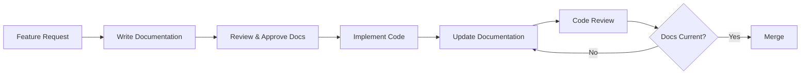

# Documentation-Code Alignment Strategy for A4C-FrontEnd

## Executive Summary

This comprehensive strategy ensures sustained documentation quality and code alignment for the A4C-FrontEnd React application. Building on the successful documentation review and updates completed, this plan establishes processes, automation, and governance to maintain >95% documentation accuracy with minimal developer overhead.

## Current State Assessment

### Recent Achievements

- ✅ Comprehensive documentation architecture analysis completed
- ✅ All priority documentation updates implemented
- ✅ Critical issues resolved (package references, project structure)
- ✅ Documentation now accurately reflects codebase implementation

### Technology Context

- **Framework**: React 19.1.1 with TypeScript 5.9.2
- **Architecture**: MVVM pattern with MobX state management
- **Build System**: Vite with ESLint and TypeScript strict mode
- **Accessibility**: WCAG 2.1 Level AA compliance requirements
- **CI/CD**: GitHub Actions pipeline in place

## Phase 1: Documentation Governance Framework

### 1.1 Documentation Ownership Model

#### Primary Roles

```yaml
Documentation Owner (Project Lead):
  - Overall documentation strategy
  - Quarterly review coordination
  - Quality gate enforcement
  
Feature Owners (Developers):
  - Component-level documentation
  - API documentation maintenance
  - Implementation guides

Technical Writers (Rotating Role):
  - Cross-cutting documentation
  - Architecture documentation
  - User-facing guides
```

### 1.2 Documentation Update Triggers

#### Automatic Triggers

1. **Code Changes**
   - Breaking API changes
   - New component creation
   - Architecture pattern changes
   - Configuration modifications

2. **Pull Request Events**
   - New feature implementation
   - Bug fixes affecting behavior
   - Dependency updates
   - Security patches

#### Scheduled Triggers

1. **Weekly**: Quick sync check
2. **Sprint End**: Feature documentation review
3. **Monthly**: Architecture documentation audit
4. **Quarterly**: Comprehensive documentation review

### 1.3 Documentation Categories and Responsibilities

```markdown
| Category | Owner | Update Frequency | Review Cycle |
|----------|-------|------------------|--------------|
| CLAUDE.md | Tech Lead | Per significant change | Monthly |
| API Documentation | Feature Dev | Per API change | Sprint |
| Component Guides | Component Dev | Per component change | Sprint |
| Architecture Docs | Architect | Per pattern change | Quarterly |
| Setup/Config | DevOps | Per config change | Monthly |
| Accessibility | QA Lead | Per WCAG update | Quarterly |
```

### 1.4 Quality Gates

#### Pre-Merge Requirements

- [ ] Documentation updated for changed components
- [ ] Examples updated if API changed
- [ ] CLAUDE.md updated for new patterns
- [ ] Type definitions documented
- [ ] Accessibility requirements documented

#### Definition of Done

- Code implementation complete
- Unit tests passing
- Documentation updated
- Examples working
- Review approved

## Phase 2: Automation and Process Integration

### 2.1 Automated Documentation Validation

#### Git Hooks Implementation

```bash
# .husky/pre-commit
#!/bin/sh
. "$(dirname "$0")/_/husky.sh"

# Run documentation validation
npm run docs:validate

# Check for documentation changes when code changes
npm run docs:check-alignment
```

#### NPM Scripts for Documentation

```json
{
  "scripts": {
    "docs:validate": "node scripts/validate-docs.js",
    "docs:check-alignment": "node scripts/check-doc-alignment.js",
    "docs:generate-api": "typedoc --out docs/api src",
    "docs:lint": "markdownlint docs/**/*.md",
    "docs:build": "npm run docs:generate-api && npm run docs:lint",
    "docs:serve": "docsify serve docs",
    "docs:watch": "nodemon --watch src --exec npm run docs:generate-api"
  }
}
```

### 2.2 CI/CD Pipeline Integration

#### GitHub Actions Workflow

```yaml
name: Validate Documentation

on:
  pull_request:
    branches: [main]
  push:
    branches: [main]

jobs:
  validate-docs:
    runs-on: ubuntu-latest
    steps:
      - uses: actions/checkout@v3
      
      - name: Setup Node.js
        uses: actions/setup-node@v3
        with:
          node-version: '20'
          
      - name: Install dependencies
        run: npm ci
        
      - name: Validate documentation structure
        run: npm run docs:validate
        
      - name: Check code-documentation alignment
        run: npm run docs:check-alignment
        
      - name: Generate API documentation
        run: npm run docs:generate-api
        
      - name: Check for documentation drift
        run: node scripts/detect-doc-drift.js
        
      - name: Post PR comment with doc status
        if: github.event_name == 'pull_request'
        uses: actions/github-script@v6
        with:
          script: |
            const fs = require('fs');
            const report = fs.readFileSync('doc-report.json', 'utf8');
            await github.rest.issues.createComment({
              issue_number: context.issue.number,
              owner: context.repo.owner,
              repo: context.repo.repo,
              body: `## 📚 Documentation Status\n\n${report}`
            });
```

### 2.3 Documentation Drift Detection

#### Automated Detection Script

```javascript
// scripts/detect-doc-drift.js
const detectDrift = {
  checkPatterns: [
    {
      name: 'Component Documentation',
      sourcePattern: 'src/**/*.tsx',
      docPattern: 'docs/components/**/*.md',
      validator: 'componentDocValidator'
    },
    {
      name: 'API Documentation',
      sourcePattern: 'src/services/api/**/*.ts',
      docPattern: 'docs/api/**/*.md',
      validator: 'apiDocValidator'
    },
    {
      name: 'ViewModel Documentation',
      sourcePattern: 'src/viewModels/**/*.ts',
      docPattern: 'docs/architecture/viewmodels.md',
      validator: 'viewModelDocValidator'
    }
  ],
  
  validators: {
    componentDocValidator: (sourceFile, docFile) => {
      // Check props documentation
      // Check event handlers
      // Check accessibility requirements
      // Check keyboard navigation
    },
    
    apiDocValidator: (sourceFile, docFile) => {
      // Check endpoint documentation
      // Check request/response types
      // Check error codes
      // Check authentication requirements
    },
    
    viewModelDocValidator: (sourceFile, docFile) => {
      // Check observable properties
      // Check computed values
      // Check actions
      // Check MobX decorators
    }
  }
};
```

### 2.4 Documentation Generation Tools

#### TypeDoc Configuration

```json
// typedoc.json
{
  "entryPoints": ["src"],
  "entryPointStrategy": "expand",
  "out": "docs/api",
  "excludePrivate": true,
  "excludeProtected": false,
  "excludeExternals": true,
  "includeVersion": true,
  "categorizeByGroup": true,
  "navigationLinks": {
    "GitHub": "https://github.com/org/A4C-FrontEnd",
    "Main Docs": "/docs"
  },
  "plugin": [
    "typedoc-plugin-markdown",
    "typedoc-plugin-mermaid"
  ]
}
```

## Phase 3: Team Workflow Enhancement

### 3.1 Developer Workflow Integration

#### Documentation-First Development Process



### 3.2 Code Review Checklist Enhancement

#### Updated PR Template

```markdown
## Pull Request Checklist

### Code Changes
- [ ] Code follows MVVM pattern
- [ ] TypeScript types properly defined
- [ ] MobX observables correctly implemented
- [ ] Accessibility requirements met

### Documentation Updates
- [ ] CLAUDE.md updated (if patterns changed)
- [ ] Component documentation updated
- [ ] API documentation current
- [ ] Examples/usage updated
- [ ] Changelog entry added

### Validation
- [ ] `npm run docs:validate` passes
- [ ] `npm run docs:check-alignment` passes
- [ ] No documentation warnings in CI
```

### 3.3 Documentation Templates

#### Component Documentation Template

```markdown
# Component: [ComponentName]

## Purpose
Brief description of what this component does and why it exists.

## Usage
\```tsx
import { ComponentName } from '@/components/ComponentName';

<ComponentName
  prop1="value"
  prop2={value}
  onEvent={handler}
/>
\```

## Props
| Prop | Type | Required | Default | Description |
|------|------|----------|---------|-------------|
| prop1 | string | Yes | - | Description |
| prop2 | number | No | 0 | Description |

## Keyboard Navigation
- **Tab**: Navigate between elements
- **Enter**: Activate primary action
- **Escape**: Cancel/close

## Accessibility
- ARIA roles: `role="button"`
- ARIA labels: Required for all interactive elements
- WCAG compliance: Level AA

## State Management
- MobX observables: List any observables used
- ViewModels: Associated ViewModel if any

## Examples
### Basic Usage
\```tsx
// Example code
\```

### Advanced Usage
\```tsx
// Example code
\```

## Related Components
- [RelatedComponent1]
- [RelatedComponent2]
```

### 3.4 Knowledge Base Structure

```
docs/
├── getting-started/
│   ├── installation.md
│   ├── configuration.md
│   └── first-steps.md
├── architecture/
│   ├── overview.md
│   ├── mvvm-pattern.md
│   ├── state-management.md
│   └── service-layer.md
├── components/
│   ├── ui/
│   │   ├── buttons.md
│   │   ├── inputs.md
│   │   └── dropdowns.md
│   └── features/
│       ├── medication-entry.md
│       └── client-selection.md
├── api/
│   ├── endpoints/
│   ├── types/
│   └── errors.md
├── testing/
│   ├── unit-testing.md
│   ├── e2e-testing.md
│   └── accessibility-testing.md
└── deployment/
    ├── build-process.md
    └── environments.md
```

## Phase 4: Monitoring and Metrics

### 4.1 Documentation Health Metrics

#### Key Performance Indicators (KPIs)

```yaml
Coverage Metrics:
  - Component documentation coverage: >95%
  - API endpoint documentation: 100%
  - Type definition documentation: >90%
  - Example code coverage: >80%

Quality Metrics:
  - Documentation accuracy score: >95%
  - Time since last update: <30 days
  - Broken link count: 0
  - Code sample validity: 100%

Process Metrics:
  - PRs with doc updates: >80%
  - Documentation review time: <24 hours
  - Documentation-related bugs: <5%
  - Onboarding time reduction: >30%
```

### 4.2 Documentation Dashboard

#### Metrics Collection Script

```javascript
// scripts/collect-doc-metrics.js
const metrics = {
  coverage: {
    components: calculateComponentCoverage(),
    apis: calculateApiCoverage(),
    types: calculateTypeCoverage(),
    examples: calculateExampleCoverage()
  },
  
  quality: {
    accuracy: calculateAccuracyScore(),
    freshness: calculateFreshnessScore(),
    brokenLinks: findBrokenLinks(),
    codeValidity: validateCodeSamples()
  },
  
  process: {
    prDocUpdates: analyzePRDocUpdates(),
    reviewTime: calculateReviewTime(),
    docBugs: countDocumentationBugs(),
    onboardingTime: measureOnboardingEfficiency()
  }
};

// Generate dashboard HTML
generateDashboard(metrics);
```

### 4.3 Monitoring Implementation

#### Weekly Documentation Report

```markdown
# Documentation Health Report - Week [X]

## Coverage Status
- Components: 94% (+2% from last week)
- APIs: 100% (maintained)
- Types: 92% (+1% from last week)

## Quality Indicators
- Accuracy Score: 96% ✅
- Average Age: 18 days ✅
- Broken Links: 0 ✅
- Invalid Code Samples: 2 ⚠️

## Process Metrics
- PRs with Documentation: 85% ✅
- Average Review Time: 18 hours ✅
- Documentation Bugs: 2 this week

## Action Items
1. Fix invalid code samples in dropdown.md
2. Update medication-entry.md (32 days old)
3. Add missing examples for new MultiSelect component

## Recommendations
- Schedule documentation sprint for next iteration
- Consider automation for code sample validation
```

### 4.4 Alerting and Notifications

#### Automated Alerts Configuration

```yaml
alerts:
  critical:
    - trigger: documentation_coverage < 90%
      notify: [tech-lead, documentation-owner]
      channel: email, slack
    
    - trigger: broken_links > 5
      notify: [documentation-owner]
      channel: slack
  
  warning:
    - trigger: documentation_age > 30_days
      notify: [component-owner]
      channel: github-issue
    
    - trigger: pr_without_docs && breaking_change
      notify: [pr-author, reviewer]
      channel: pr-comment
  
  info:
    - trigger: weekly_report_ready
      notify: [team]
      channel: slack
```

## Implementation Roadmap

### Quarter 1: Foundation (Months 1-3)

#### Month 1: Governance Setup

- Week 1-2: Define roles and responsibilities
- Week 3: Implement PR template updates
- Week 4: Create documentation templates

#### Month 2: Basic Automation

- Week 1-2: Set up git hooks
- Week 3: Implement basic validation scripts
- Week 4: Create CI/CD pipeline integration

#### Month 3: Process Integration

- Week 1-2: Roll out to development team
- Week 3: Gather feedback and iterate
- Week 4: Refine processes based on feedback

### Quarter 2: Automation Enhancement (Months 4-6)

#### Month 4: Advanced Detection

- Week 1-2: Implement drift detection
- Week 3: Create documentation generation tools
- Week 4: Set up TypeDoc integration

#### Month 5: Metrics and Monitoring

- Week 1-2: Build metrics collection system
- Week 3: Create documentation dashboard
- Week 4: Implement alerting system

#### Month 6: Optimization

- Week 1-2: Analyze metrics and identify gaps
- Week 3: Optimize automation scripts
- Week 4: Performance tuning and refinement

### Quarter 3: Maturation (Months 7-9)

#### Month 7: Advanced Features

- Week 1-2: Implement AI-assisted documentation
- Week 3: Create interactive documentation
- Week 4: Build documentation search system

#### Month 8: Team Enablement

- Week 1: Conduct team training sessions
- Week 2: Create video tutorials
- Week 3-4: Establish documentation champions

#### Month 9: Full Integration

- Week 1-2: Complete system integration
- Week 3: Final testing and validation
- Week 4: Full production rollout

## Success Metrics and Validation

### Primary Success Indicators

```yaml
Technical Metrics:
  - Documentation coverage: ≥95%
  - Code-doc alignment: ≥95%
  - Build time impact: <5% increase
  - False positive rate: <10%

Process Metrics:
  - Developer satisfaction: ≥4/5
  - Documentation update time: <30 minutes/feature
  - PR approval time: No increase
  - Onboarding time: 30% reduction

Business Metrics:
  - Bug reduction: 20% fewer doc-related bugs
  - Time to market: No negative impact
  - Knowledge transfer: 50% faster
  - Team productivity: 15% improvement
```

### Validation Methods

#### Quarterly Reviews

1. Analyze metrics dashboard
2. Survey development team
3. Review bug reports
4. Assess onboarding effectiveness
5. Calculate ROI

#### Continuous Monitoring

- Daily: Automated validation runs
- Weekly: Metrics collection and reporting
- Sprint: Documentation review in retrospectives
- Monthly: Trend analysis and adjustments

## Risk Mitigation

### Identified Risks and Mitigations

| Risk | Impact | Probability | Mitigation |
|------|--------|-------------|------------|
| Developer resistance | High | Medium | Gradual rollout, automation focus, clear benefits communication |
| Performance impact | Medium | Low | Optimize scripts, async processing, caching |
| False positives | Medium | Medium | Tune validators, whitelist patterns, manual overrides |
| Maintenance overhead | High | Low | Automation first, clear ownership, regular reviews |
| Tool compatibility | Low | Low | Standard tooling, fallback options, vendor-neutral approach |

## Budget and Resources

### Tooling Requirements

- **Essential** (Already Available):
  - Git hooks (Husky)
  - CI/CD (GitHub Actions)
  - Markdown linter
  - TypeDoc

- **Recommended** (Minimal Cost):
  - Documentation hosting (GitHub Pages)
  - Search indexing (Algolia free tier)
  - Monitoring dashboard (custom build)

- **Optional** (Future Enhancement):
  - AI documentation assistant
  - Professional documentation platform
  - Advanced analytics tools

### Time Investment

- Initial setup: 2-3 developer weeks
- Ongoing maintenance: 2-4 hours/week
- Quarterly reviews: 1 day/quarter

## Conclusion

This comprehensive strategy ensures documentation remains aligned with code through:

1. Clear governance and ownership
2. Automated validation and detection
3. Integrated developer workflows
4. Continuous monitoring and improvement

The phased implementation approach minimizes disruption while building toward a mature documentation system that supports the team's velocity and maintains high quality standards.

## Appendices

### Appendix A: Script Examples

[Detailed implementation scripts available in `/scripts/documentation/`]

### Appendix B: Template Library

[Complete template collection in `/docs/templates/`]

### Appendix C: Tool Configurations

[Configuration files in `/config/documentation/`]

### Appendix D: Training Materials

[Training resources in `/docs/training/`]
