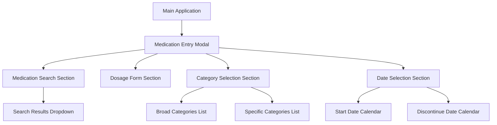

# Testing Guide

Comprehensive testing strategy and patterns for the A4C-FrontEnd application with Playwright E2E testing and accessibility validation.

## Testing Philosophy

The A4C-FrontEnd testing strategy emphasizes:
- **E2E First**: Comprehensive end-to-end testing with Playwright
- **Accessibility Testing**: Built-in WCAG compliance validation
- **Cross-Browser Testing**: Automated testing across Chrome, Firefox, Safari
- **Performance Testing**: Load time and interaction performance validation

## Test Architecture

### Test Coverage Overview

**172 test cases** across **9 major categories**:

1. **Functional Testing (TC001-TC067)** - Core application functionality
2. **UI/UX Testing (TC068-TC084)** - User interface and experience validation  
3. **Cross-Browser Testing (TC085-TC094)** - Multi-browser compatibility
4. **Mobile Responsive Testing (TC095-TC109)** - Mobile and tablet layouts
5. **Accessibility Testing (TC110-TC126)** - WCAG compliance and screen reader support
6. **Performance Testing (TC127-TC138)** - Load times and interaction performance
7. **Edge Cases & Boundary Testing (TC139-TC155)** - Input validation and limits
8. **Integration Testing (TC156-TC165)** - Component interaction validation
9. **Security Testing (TC166-TC172)** - XSS prevention and input sanitization

### Test Commands

```bash
# Run all E2E tests
npm run test:e2e

# Run tests with UI interface  
npm run test:e2e:ui

# Run tests in headed mode (see browser)
npm run test:e2e:headed

# Run tests in debug mode
npm run test:e2e:debug

# Run specific test file
npx playwright test medication-entry.spec.ts

# Generate test report
npx playwright show-report
```

## Modal Identification System

### Data Modal ID Pattern

The `data-modal-id` attribute provides stable, semantic identifiers for UI elements:

```typescript
// Component implementation
<div data-modal-id="add-new-prescribed-medication">
  <div data-modal-id="medication-search-results">
    {/* Modal content */}
  </div>
</div>
```

### Current Modal Hierarchy

**15 modal-like elements** identified:

#### Primary Modals
- **`medication-entry`** - Main medication entry modal
- **`medication-search-results`** - Search dropdown results

#### Category Selection  
- **`broad-categories-list`** - Broad category dropdown
- **`specific-categories-list`** - Specific category dropdown

#### Date Selection
- **`start-date-calendar`** - Start date calendar popup
- **`discontinue-date-calendar`** - Discontinue date calendar popup

### Testing Modal Architecture



## Test Patterns and Examples

### Helper Class Pattern

```typescript
class MedicationEntryHelper {
  constructor(private page: Page) {}

  async selectClient(clientId: string = 'CLIENT001') {
    await this.page.waitForSelector('[data-testid="client-selector"]');
    await this.page.click(`[data-testid="client-${clientId}"]`);
    await this.page.waitForSelector('text=Medication Management');
  }

  async openMedicationModal() {
    await this.page.click('text=Add Medication');
    await this.page.waitForSelector('text=Select Medication Type');
    await this.page.click('text=Prescribed Medication');
    await this.page.waitForSelector('text=Add New Prescribed Medication');
  }

  async searchMedication(medicationName: string) {
    const searchInput = this.page.locator('[data-testid="medication-search"]');
    await searchInput.fill(medicationName);
    await this.page.waitForTimeout(500); // Wait for debounced search
  }
}
```

### Basic Modal Testing

```typescript
test('Basic modal interaction flow', async ({ page }) => {
  const helper = new MedicationEntryHelper(page);
  
  // Navigation and setup
  await helper.navigateToApp();
  await helper.selectClient();
  
  // Modal opening
  await helper.openMedicationModal();
  await expect(page.locator('[data-modal-id="add-new-prescribed-medication"]')).toBeVisible();
  
  // Form interaction
  await helper.searchMedication('Lorazepam');
  await page.waitForTimeout(1000);
  
  // Verify search results modal
  const resultsModal = page.locator('[data-modal-id="medication-search-results"]');
  if (await resultsModal.isVisible()) {
    await expect(resultsModal).toContainText('Lorazepam');
  }
});
```

### Cross-Browser Testing

```typescript
test('Cross-browser modal functionality', async ({ page, browserName }) => {
  const helper = new MedicationEntryHelper(page);
  await helper.navigateToApp();
  await helper.selectClient();
  await helper.openMedicationModal();
  
  // Browser-specific modal behavior
  const modal = page.locator('[data-modal-id="add-new-prescribed-medication"]');
  await expect(modal).toBeVisible();
  
  if (browserName === 'webkit') {
    // Safari-specific modal tests
    await expect(modal).toHaveCSS('position', 'fixed');
  }
  
  console.log(`Modal test completed successfully on ${browserName}`);
});
```

## Accessibility Testing

### WCAG Compliance Testing

```typescript
import { AxeBuilder } from '@axe-core/playwright';

test('Modal accessibility compliance', async ({ page }) => {
  const helper = new MedicationEntryHelper(page);
  await helper.navigateToApp();
  await helper.selectClient();
  await helper.openMedicationModal();
  
  // Automated accessibility scan
  const accessibilityScanResults = await new AxeBuilder({ page }).analyze();
  expect(accessibilityScanResults.violations).toEqual([]);
  
  // ARIA compliance checks
  const modal = page.locator('[data-modal-id="add-new-prescribed-medication"]');
  await expect(modal).toHaveAttribute('role', 'dialog');
  await expect(modal).toHaveAttribute('aria-modal', 'true');
});
```

### Keyboard Navigation Testing

```typescript
test('Keyboard navigation compliance', async ({ page }) => {
  const helper = new MedicationEntryHelper(page);
  await helper.navigateToApp();
  await helper.selectClient();
  await helper.openMedicationModal();
  
  // Test tab order
  await page.keyboard.press('Tab');
  const focusedElement = page.locator(':focus');
  await expect(focusedElement).toBeVisible();
  
  // Test modal escape key
  await page.keyboard.press('Escape');
  await expect(page.locator('[data-modal-id="add-new-prescribed-medication"]')).not.toBeVisible();
  
  // Test screen reader compatibility
  const headings = page.locator('h1, h2, h3');
  await expect(headings).toHaveCount({ min: 1 });
});
```

### Focus Management Testing

```typescript
test('Focus management validation', async ({ page }) => {
  const helper = new MedicationEntryHelper(page);
  await helper.navigateToApp();
  await helper.selectClient();
  
  // Store initial focus
  const triggerButton = page.locator('text=Add Medication');
  await triggerButton.focus();
  
  // Open modal
  await helper.openMedicationModal();
  
  // Verify focus moved to modal
  const modal = page.locator('[data-modal-id="add-new-prescribed-medication"]');
  await expect(modal).toBeVisible();
  
  // Verify focus trap
  await page.keyboard.press('Tab');
  const focusedElement = page.locator(':focus');
  const isInsideModal = await modal.locator(':focus').count() > 0;
  expect(isInsideModal).toBe(true);
  
  // Close modal and verify focus restoration
  await page.keyboard.press('Escape');
  await expect(triggerButton).toBeFocused();
});
```

## Performance Testing

### Load Time Testing

```typescript
test('Modal performance validation', async ({ page }) => {
  const helper = new MedicationEntryHelper(page);
  const startTime = Date.now();
  
  await helper.navigateToApp();
  await helper.selectClient();
  
  // Test modal opening performance
  const modalStartTime = Date.now();
  await helper.openMedicationModal();
  
  const modalLoadTime = Date.now() - modalStartTime;
  expect(modalLoadTime).toBeLessThan(2000); // Modal should open within 2 seconds
  
  // Test search performance
  await helper.searchMedication('Aspirin');
  const searchStartTime = Date.now();
  
  await page.waitForSelector('[data-modal-id="medication-search-results"]', { timeout: 3000 });
  const searchTime = Date.now() - searchStartTime;
  expect(searchTime).toBeLessThan(3000); // Search should complete within 3 seconds
});
```

### Memory Usage Testing

```typescript
test('Memory usage validation', async ({ page }) => {
  const helper = new MedicationEntryHelper(page);
  
  // Measure initial memory
  const initialMemory = await page.evaluate(() => performance.memory?.usedJSHeapSize || 0);
  
  // Perform operations
  await helper.navigateToApp();
  await helper.selectClient();
  await helper.openMedicationModal();
  
  // Multiple search operations
  for (const medication of ['Aspirin', 'Lorazepam', 'Metformin']) {
    await helper.searchMedication(medication);
    await page.waitForTimeout(1000);
  }
  
  // Measure final memory
  const finalMemory = await page.evaluate(() => performance.memory?.usedJSHeapSize || 0);
  const memoryIncrease = finalMemory - initialMemory;
  
  // Memory increase should be reasonable (< 50MB)
  expect(memoryIncrease).toBeLessThan(50 * 1024 * 1024);
});
```

## Mobile and Responsive Testing

### Mobile Layout Testing

```typescript
test('Mobile responsive modal layout', async ({ page }) => {
  // Set mobile viewport
  await page.setViewportSize({ width: 375, height: 667 });
  
  const helper = new MedicationEntryHelper(page);
  await helper.navigateToApp();
  await helper.selectClient();
  await helper.openMedicationModal();
  
  const modal = page.locator('[data-modal-id="add-new-prescribed-medication"]');
  await expect(modal).toBeVisible();
  
  // Check mobile-specific layout
  const modalBounds = await modal.boundingBox();
  expect(modalBounds?.width).toBeLessThan(400); // Should fit mobile screen
  
  // Test touch interactions
  await helper.searchMedication('Aspirin');
  const searchResults = page.locator('[data-modal-id="medication-search-results"]');
  if (await searchResults.isVisible()) {
    // Touch-friendly target sizes (minimum 44px)
    const buttons = searchResults.locator('button');
    for (let i = 0; i < await buttons.count(); i++) {
      const button = buttons.nth(i);
      const bounds = await button.boundingBox();
      expect(bounds?.height).toBeGreaterThanOrEqual(44);
    }
  }
});
```

### Tablet Layout Testing

```typescript
test('Tablet responsive modal layout', async ({ page }) => {
  // Set tablet viewport
  await page.setViewportSize({ width: 768, height: 1024 });
  
  const helper = new MedicationEntryHelper(page);
  await helper.navigateToApp();
  await helper.selectClient();
  await helper.openMedicationModal();
  
  const modal = page.locator('[data-modal-id="add-new-prescribed-medication"]');
  await expect(modal).toBeVisible();
  
  // Tablet should have more spacious layout
  const modalBounds = await modal.boundingBox();
  expect(modalBounds?.width).toBeGreaterThan(400);
  expect(modalBounds?.width).toBeLessThan(800);
});
```

## Security Testing

### XSS Prevention Testing

```typescript
test('XSS prevention in search inputs', async ({ page }) => {
  const helper = new MedicationEntryHelper(page);
  await helper.navigateToApp();
  await helper.selectClient();
  await helper.openMedicationModal();
  
  // Attempt XSS injection in search
  const maliciousInput = '<script>alert("xss")</script>';
  await helper.searchMedication(maliciousInput);
  
  // Verify script is not executed
  const pageContent = await page.content();
  expect(pageContent).not.toContain('<script>alert("xss")</script>');
  
  // Verify input is sanitized or escaped
  const searchInput = page.locator('[data-testid="medication-search"]');
  const inputValue = await searchInput.inputValue();
  expect(inputValue).toBe(maliciousInput); // Should be displayed as text, not executed
});
```

### Input Sanitization Testing

```typescript
test('Input sanitization validation', async ({ page }) => {
  const helper = new MedicationEntryHelper(page);
  await helper.navigateToApp();
  await helper.selectClient();
  await helper.openMedicationModal();
  
  // Test various malicious inputs
  const maliciousInputs = [
    'javascript:alert("xss")',
    '',
    '"><script>alert("xss")</script>',
    "'><script>alert('xss')</script>"
  ];
  
  for (const input of maliciousInputs) {
    await helper.searchMedication(input);
    await page.waitForTimeout(500);
    
    // Verify no script execution
    const alerts = await page.evaluate(() => window.alert);
    expect(alerts).toBeUndefined();
  }
});
```

## Test Data Management

### Mock Data Strategy

```typescript
// Use consistent test data across tests
const TEST_MEDICATIONS = [
  { id: 'MED001', name: 'Aspirin', strength: '325mg' },
  { id: 'MED002', name: 'Lorazepam', strength: '1mg' },
  { id: 'MED003', name: 'Metformin', strength: '500mg' }
];

const TEST_CLIENTS = [
  { id: 'CLIENT001', name: 'John Doe', age: 45 },
  { id: 'CLIENT002', name: 'Jane Smith', age: 32 }
];
```

### Test Environment Configuration

```typescript
// Configure test-specific settings
const TEST_CONFIG = {
  API_URL: process.env.TEST_API_URL || 'http://localhost:3001',
  MOCK_DELAYS: false, // Disable delays in tests
  ACCESSIBILITY_CHECKS: true,
  PERFORMANCE_MONITORING: true
};
```

## Best Practices

### Selector Strategies

**Priority order for element selection**:
1. **`data-testid`** - Primary test identifiers
2. **`data-modal-id`** - Modal-specific identifiers  
3. **ARIA attributes** - `role`, `aria-label`, etc.
4. **Text content** - Visible text when stable
5. **CSS selectors** - Last resort, brittle

```typescript
// ✅ PREFERRED: Stable test identifiers
await page.locator('[data-testid="medication-search"]').fill('Aspirin');

// ✅ GOOD: Modal-specific identifiers
await page.locator('[data-modal-id="medication-search-results"]').waitFor();

// ✅ ACCEPTABLE: ARIA attributes
await page.locator('[role="dialog"]').waitFor();

// ⚠️ CAUTION: Text content (can change with localization)
await page.locator('text=Add Medication').click();

// ❌ AVOID: CSS classes (can change frequently)
await page.locator('.modal-container .search-input').fill('Aspirin');
```

### Error Handling and Debugging

```typescript
test('Test with comprehensive error handling', async ({ page }) => {
  try {
    const helper = new MedicationEntryHelper(page);
    await helper.navigateToApp();
    
    // Perform test operations
    await helper.selectClient();
    await helper.openMedicationModal();
    
  } catch (error) {
    // Capture screenshot on failure
    await page.screenshot({ path: 'test-failure-screenshot.png' });
    
    // Log page content for debugging
    console.log('Page title:', await page.title());
    console.log('Current URL:', page.url());
    
    // Re-throw to fail the test
    throw error;
  }
});
```

### Parallel Test Execution

```typescript
// Configure tests for safe parallel execution
test.describe.configure({ mode: 'parallel' });

test.describe('Medication Entry Tests', () => {
  // Each test gets isolated browser context
  test('Test 1', async ({ page }) => {
    // Test implementation
  });
  
  test('Test 2', async ({ page }) => {
    // Test implementation  
  });
});
```

### CI/CD Integration

```yaml
# .github/workflows/test.yml
name: E2E Tests
on: [push, pull_request]

jobs:
  test:
    runs-on: ubuntu-latest
    steps:
      - uses: actions/checkout@v4
      - uses: actions/setup-node@v4
        with:
          node-version: '20'
      - name: Install dependencies
        run: npm ci
      - name: Install Playwright Browsers
        run: npx playwright install --with-deps
      - name: Run Playwright tests
        run: npm run test:e2e
      - uses: actions/upload-artifact@v4
        if: always()
        with:
          name: playwright-report
          path: playwright-report/
```

This comprehensive testing strategy ensures robust, maintainable, and accessible application quality across all browsers and devices.