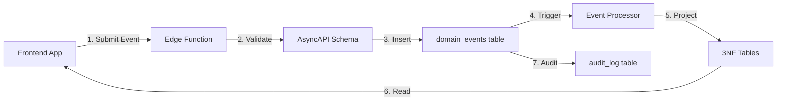

# Event-Driven Architecture Documentation

## Table of Contents
1. [Overview](#overview)
2. [Architecture Principles](#architecture-principles)
3. [Event Flow](#event-flow)
4. [Implementation Guide](#implementation-guide)
5. [API Contracts](#api-contracts)
6. [Database Design](#database-design)
7. [Frontend Integration](#frontend-integration)
8. [Testing Strategy](#testing-strategy)
9. [Migration Guide](#migration-guide)
10. [Best Practices](#best-practices)

## Overview

The A4C platform uses an **Event-First Architecture with CQRS (Command Query Responsibility Segregation)** where all state changes flow through an immutable event log before being projected to normalized tables for efficient querying.

### Key Concepts

- **Event Sourcing**: Events are the single source of truth
- **CQRS**: Separate write model (events) from read model (3NF tables)
- **Audit by Design**: Every change captures WHO, WHAT, WHEN, and WHY
- **Immutable History**: Events are append-only, never updated or deleted
- **Automatic Projections**: Database triggers project events to queryable tables

## Architecture Principles

### 1. Events as First-Class Citizens

```javascript
// Traditional CRUD (loses history and context)
await supabase.from('clients').update({
  status: 'discharged',
  discharge_date: '2024-01-15'
}).eq('id', clientId);

// Event-Driven (preserves everything)
await supabase.from('domain_events').insert({
  stream_id: clientId,
  stream_type: 'client',
  event_type: 'client.discharged',
  event_data: {
    discharge_date: '2024-01-15',
    discharge_type: 'planned',
    discharge_disposition: 'home'
  },
  event_metadata: {
    user_id: currentUser.id,
    reason: 'Treatment completed successfully, all goals achieved',
    approval_chain: [...]
  }
});
```

### 2. The "Reason" Requirement

Every event MUST include a `reason` field in metadata (minimum 10 characters) explaining WHY the change is occurring. This is enforced at multiple levels:

1. **AsyncAPI Schema**: Required field with minLength validation
2. **Database Constraint**: CHECK constraint on event_metadata
3. **Edge Function**: Pre-validation before database insertion
4. **TypeScript Types**: Required property in generated types

### 3. Separation of Concerns

- **Write Path**: Applications only write events
- **Read Path**: Applications read from projected 3NF tables
- **Processing**: Database triggers handle projection logic
- **Validation**: Contracts define and enforce event schemas

## Event Flow



### Detailed Flow

1. **Application emits event** with full context and reason
2. **Edge Function validates** against AsyncAPI schema
3. **Event inserted** into `domain_events` table (append-only)
4. **Database trigger fires** calling appropriate processor
5. **Processor projects** event data to normalized tables
6. **Application queries** projected tables for current state
7. **Audit log updated** with change details and reason

## Implementation Guide

### Step 1: Define Event Schema

Create AsyncAPI specification for your domain event:

```yaml
# contracts/asyncapi/domains/medication.yaml
MedicationPrescribedEvent:
  type: object
  required:
    - stream_id
    - event_type
    - event_data
    - event_metadata
  properties:
    event_metadata:
      required: [user_id, reason]
      properties:
        reason:
          minLength: 10
          examples:
            - "Initial prescription for diagnosed condition"
            - "Dosage adjustment based on therapeutic response"
```

### Step 2: Create Event Processor

```sql
-- sql/03-functions/event-processing/process-medication-events.sql
CREATE OR REPLACE FUNCTION process_medication_history_event(
  p_event domain_events
) RETURNS VOID AS $$
BEGIN
  CASE p_event.event_type
    WHEN 'medication.prescribed' THEN
      INSERT INTO medication_history (
        id, client_id, medication_id, dosage_amount, ...
      ) VALUES (
        p_event.stream_id,
        (p_event.event_data->>'client_id')::UUID,
        ...
      );

    WHEN 'medication.discontinued' THEN
      UPDATE medication_history
      SET discontinue_date = (p_event.event_data->>'date')::DATE,
          discontinue_reason = p_event.event_metadata->>'reason'
      WHERE id = p_event.stream_id;
  END CASE;
END;
$$ LANGUAGE plpgsql;
```

### Step 3: Emit Events from Application

```typescript
// frontend/services/medication.service.ts
import { createEvent, MedicationPrescribedEvent } from '@/types/events';

async function prescribeMedication(data: PrescriptionForm) {
  const event = createEvent<MedicationPrescribedEvent>(
    'medication.prescribed',
    crypto.randomUUID(),
    'medication_history',
    {
      client_id: data.clientId,
      medication_id: data.medicationId,
      dosage_amount: data.dosage,
      frequency: data.frequency,
      // ... other prescription details
    },
    {
      user_id: currentUser.id,
      reason: data.prescriptionReason, // Required field from form
      approval_chain: data.approvals
    }
  );

  return await supabase.from('domain_events').insert(event);
}
```

### Step 4: Query Projected Data

```typescript
// Read from normalized tables as usual
const { data: activeMedications } = await supabase
  .from('medication_history')
  .select('*, medications(*)')
  .eq('client_id', clientId)
  .eq('status', 'active');
```

## API Contracts

### Contract-First Development

All events are defined in AsyncAPI/OpenAPI specifications BEFORE implementation:

```
contracts/
├── asyncapi/              # Event definitions
│   ├── asyncapi.yaml      # Main specification
│   └── domains/           # Domain-specific events
├── openapi/               # REST API definitions
│   └── api.yaml          # Event submission endpoint
└── generated/            # Generated code
    └── typescript/       # TypeScript types
```

### Type Generation

```bash
# Generate TypeScript types from contracts
./scripts/generate-contracts.sh

# Output includes:
# - Discriminated union types for events
# - Type guards for event detection
# - Factory functions with validation
```

### Example Generated Types

```typescript
export interface EventMetadata {
  user_id: string;
  reason: string; // REQUIRED: minimum 10 characters
  correlation_id?: string;
  approval_chain?: Approval[];
}

export type MedicationPrescribedEvent = DomainEvent<MedicationPrescriptionData> & {
  event_type: 'medication.prescribed';
  stream_type: 'medication_history';
};

// Type guard
export function isMedicationPrescribedEvent(
  event: DomainEvent
): event is MedicationPrescribedEvent {
  return event.event_type === 'medication.prescribed';
}
```

## Database Design

### Core Tables

#### domain_events (Source of Truth)

```sql
CREATE TABLE domain_events (
  id UUID PRIMARY KEY,
  sequence_number BIGSERIAL UNIQUE,      -- Global ordering
  stream_id UUID NOT NULL,               -- Entity ID
  stream_type TEXT NOT NULL,             -- Entity type
  stream_version INTEGER NOT NULL,       -- Version in stream
  event_type TEXT NOT NULL,              -- domain.action format
  event_data JSONB NOT NULL,             -- Event payload
  event_metadata JSONB NOT NULL,         -- Context & reason
  created_at TIMESTAMPTZ DEFAULT NOW(),
  processed_at TIMESTAMPTZ,               -- When projected
  processing_error TEXT,                  -- If projection failed

  -- Constraints
  UNIQUE(stream_id, stream_type, stream_version),
  CHECK (event_metadata->>'reason' IS NOT NULL),
  CHECK (length(event_metadata->>'reason') >= 10)
);
```

#### Projection Tables (Read Models)

Standard 3NF tables that are populated from events:

```sql
CREATE TABLE clients (
  id UUID PRIMARY KEY,
  -- Standard columns
  first_name TEXT,
  last_name TEXT,
  -- NO updated_at column needed (events track this)
  created_at TIMESTAMPTZ
);

-- No UPDATE triggers needed
-- All changes come through event projection
```

### Event Processing Infrastructure

```sql
-- Main router trigger
CREATE TRIGGER process_domain_event_trigger
  BEFORE INSERT OR UPDATE ON domain_events
  FOR EACH ROW
  EXECUTE FUNCTION process_domain_event();

-- Router function
CREATE OR REPLACE FUNCTION process_domain_event()
RETURNS TRIGGER AS $$
BEGIN
  -- Route to appropriate processor based on stream_type
  CASE NEW.stream_type
    WHEN 'client' THEN
      PERFORM process_client_event(NEW);
    WHEN 'medication' THEN
      PERFORM process_medication_event(NEW);
    -- ... other processors
  END CASE;

  NEW.processed_at = NOW();
  RETURN NEW;
END;
$$ LANGUAGE plpgsql;
```

## Frontend Integration

### Setup

1. **Install Dependencies**
```bash
npm install --save-dev openapi-typescript @asyncapi/generator
```

2. **Add Scripts to package.json**
```json
{
  "scripts": {
    "update-event-types": "npm run generate-types && npm run copy-types",
    "generate-types": "cd ../A4C-Infrastructure/supabase && ./scripts/generate-contracts.sh",
    "copy-types": "cp ../A4C-Infrastructure/supabase/contracts/generated/typescript/* ./src/types/events/"
  }
}
```

3. **Create Event Service**
```typescript
// services/events.service.ts
import { DomainEvent, EventMetadata } from '@/types/events';

export class EventService {
  private async submitEvent(event: DomainEvent): Promise<void> {
    // Validate reason is present and meaningful
    if (!event.event_metadata.reason || event.event_metadata.reason.length < 10) {
      throw new Error('Event must include a meaningful reason (10+ characters)');
    }

    const { error } = await supabase
      .from('domain_events')
      .insert(event);

    if (error) throw error;
  }

  // Helper to ensure reason is captured
  private promptForReason(action: string): string {
    const reason = prompt(`Please explain why you are ${action}:`);
    if (!reason || reason.length < 10) {
      throw new Error('A valid reason is required for audit compliance');
    }
    return reason;
  }
}
```

### Form Integration

```tsx
// components/MedicationForm.tsx
export function MedicationPrescriptionForm() {
  return (
    <form onSubmit={handleSubmit}>
      {/* Standard medication fields */}

      <div className="required-field">
        <label>
          Reason for Prescription*
          <textarea
            name="reason"
            required
            minLength={10}
            placeholder="Explain why this medication is being prescribed..."
            helpText="Required for audit compliance"
          />
        </label>
      </div>

      <button type="submit">Prescribe Medication</button>
    </form>
  );
}
```

## Testing Strategy

### Unit Tests for Event Creation

```typescript
describe('Event Creation', () => {
  it('should require reason in metadata', () => {
    expect(() => {
      createEvent('client.registered', id, 'client', data, {
        user_id: 'test',
        reason: '' // Invalid: empty reason
      });
    }).toThrow('reason with at least 10 characters');
  });

  it('should create valid event with reason', () => {
    const event = createEvent('client.registered', id, 'client', data, {
      user_id: 'test',
      reason: 'Initial intake from referral #12345'
    });

    expect(event.event_metadata.reason).toBeDefined();
    expect(event.event_metadata.reason.length).toBeGreaterThanOrEqual(10);
  });
});
```

### Integration Tests for Event Processing

```sql
-- Test event projection
INSERT INTO domain_events (
  stream_id, stream_type, event_type, event_data, event_metadata
) VALUES (
  gen_random_uuid(),
  'client',
  'client.registered',
  '{"first_name": "Test", "last_name": "User"}',
  '{"user_id": "test", "reason": "Test registration for integration testing"}'
);

-- Verify projection
SELECT * FROM clients WHERE first_name = 'Test';
```

### E2E Tests

```typescript
describe('Medication Prescription Flow', () => {
  it('should capture reason throughout workflow', async () => {
    // Submit prescription form
    await page.fill('[name="reason"]', 'Patient diagnosed with condition requiring treatment');
    await page.click('[type="submit"]');

    // Verify event was created with reason
    const { data: events } = await supabase
      .from('domain_events')
      .select('event_metadata')
      .order('created_at', { ascending: false })
      .limit(1);

    expect(events[0].event_metadata.reason).toContain('diagnosed with condition');
  });
});
```

## Migration Guide

### Migrating from Traditional CRUD

#### Before (Traditional Update)
```typescript
async function dischargeClient(clientId: string, dischargeData: any) {
  return await supabase
    .from('clients')
    .update({
      status: 'discharged',
      discharge_date: dischargeData.date,
      updated_at: new Date() // Loses context
    })
    .eq('id', clientId);
}
```

#### After (Event-Driven)
```typescript
async function dischargeClient(clientId: string, dischargeData: DischargeForm) {
  return await supabase.from('domain_events').insert({
    stream_id: clientId,
    stream_type: 'client',
    event_type: 'client.discharged',
    event_data: {
      discharge_date: dischargeData.date,
      discharge_type: dischargeData.type,
      discharge_disposition: dischargeData.disposition
    },
    event_metadata: {
      user_id: currentUser.id,
      reason: dischargeData.reason, // Now captured!
      approval_chain: dischargeData.approvals
    }
  });
}
```

### Gradual Migration Strategy

1. **Phase 1**: Add event logging alongside existing CRUD
2. **Phase 2**: Route new features through events only
3. **Phase 3**: Migrate existing features incrementally
4. **Phase 4**: Deprecate direct table updates

## Best Practices

### 1. Meaningful Reasons

❌ **Bad Reasons:**
- "update"
- "changed"
- "per request"

✅ **Good Reasons:**
- "Dosage increased from 25mg to 50mg due to insufficient therapeutic response after 4-week trial"
- "Emergency admission from ER for acute psychiatric crisis, police case #2024-1234"
- "Client information updated per court order dated 2024-01-15, case #ABC-123"

### 2. Event Granularity

- **One event per business action** (not per field change)
- **Include all relevant data** in a single event
- **Use past tense** for event names (registered, prescribed, discharged)

### 3. Event Versioning

```typescript
// Handle schema evolution
interface MedicationPrescribedEventV1 {
  // Original schema
}

interface MedicationPrescribedEventV2 {
  // Enhanced schema with new fields
  insurance_authorization?: string;
}

// Processor handles both versions
function processMedicationEvent(event: DomainEvent) {
  const version = event.event_metadata.schema_version || 1;

  switch(version) {
    case 1: return processV1(event);
    case 2: return processV2(event);
  }
}
```

### 4. Error Recovery

```sql
-- Monitor failed projections
SELECT * FROM domain_events
WHERE processed_at IS NULL
  OR processing_error IS NOT NULL;

-- Retry failed events
UPDATE domain_events
SET processed_at = NULL,
    processing_error = NULL,
    retry_count = retry_count + 1
WHERE id = 'failed-event-id';
```

### 5. Performance Optimization

- **Index strategically** on domain_events for common queries
- **Use materialized views** for complex event aggregations
- **Archive old events** to separate tables after N days
- **Consider read replicas** for heavy query loads

## Troubleshooting

### Common Issues

#### Event Not Processing
```sql
-- Check for processing errors
SELECT id, event_type, processing_error
FROM domain_events
WHERE processed_at IS NULL;

-- Manually trigger reprocessing
SELECT process_domain_event(id)
FROM domain_events
WHERE id = 'stuck-event-id';
```

#### Duplicate Events
```sql
-- Ensure idempotency with unique constraint
ALTER TABLE domain_events
ADD CONSTRAINT unique_event_idempotency
UNIQUE (stream_id, stream_type, stream_version);
```

#### Performance Issues
```sql
-- Add missing indexes
CREATE INDEX idx_events_unprocessed ON domain_events(processed_at)
WHERE processed_at IS NULL;

-- Monitor slow projections
SELECT event_type,
       AVG(EXTRACT(EPOCH FROM (processed_at - created_at))) as avg_seconds
FROM domain_events
GROUP BY event_type
ORDER BY avg_seconds DESC;
```

## Security Considerations

### 1. Event Authorization

```typescript
// Validate user can emit this event
async function authorizeEvent(event: DomainEvent, user: User): Promise<boolean> {
  // Check user has permission for this stream_type
  if (!user.permissions.includes(event.stream_type)) {
    return false;
  }

  // Verify user belongs to organization
  if (event.event_data.organization_id !== user.organization_id) {
    return false;
  }

  // Additional role-based checks
  return checkRolePermissions(user.role, event.event_type);
}
```

### 2. PII Protection

```sql
-- Encrypt sensitive data in events
CREATE OR REPLACE FUNCTION encrypt_pii(data JSONB)
RETURNS JSONB AS $$
BEGIN
  -- Encrypt specific fields
  IF data ? 'ssn' THEN
    data = jsonb_set(data, '{ssn}',
      to_jsonb(pgp_sym_encrypt(data->>'ssn', current_setting('app.encryption_key'))));
  END IF;

  RETURN data;
END;
$$ LANGUAGE plpgsql;
```

### 3. Audit Trail Integrity

```sql
-- Prevent event tampering
CREATE TRIGGER prevent_event_modification
  BEFORE UPDATE OR DELETE ON domain_events
  FOR EACH ROW
  EXECUTE FUNCTION raise_exception('Events are immutable');
```

## Appendix

### A. Event Type Naming Convention

Format: `domain.past_tense_action`

Examples:
- `client.registered` (not client.register)
- `medication.prescribed` (not medication.prescribe)
- `payment.processed` (not payment.process)

### B. Required Fields Checklist

Every event MUST have:
- [ ] `stream_id` - The entity being modified
- [ ] `stream_type` - The type of entity
- [ ] `event_type` - The specific event
- [ ] `event_data` - The change details
- [ ] `event_metadata.user_id` - Who made the change
- [ ] `event_metadata.reason` - WHY the change was made (10+ chars)

### C. Useful Queries

```sql
-- Event history for an entity
SELECT * FROM event_history_by_entity
WHERE entity_id = 'client-id'
ORDER BY version;

-- All changes by a user with reasons
SELECT
  event_type,
  event_metadata->>'reason' as reason,
  created_at
FROM domain_events
WHERE event_metadata->>'user_id' = 'user-id'
ORDER BY created_at DESC;

-- Audit trail for compliance
SELECT
  de.event_type,
  de.event_metadata->>'reason' as change_reason,
  u.name as changed_by,
  de.created_at
FROM domain_events de
JOIN users u ON u.id = (de.event_metadata->>'user_id')::UUID
WHERE de.stream_id = 'entity-id'
ORDER BY de.created_at;
```

### D. Resources

- [AsyncAPI Specification](https://www.asyncapi.com/)
- [Event Sourcing Pattern](https://martinfowler.com/eaaDev/EventSourcing.html)
- [CQRS Pattern](https://martinfowler.com/bliki/CQRS.html)
- [Domain-Driven Design](https://dddcommunity.org/)