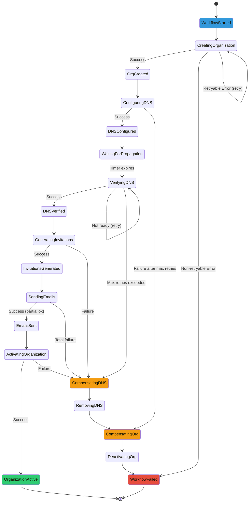

<!-- TL;DR-START -->
## TL;DR

**Summary**: Complete design specification for OrganizationBootstrapWorkflow (15 activities: 7 forward + 2 event emission + 6 compensation, 10-40min duration). Three-layer idempotency: Workflow ID (`org-bootstrap-{orgId}`), activity check-then-act, event upsert. Unified ID system uses `organizationId` everywhere. 7-step flow: Create org → Grant permissions → Configure DNS → Wait propagation → Verify DNS (quorum 2/3) → Generate invitations → Send emails → Emit bootstrap completed. Saga compensation emits `organization.bootstrap.failed` event; `deactivateOrganization` kept as safety net fallback.

**When to read**:
- Understanding complete workflow design and rationale
- Implementing changes to bootstrap workflow
- Debugging workflow execution failures
- Understanding three-layer idempotency strategy

**Prerequisites**: [temporal-overview](../../architecture/workflows/temporal-overview.md), [activities-reference](../reference/activities-reference.md)

**Key topics**: `bootstrap-workflow-design`, `three-layer-idempotency`, `unified-id`, `saga-compensation`, `dns-verification`, `design-by-contract`

**Estimated read time**: 45 minutes
<!-- TL;DR-END -->

# OrganizationBootstrapWorkflow - Implementation & Design Specification

**Status**: ✅ Fully Implemented and Operational
**Implemented**: 2025-12-01 (production deployment with UAT passed)
**Updated**: 2025-12-12 (Quorum-based DNS verification for Cloudflare proxy support)
**Architecture**: 2-Hop (Frontend → Backend API → Temporal)
**Activities**: 15 total (7 forward + 2 event emission + 6 compensation)
**Design Pattern**: Design by Contract with Three-Layer Idempotency
**Complexity Score**: 2.6/5 (Moderate - Justified)
**Priority**: Critical - Core business functionality

## Unified ID System (2025-12-09 Update)

The workflow uses a **Unified ID System** where `organizationId` is the single identifier:

| Use Case | Identifier | Example |
|----------|-----------|---------|
| Event Stream ID | `stream_id = organizationId` | `550e8400-e29b-41d4-a716-446655440000` |
| Temporal Workflow ID | `org-bootstrap-{organizationId}` | `org-bootstrap-550e8400-e29b-41d4-a716-446655440000` |
| Frontend Route | `/organizations/bootstrap/:organizationId/status` | `/organizations/bootstrap/550e8400.../status` |
| Status Polling | `get_bootstrap_status(p_bootstrap_id)` | Pass `organizationId` directly |

### Breaking Change: `workflowId` Deprecated

The `WorkflowStatus` interface's `workflowId` field is now deprecated. Use `organizationId` instead:

```typescript
interface WorkflowStatus {
  /** @deprecated Use organizationId instead */
  workflowId: string;
  /** Primary identifier in unified ID system */
  organizationId: string;
  status: 'running' | 'completed' | 'failed' | 'cancelled';
  progress: Array<{ step: string; completed: boolean; error?: string; }>;
  result?: OrganizationBootstrapResult;
}
```

> **Related Documentation**: This document provides comprehensive design specification and architecture rationale. For a more concise implementation guide focused on Temporal.io deployment, see [Organization Onboarding Workflow](../../architecture/workflows/organization-onboarding-workflow.md).

---

## Table of Contents

1. [Architecture Overview](#architecture-overview)
2. [Problem Analysis](#problem-analysis)
3. [Component Specifications](#component-specifications)
4. [Idempotency Patterns](#idempotency-patterns)
5. [Error Handling Architecture](#error-handling-architecture)
6. [State Management](#state-management)
7. [Complexity Analysis](#complexity-analysis)
8. [Risk Assessment](#risk-assessment)
9. [Testing Strategy](#testing-strategy)
10. [Implementation Roadmap](#implementation-roadmap)
11. [Decision Record](#decision-record)

---

## Architecture Overview

### System Context

The OrganizationBootstrapWorkflow is a long-running (10-40 minutes), durable workflow that orchestrates the complete bootstrap process for new healthcare provider and partner organizations. It must guarantee idempotency across all operations to prevent duplicate resources when workflows are retried or replayed.

### Three-Layer Idempotency Strategy

```mermaid
graph TB
    subgraph "Layer 1: Workflow-Level Idempotency"
        W[Deterministic Workflow ID]
        W --> WID["org-bootstrap-{subdomain}"]
        WID --> TC[Temporal Checks Uniqueness]
    end

    subgraph "Layer 2: Activity-Level Idempotency"
        A[Activity Execution]
        A --> CTA[Check-Then-Act Pattern]
        CTA --> Q[Query Existing State]
        Q --> D{Resource Exists?}
        D -->|Yes| V[Validate Matches Request]
        D -->|No| C[Create Resource]
        V --> R[Return Existing ID]
        C --> R
    end

    subgraph "Layer 3: Event-Level Idempotency"
        E[Event Emission]
        E --> DID[Deterministic Event ID]
        DID --> H[SHA256 Hash of Event Data]
        H --> U[Upsert with Unique Constraint]
        U --> IG[Ignore Duplicates]
    end

    style W fill:#2ecc71
    style A fill:#3498db
    style E fill:#9b59b6
```



### Component Architecture

```mermaid
graph TB
    subgraph "Workflow Orchestration Layer"
        W[OrganizationBootstrapWorkflow]
        W --> WS[Workflow State Machine]
        WS --> |Deterministic ID| WID[Workflow ID Generator]
    end

    subgraph "Activity Execution Layer"
        W --> A1[CreateOrganizationActivity]
        W --> A2[ConfigureDNSActivity]
        W --> A3[VerifyDNSActivity]
        W --> A4[GenerateInvitationsActivity]
        W --> A5[SendInvitationEmailsActivity]
        W --> A6[EmitBootstrapCompletedActivity]
    end

    subgraph "Idempotency Control"
        A1 --> IK1[Idempotency Key: subdomain]
        A2 --> IK2[DNS Record Check]
        A4 --> IK3[Token Deduplication]
        A5 --> IK4[Email Send Record]
    end

    subgraph "Event Store"
        A1 --> E1[OrganizationCreated]
        A2 --> E2[DNSConfigured]
        A4 --> E3[UserInvited]
        A5 --> E4[InvitationEmailSent]
        A6 --> E5[organization.bootstrap.completed]
    end

    subgraph "Compensation Activities"
        W -.-> C1[RemoveDNSActivity]
        W -.-> C2[EmitBootstrapFailedActivity]
        W -.-> C3[DeactivateOrganizationActivity - safety net]
        C1 -.-> E6[DNSRemoved]
        C2 -.-> E7[organization.bootstrap.failed]
        C3 -.-> E8[organization.deactivated]
    end

    style W fill:#2ecc71
    style E1 fill:#3498db
    style E2 fill:#3498db
    style E3 fill:#3498db
    style E4 fill:#3498db
    style E5 fill:#3498db
    style C1 fill:#e74c3c
    style C2 fill:#e74c3c
```



---

## Problem Analysis

### Key Architectural Challenges

1. **Idempotency Guarantees**
   - Workflow may be retried multiple times due to worker crashes, network issues, or Temporal cluster restarts
   - Activities may be executed multiple times due to transient failures
   - Must prevent duplicate organizations, DNS records, and invitation emails

2. **Long-Running Operations**
   - DNS propagation takes 5-30 minutes (unpredictable)
   - Total workflow duration: 10-40 minutes
   - Must survive worker restarts during this time

3. **External API Failures**
   - Cloudflare API may rate limit or fail
   - SMTP servers may reject emails
   - Must retry intelligently without creating duplicates

4. **Partial Failure Scenarios**
   - Organization created but DNS fails
   - DNS configured but invitations fail
   - Must compensate (rollback) completed steps

5. **Event Ordering Consistency**
   - Events must be emitted in correct order
   - Projections updated atomically via triggers
   - Must maintain referential integrity

### Design Constraints

1. **No Direct Database Writes**: Activities emit events only; PostgreSQL triggers update projections
2. **Stateless Activities**: All state tracked in workflow or derived from events
3. **Deterministic Workflow**: No side effects in workflow code (all I/O in activities)
4. **Temporal Best Practices**: Follow Temporal's workflow determinism requirements

---

## Component Specifications

### 1. Workflow Contract

```typescript
/**
 * OrganizationBootstrapWorkflow
 *
 * Orchestrates the complete bootstrap process for new organizations with
 * guaranteed idempotency and compensation support.
 *
 * PRECONDITIONS:
 * - params.orgData.name is non-empty and <= 100 characters
 * - params.subdomain matches /^[a-z0-9-]{3,63}$/ and doesn't start/end with hyphen
 * - params.subdomain is globally unique across all organizations
 * - params.users array has at least one user with provider_admin role
 * - All user emails are valid format and unique within the array
 * - Temporal cluster is available and accepting workflows
 * - Worker is connected to 'bootstrap' task queue
 *
 * POSTCONDITIONS (Success):
 * - Organization exists in organizations_projection with unique org_id
 * - DNS CNAME record exists: {subdomain}.firstovertheline.com → app.firstovertheline.com
 * - DNS record is verified to resolve correctly
 * - All users have invitation records in user_invitations_projection
 * - All invitation emails have been sent (or failures recorded)
 * - Organization is_active = true in projection
 * - All domain events emitted to domain_events table
 * - Workflow returns OrganizationBootstrapResult with orgId and metrics
 *
 * POSTCONDITIONS (Failure):
 * - Compensation executed for any completed steps
 * - DNS record removed if it was created
 * - Organization marked as inactive if it was created
 * - Error details available in workflow history
 * - Workflow throws with descriptive error message
 *
 * INVARIANTS:
 * - Subdomain uniqueness is maintained (no duplicate DNS records)
 * - Organization hierarchy integrity preserved (parent relationships valid)
 * - Event ordering is strictly sequential per aggregate
 * - No orphaned resources (DNS without org, invitations without org)
 * - Workflow ID is deterministic: org-bootstrap-{subdomain}-{timestamp}
 *
 * PERFORMANCE:
 * - Total execution time: 10-40 minutes (DNS propagation dependent)
 * - Activity timeout: 5 minutes per activity (10 minutes for DNS)
 * - Maximum retries: 3 per activity (5 for DNS operations)
 * - Workflow timeout: 60 minutes total
 *
 * IDEMPOTENCY:
 * - Workflow ID includes subdomain to prevent duplicate workflows
 * - Activities check existing state before creating resources
 * - Events use upsert patterns with unique constraints
 * - DNS operations check for existing records first
 */
export async function OrganizationBootstrapWorkflow(
  params: OrganizationBootstrapParams
): Promise<OrganizationBootstrapResult> {

  const state: WorkflowState = {
    orgCreated: false,
    dnsConfigured: false,
    invitationsSent: false,
    errors: [],
    compensationErrors: []
  };

  try {
    // ========================================
    // STEP 1: Create Organization
    // ========================================
    console.log('[WORKFLOW] Creating organization:', params.orgData.name);

    state.orgId = await createOrganizationActivity({
      name: params.orgData.name,
      type: params.orgData.type,
      parentOrgId: params.orgData.parentOrgId,
      contactEmail: params.orgData.contactEmail,
      subdomain: params.subdomain
    });

    state.orgCreated = true;
    console.log('[WORKFLOW] Organization created:', state.orgId);

    // ========================================
    // STEP 2: Configure DNS Subdomain
    // ========================================
    console.log('[WORKFLOW] Configuring DNS for subdomain:', params.subdomain);

    const dnsResult = await configureDNSActivity({
      orgId: state.orgId,
      subdomain: params.subdomain,
      targetDomain: 'firstovertheline.com'
    });

    state.domain = dnsResult.fqdn;
    state.dnsRecordId = dnsResult.recordId;
    state.dnsConfigured = true;
    console.log('[WORKFLOW] DNS configured:', state.domain);

    // ========================================
    // STEP 3: Wait for DNS Propagation
    // ========================================
    const propagationWait = 5 * 60 * 1000; // 5 minutes
    console.log('[WORKFLOW] Waiting for DNS propagation:', propagationWait / 1000, 'seconds');
    await sleep(propagationWait);

    // ========================================
    // STEP 4: Verify DNS Resolution
    // ========================================
    console.log('[WORKFLOW] Verifying DNS resolution for:', state.domain);

    const maxRetries = 6; // Total: 5 min + (6 * 5 min) = 35 min max
    const retryDelay = 5 * 60 * 1000;

    for (let attempt = 1; attempt <= maxRetries; attempt++) {
      try {
        // NOTE: verifyDNSActivity uses quorum-based multi-server lookup
        // - Queries 3 DNS servers in parallel (Google, Cloudflare, OpenDNS)
        // - Requires 2/3 quorum for success
        // - Emits organization.subdomain.verified event on success
        await verifyDNSActivity({ orgId: state.orgId, domain: state.domain });
        console.log('[WORKFLOW] DNS verified on attempt', attempt);
        break;
      } catch (error) {
        if (attempt === maxRetries) {
          throw new Error(`DNS verification failed after ${maxRetries} attempts`);
        }
        console.log(`[WORKFLOW] DNS not ready, retrying in ${retryDelay / 1000}s (${attempt}/${maxRetries})`);
        await sleep(retryDelay);
      }
    }

    // ========================================
    // STEP 5: Generate User Invitations
    // ========================================
    console.log('[WORKFLOW] Generating invitations for', params.users.length, 'users');

    state.invitations = await generateInvitationsActivity({
      orgId: state.orgId,
      users: params.users
    });

    // ========================================
    // STEP 6: Send Invitation Emails
    // ========================================
    console.log('[WORKFLOW] Sending invitation emails');

    const emailResults = await sendInvitationEmailsActivity({
      orgId: state.orgId,
      invitations: state.invitations,
      domain: state.domain
    });

    state.invitationsSent = true;

    if (emailResults.failures.length > 0) {
      state.errors = emailResults.failures.map(f =>
        `Failed to send email to ${f.email}: ${f.error}`
      );
      console.warn('[WORKFLOW] Some emails failed:', state.errors);
    }

    // ========================================
    // STEP 7: Emit Bootstrap Completed Event
    // ========================================
    console.log('[WORKFLOW] Emitting bootstrap completed event');

    await emitBootstrapCompletedActivity({
      orgId: state.orgId,
      bootstrapId: params.tracing?.correlationId || state.orgId,
      adminRoleAssigned: 'provider_admin',
      permissionsGranted: permResult.permissionsGranted,
      ltreePath: scopePath,
      tracing: params.tracing,
    });

    console.log('[WORKFLOW] Organization bootstrap completed successfully');

    return {
      orgId: state.orgId,
      domain: state.domain,
      dnsConfigured: true,
      invitationsSent: emailResults.successCount,
      errors: state.errors.length > 0 ? state.errors : undefined
    };

  } catch (error) {
    console.error('[WORKFLOW] Error during bootstrap:', error);

    // ========================================
    // COMPENSATION: Rollback Completed Steps
    // ========================================
    console.log('[WORKFLOW] Starting compensation...');

    try {
      // Remove DNS if it was configured
      if (state.dnsConfigured) {
        console.log('[WORKFLOW] Compensating: Removing DNS configuration');
        await removeDNSActivity({
          subdomain: params.subdomain
        });
      }

      // Emit bootstrap failed event (handler sets is_active = false)
      if (state.orgCreated && state.orgId) {
        console.log('[WORKFLOW] Compensating: Emitting bootstrap failed event');
        await emitBootstrapFailedActivity({
          orgId: state.orgId,
          bootstrapId: params.tracing?.correlationId || state.orgId,
          failureStage: 'unknown',
          errorMessage: error.message,
          tracing: params.tracing,
        });
      }

      // Deactivate organization (safety net)
      // Redundant when emitBootstrapFailedActivity succeeds (handler sets is_active = false).
      // Kept as fallback in case event emission failed above. Remove in P2 cleanup.
      if (state.orgCreated && state.orgId) {
        console.log('[WORKFLOW] Compensating: Deactivating organization (safety net)');
        await deactivateOrganizationActivity({
          orgId: state.orgId
        });
      }

      console.log('[WORKFLOW] Compensation completed');
    } catch (compensationError) {
      console.error('[WORKFLOW] Compensation failed:', compensationError);
      state.compensationErrors.push(compensationError.message);
    }

    throw error; // Re-throw original error
  }
}

interface WorkflowState {
  orgId?: string;
  domain?: string;
  dnsRecordId?: string;
  invitations?: Invitation[];
  orgCreated: boolean;
  dnsConfigured: boolean;
  invitationsSent: boolean;
  errors: string[];
  compensationErrors: string[];
}
```

---

## Provider Interfaces

To ensure testability and flexibility, external service integrations (DNS and email) are abstracted behind provider interfaces that support dependency injection.

### IDNSProvider Interface

```typescript
/**
 * DNS Provider Interface
 *
 * Abstracts DNS record management operations to enable:
 * - Testing without Cloudflare API access
 * - Local development without real DNS changes
 * - Future migration to alternative DNS providers
 */
export interface IDNSProvider {
  /**
   * List DNS zones for a domain
   */
  listZones(domain: string): Promise<DNSZone[]>;

  /**
   * List DNS records in a zone with optional filtering
   */
  listRecords(zoneId: string, filter: DNSRecordFilter): Promise<DNSRecord[]>;

  /**
   * Create a new DNS record
   */
  createRecord(zoneId: string, params: CreateDNSRecordParams): Promise<DNSRecord>;

  /**
   * Delete a DNS record by ID
   */
  deleteRecord(zoneId: string, recordId: string): Promise<void>;
}

export interface DNSZone {
  id: string;
  name: string;
}

export interface DNSRecord {
  id: string;
  type: 'CNAME' | 'A' | 'AAAA' | 'TXT' | 'MX';
  name: string;
  content: string;
  proxied?: boolean;
  ttl?: number;
}

export interface DNSRecordFilter {
  name?: string;
  type?: string;
}

export interface CreateDNSRecordParams {
  type: 'CNAME' | 'A' | 'AAAA' | 'TXT' | 'MX';
  name: string;
  content: string;
  proxied?: boolean;
  ttl?: number;
}
```

### IEmailProvider Interface

```typescript
/**
 * Email Provider Interface
 *
 * Abstracts email sending operations to enable:
 * - Testing without SMTP server access
 * - Local development without sending real emails
 * - Future migration to transactional email services (SendGrid, Postmark, etc.)
 */
export interface IEmailProvider {
  /**
   * Send an email
   */
  sendEmail(params: EmailParams): Promise<EmailResult>;

  /**
   * Verify email service connection
   */
  verifyConnection(): Promise<boolean>;
}

export interface EmailParams {
  from: string;
  to: string;
  subject: string;
  html: string;
  text?: string;
}

export interface EmailResult {
  messageId: string;
  accepted: string[];
  rejected: string[];
}
```

### Provider Implementations

| Provider | Environment | Description | Use Case |
|----------|-------------|-------------|----------|
| **CloudflareDNSProvider** | Production | Real Cloudflare API integration | Production workflows |
| **MockDNSProvider** | Testing | In-memory mock, returns success | Unit/integration tests |
| **LoggingDNSProvider** | Development | Logs operations to console | Local development without API |
| **ResendEmailProvider** | Production | Resend transactional email service | Production workflows (RECOMMENDED) |
| **SMTPEmailProvider** | Production (legacy) | Nodemailer with SMTP | Legacy SMTP servers |
| **MockEmailProvider** | Testing | In-memory mock, returns success | Unit/integration tests |
| **LoggingEmailProvider** | Development | Logs email content to console | Local development without email |

### Provider Factory Pattern

```typescript
/**
 * Factory function to get DNS provider based on environment
 */
export function getDNSProvider(): IDNSProvider {
  const env = process.env.NODE_ENV || 'development';

  switch (env) {
    case 'production':
      return new CloudflareDNSProvider({
        apiToken: process.env.CLOUDFLARE_API_TOKEN!
      });

    case 'test':
      return new MockDNSProvider();

    case 'development':
    default:
      // Use logging provider for local dev (no real DNS changes)
      return new LoggingDNSProvider();
  }
}

/**
 * Factory function to get email provider based on environment
 */
export function getEmailProvider(): IEmailProvider {
  const env = process.env.NODE_ENV || 'development';

  switch (env) {
    case 'production':
      // Use Resend for transactional emails (recommended)
      if (process.env.RESEND_API_KEY) {
        return new ResendEmailProvider(process.env.RESEND_API_KEY);
      }
      // Fallback to SMTP if Resend not configured
      if (process.env.SMTP_HOST) {
        return new SMTPEmailProvider({
          host: process.env.SMTP_HOST,
          port: parseInt(process.env.SMTP_PORT || '587'),
          user: process.env.SMTP_USER!,
          pass: process.env.SMTP_PASS!
        });
      }
      throw new Error('No email provider configured. Set RESEND_API_KEY or SMTP credentials.');

    case 'test':
      return new MockEmailProvider();

    case 'development':
    default:
      // Use logging provider for local dev (logs to console)
      return new LoggingEmailProvider();
  }
}
```

### Dependency Injection Pattern

Activities accept provider instances as optional parameters, with factory functions as defaults:

```typescript
// Example: ConfigureDNSActivity with dependency injection
export async function configureDNSActivity(
  params: ConfigureDNSParams,
  dnsProvider: IDNSProvider = getDNSProvider()  // Injected or default
): Promise<ConfigureDNSResult> {
  // Use dnsProvider instead of direct Cloudflare SDK
  const zones = await dnsProvider.listZones(params.targetDomain);
  const records = await dnsProvider.listRecords(zoneId, { name: fqdn, type: 'CNAME' });
  // ...
}

// In tests, inject mock provider:
const mockDNS = new MockDNSProvider();
const result = await configureDNSActivity(params, mockDNS);
```

### ResendEmailProvider Implementation

Complete implementation of the Resend email provider for production use:

```typescript
import { Resend } from 'resend';
import type { IEmailProvider, EmailParams, EmailResult } from './interfaces';

/**
 * ResendEmailProvider - Production email provider using Resend API
 *
 * Resend is a modern transactional email service optimized for developers.
 *
 * Benefits:
 * - Excellent deliverability (emails don't land in spam)
 * - Simple API (no SMTP configuration needed)
 * - 100 emails/day free tier
 * - $20/month for 50,000 emails (production)
 * - Built-in analytics and tracking
 * - HIPAA-compliant infrastructure available
 *
 * Setup:
 * 1. Sign up at https://resend.com
 * 2. Verify your domain (add DNS records)
 * 3. Get API key from dashboard
 * 4. Set RESEND_API_KEY environment variable
 *
 * Installation:
 * npm install resend
 */
export class ResendEmailProvider implements IEmailProvider {
  private resend: Resend;

  constructor(apiKey: string) {
    if (!apiKey) {
      throw new Error('Resend API key is required');
    }
    this.resend = new Resend(apiKey);
  }

  async sendEmail(params: EmailParams): Promise<EmailResult> {
    try {
      const { data, error } = await this.resend.emails.send({
        from: params.from,
        to: params.to,
        subject: params.subject,
        html: params.html,
        text: params.text
      });

      if (error) {
        throw new Error(`Resend API error: ${error.message}`);
      }

      if (!data) {
        throw new Error('Resend API returned no data');
      }

      return {
        messageId: data.id,
        accepted: [params.to],
        rejected: []
      };

    } catch (error) {
      const errorMessage = error instanceof Error ? error.message : 'Unknown error';
      throw new Error(`Failed to send email via Resend: ${errorMessage}`);
    }
  }

  async verifyConnection(): Promise<boolean> {
    try {
      // Resend doesn't have a dedicated health check endpoint
      // We verify the API key is valid by checking if we can access it
      // (The SDK will throw an error on initialization if key is invalid)
      return true;
    } catch (error) {
      return false;
    }
  }
}
```

### Environment Variables

Required environment variables for each provider:

```bash
# ===================================
# Production: Resend (Recommended)
# ===================================
RESEND_API_KEY=re_xxxxxxxxxxxxxxxxxx

# ===================================
# Production: SMTP (Legacy/Fallback)
# ===================================
SMTP_HOST=smtp.example.com
SMTP_PORT=587
SMTP_USER=your-smtp-username
SMTP_PASS=your-smtp-password

# ===================================
# DNS Provider: Cloudflare
# ===================================
CLOUDFLARE_API_TOKEN=your-cloudflare-api-token
CLOUDFLARE_ZONE_ID=your-zone-id (optional, can be queried)

# ===================================
# Application
# ===================================
NODE_ENV=production|development|test
```

**Production Configuration Example**:
```bash
# Kubernetes Secret: temporal-worker-secrets
NODE_ENV=production
RESEND_API_KEY=re_xxxxxxxxxxxxxxxxxxxxxxxxxxxxx
CLOUDFLARE_API_TOKEN=your-cloudflare-api-token
SUPABASE_URL=https://your-project.supabase.co
SUPABASE_SERVICE_ROLE_KEY=your-service-role-key
```

---

### 2. Activity Contracts

#### 2.1 CreateOrganizationActivity

```typescript
/**
 * Creates an organization by emitting OrganizationCreated event
 *
 * PRECONDITIONS:
 * - params.subdomain is globally unique (not in organizations_projection)
 * - params.parentOrgId exists if type='partner'
 * - Database connection is available
 * - domain_events table accepts inserts
 *
 * POSTCONDITIONS:
 * - Returns existing orgId if organization with subdomain already exists
 * - Otherwise, new UUID generated and OrganizationCreated event emitted
 * - Event contains complete organization data including ltree path
 * - Event processor will create organizations_projection record
 *
 * INVARIANTS:
 * - Only one organization per subdomain can exist
 * - Organization paths follow ltree hierarchy rules
 * - Event aggregate_id matches returned orgId
 *
 * IDEMPOTENCY:
 * - Query organizations_projection for existing subdomain first
 * - If exists and matches all params, return existing orgId
 * - If exists with different params, throw non-retryable error
 * - Use subdomain as natural idempotency key
 *
 * PERFORMANCE:
 * - Database query: < 100ms
 * - Event insertion: < 200ms
 * - Total: < 500ms p99
 *
 * COMPLEXITY: 3/5 (Moderate)
 * - Ltree path calculation logic
 * - Parent organization lookup for partners
 * - Event emission with workflow metadata
 */
export async function createOrganizationActivity(
  params: CreateOrganizationParams
): Promise<string> {

  // IDEMPOTENCY: Check if organization already exists
  const { data: existing } = await supabase
    .from('organizations_projection')
    .select('org_id, name, type, domain')
    .eq('domain', `${params.subdomain}.firstovertheline.com`)
    .single();

  if (existing) {
    // Validate it matches expected parameters
    if (existing.name !== params.name || existing.type !== params.type) {
      throw ApplicationFailure.create({
        message: 'Organization exists with different configuration',
        nonRetryable: true,
        details: [{
          existing: existing,
          requested: params
        }]
      });
    }

    console.log('[ACTIVITY] Organization already exists, returning:', existing.org_id);
    return existing.org_id;
  }

  // Generate new organization ID
  const orgId = uuidv4();

  // Build ltree path
  let path: string;
  if (params.type === 'provider') {
    // Top-level provider: path = subdomain
    path = params.subdomain;
  } else {
    // Partner organization: path = parent.subdomain
    if (!params.parentOrgId) {
      throw ApplicationFailure.create({
        message: 'Partner organizations must have a parent',
        nonRetryable: true
      });
    }

    const { data: parent } = await supabase
      .from('organizations_projection')
      .select('path')
      .eq('org_id', params.parentOrgId)
      .single();

    if (!parent) {
      throw ApplicationFailure.create({
        message: `Parent organization not found: ${params.parentOrgId}`,
        nonRetryable: true
      });
    }

    path = `${parent.path}.${params.subdomain}`;
  }

  // Get workflow context for event metadata
  const workflowInfo = Context.current().info;

  // Emit OrganizationCreated event
  const { error: eventError } = await supabase
    .from('domain_events')
    .insert({
      event_type: 'OrganizationCreated',
      aggregate_type: 'Organization',
      aggregate_id: orgId,
      event_data: {
        org_id: orgId,
        name: params.name,
        type: params.type,
        parent_org_id: params.parentOrgId || null,
        contact_email: params.contactEmail,
        domain: `${params.subdomain}.firstovertheline.com`,
        path: path,
        is_active: false // Activated after full bootstrap
      },
      metadata: {
        workflow_id: workflowInfo.workflowId,
        workflow_run_id: workflowInfo.runId,
        workflow_type: workflowInfo.workflowType,
        activity_id: workflowInfo.activityId
      }
    });

  if (eventError) {
    throw new Error(`Failed to emit OrganizationCreated event: ${eventError.message}`);
  }

  console.log(`[ACTIVITY] Emitted OrganizationCreated event for org: ${orgId}`);

  return orgId;
}

interface CreateOrganizationParams {
  name: string;
  type: 'provider' | 'partner';
  parentOrgId?: string;
  contactEmail: string;
  subdomain: string;
}
```

#### 2.2 ConfigureDNSActivity

```typescript
/**
 * Configures DNS CNAME record via DNS provider (abstracted for testability)
 *
 * PRECONDITIONS:
 * - params.orgId exists in organizations_projection
 * - params.subdomain doesn't have existing DNS record (or matches expected)
 * - DNS provider has valid credentials and zone access
 * - Target zone (firstovertheline.com) exists in DNS provider account
 *
 * POSTCONDITIONS:
 * - CNAME record exists: {subdomain}.firstovertheline.com → app.firstovertheline.com
 * - Record is proxied (if supported by provider)
 * - DNSConfigured event emitted with record_id
 * - Returns fqdn and recordId for verification
 *
 * INVARIANTS:
 * - Only one DNS record per subdomain
 * - All records point to same target (app.firstovertheline.com)
 * - Proxied status is always true for SSL/CDN benefits (Cloudflare)
 *
 * IDEMPOTENCY:
 * - List existing DNS records for subdomain first
 * - If exists with correct target, retrieve and return recordId
 * - If exists with wrong target, throw non-retryable error
 * - Store record_id in event for future reference
 *
 * DEPENDENCY INJECTION:
 * - dnsProvider parameter allows injecting mock/logging providers for testing
 * - Defaults to getDNSProvider() factory (production/dev/test based on NODE_ENV)
 * - Enables unit testing without Cloudflare API access
 *
 * PERFORMANCE:
 * - DNS API call: < 2s
 * - Event emission: < 200ms
 * - Total: < 3s p99
 *
 * COMPLEXITY: 4/5 (Moderate-High)
 * - External API integration
 * - API error handling and rate limiting
 * - DNS record conflict resolution
 */
export async function configureDNSActivity(
  params: ConfigureDNSParams,
  dnsProvider: IDNSProvider = getDNSProvider()  // Dependency injection
): Promise<ConfigureDNSResult> {

  const fqdn = `${params.subdomain}.${params.targetDomain}`;

  // Get zone ID for target domain
  const zones = await dnsProvider.listZones(params.targetDomain);
  if (!zones || zones.length === 0) {
    throw ApplicationFailure.create({
      message: `Zone not found for domain: ${params.targetDomain}`,
      nonRetryable: true
    });
  }
  const zoneId = zones[0].id;

  // IDEMPOTENCY: Check for existing DNS record
  const existingRecords = await dnsProvider.listRecords(zoneId, {
    name: fqdn,
    type: 'CNAME'
  });

  if (existingRecords && existingRecords.length > 0) {
    const existing = existingRecords[0];

    // Verify it points to correct target
    if (existing.content !== 'app.firstovertheline.com') {
      throw ApplicationFailure.create({
        message: `DNS record exists but points to wrong target: ${existing.content}`,
        nonRetryable: true,
        details: [{ existing, expected: 'app.firstovertheline.com' }]
      });
    }

    console.log(`[ACTIVITY] DNS record already exists, reusing: ${existing.id}`);

    // Emit DNSConfigured event (idempotent)
    await emitDNSConfiguredEvent(params.orgId, params.subdomain, fqdn, existing.id);

    return {
      fqdn,
      recordId: existing.id
    };
  }

  // Create CNAME record
  const record = await dnsProvider.createRecord(zoneId, {
    type: 'CNAME',
    name: params.subdomain,
    content: 'app.firstovertheline.com',
    proxied: true, // Cloudflare proxy for SSL/CDN (ignored by non-Cloudflare providers)
    ttl: 1 // Auto TTL (proxied)
  });

  console.log(`[ACTIVITY] Created DNS record: ${fqdn} -> ${record.content}`);

  // Emit DNSConfigured event
  await emitDNSConfiguredEvent(params.orgId, params.subdomain, fqdn, record.id);

  return {
    fqdn,
    recordId: record.id
  };
}

async function emitDNSConfiguredEvent(
  orgId: string,
  subdomain: string,
  fqdn: string,
  recordId: string
): Promise<void> {
  const workflowInfo = Context.current().info;

  const { error: eventError } = await supabase
    .from('domain_events')
    .insert({
      event_type: 'DNSConfigured',
      aggregate_type: 'Organization',
      aggregate_id: orgId,
      event_data: {
        org_id: orgId,
        subdomain: subdomain,
        fqdn: fqdn,
        cloudflare_record_id: recordId,
        proxied: true
      },
      metadata: {
        workflow_id: workflowInfo.workflowId,
        workflow_run_id: workflowInfo.runId,
        workflow_type: workflowInfo.workflowType
      }
    });

  if (eventError) {
    console.error(`[ACTIVITY] Failed to emit DNSConfigured event: ${eventError.message}`);
    throw new Error(`Failed to emit DNSConfigured event: ${eventError.message}`);
  }
}

interface ConfigureDNSParams {
  orgId: string;
  subdomain: string;
  targetDomain: string;
}

interface ConfigureDNSResult {
  fqdn: string;
  recordId: string;
}
```

#### 2.3 VerifyDNSActivity

```typescript
/**
 * Verifies DNS record propagation using quorum-based multi-server lookup
 *
 * PRECONDITIONS:
 * - DNS record has been created via Cloudflare
 * - params.domain is valid FQDN
 * - params.orgId is valid organization UUID
 *
 * POSTCONDITIONS:
 * - At least 2 of 3 DNS servers confirm A records exist
 * - organization.subdomain.verified event emitted
 * - subdomain_status updated to 'verified' in organizations_projection
 * - Throws error if quorum not reached (will be retried by workflow)
 *
 * WHY QUORUM-BASED:
 * - Cloudflare proxied records return A records, not CNAME
 * - dns.resolveCname() fails with ENODATA for proxied records
 * - Quorum provides redundancy against single server failures
 * - Different providers = global propagation confirmation
 *
 * DNS SERVERS QUERIED (parallel):
 * - Google DNS (8.8.8.8)
 * - Cloudflare DNS (1.1.1.1)
 * - OpenDNS (208.67.222.222)
 *
 * QUORUM CONFIGURATION:
 * - Total servers: 3
 * - Required for success: 2
 * - Timeout per server: 5000ms
 *
 * INVARIANTS:
 * - Uses Resolver.resolve4() for A record lookup (not CNAME)
 * - Each server queried via isolated Resolver instance
 * - Event emission is idempotent (ON CONFLICT DO NOTHING)
 *
 * IDEMPOTENCY:
 * - DNS queries are read-only (fully idempotent)
 * - Event emission uses idempotent insert
 * - Safe to retry unlimited times
 *
 * PERFORMANCE:
 * - Parallel DNS queries: ~100-500ms per server
 * - 5s timeout prevents hanging on slow servers
 * - Total: < 6s worst case (timeout + event emission)
 *
 * COMPLEXITY: 2/5 (Low-Moderate)
 * - Parallel DNS queries to multiple servers
 * - Quorum logic
 * - Event emission with rich debugging data
 */
export async function verifyDNSActivity(
  params: VerifyDNSParams
): Promise<boolean> {

  // Development/mock mode: skip real DNS verification
  const workflowMode = process.env.WORKFLOW_MODE || 'development';
  if (workflowMode === 'mock' || workflowMode === 'development') {
    await emitEvent({
      event_type: 'organization.subdomain.verified',
      aggregate_type: 'Organization',
      aggregate_id: params.orgId,
      event_data: {
        domain: params.domain,
        verified: true,
        verification_method: 'development'
      }
    });
    return true;
  }

  // Production mode: Quorum-based DNS verification
  const { verified, results } = await verifyDnsWithQuorum(params.domain);

  const successCount = results.filter(r => r.success).length;
  console.log(`[ACTIVITY] DNS quorum: ${successCount}/3 (required: 2)`);

  if (!verified) {
    throw new Error(
      `DNS verification failed: only ${successCount}/3 servers confirmed. ` +
      `Required quorum: 2. Domain may not be fully propagated.`
    );
  }

  // Emit verification event with full debugging data
  await emitEvent({
    event_type: 'organization.subdomain.verified',
    aggregate_type: 'Organization',
    aggregate_id: params.orgId,
    event_data: {
      domain: params.domain,
      verified: true,
      verification_method: 'dns_quorum',
      quorum: `${successCount}/3`,
      dns_results: results,
      resolved_ips: results.find(r => r.success)?.ips || []
    }
  });

  return true;
}

interface VerifyDNSParams {
  orgId: string;
  domain: string;
}
```

#### 2.4 GenerateInvitationsActivity

```typescript
/**
 * Generates secure invitation tokens for users
 *
 * PRECONDITIONS:
 * - params.orgId exists in organizations_projection
 * - All user emails are valid format
 * - User roles are valid enum values
 *
 * POSTCONDITIONS:
 * - Each user has invitation record in user_invitations_projection
 * - Tokens are cryptographically secure (256-bit random)
 * - Tokens are URL-safe base64 encoded
 * - UserInvited events emitted for each invitation
 * - Expiration set to 7 days from generation
 *
 * INVARIANTS:
 * - Token uniqueness across all invitations
 * - One invitation per email per organization
 * - Invitation status is 'pending' on creation
 *
 * IDEMPOTENCY:
 * - Query existing invitations for orgId + email pairs
 * - Reuse existing tokens if status='pending' and not expired
 * - Generate new tokens only for missing invitations
 * - Return mix of existing and new invitation data
 *
 * PERFORMANCE:
 * - Token generation: < 10ms per user
 * - Event emission: < 200ms per user
 * - Total: < 1s for 10 users
 *
 * COMPLEXITY: 2/5 (Low-Moderate)
 * - Cryptographic token generation
 * - Batch event emission
 */
export async function generateInvitationsActivity(
  params: GenerateInvitationsParams
): Promise<Invitation[]> {

  const invitations: Invitation[] = [];
  const workflowInfo = Context.current().info;

  for (const user of params.users) {
    // IDEMPOTENCY: Check for existing invitation
    const { data: existing } = await supabase
      .from('user_invitations_projection')
      .select('invitation_id, email, token, expires_at, status')
      .eq('org_id', params.orgId)
      .eq('email', user.email)
      .single();

    if (existing && existing.status === 'pending' && new Date(existing.expires_at) > new Date()) {
      console.log(`[ACTIVITY] Reusing existing invitation for: ${user.email}`);
      invitations.push({
        invitationId: existing.invitation_id,
        email: existing.email,
        token: existing.token,
        expiresAt: new Date(existing.expires_at)
      });
      continue;
    }

    // Generate new invitation
    const invitationId = uuidv4();
    const token = randomBytes(32).toString('base64url'); // URL-safe token
    const expiresAt = new Date(Date.now() + 7 * 24 * 60 * 60 * 1000); // 7 days

    // Emit UserInvited event
    const { error: eventError } = await supabase
      .from('domain_events')
      .insert({
        event_type: 'UserInvited',
        aggregate_type: 'User',
        aggregate_id: invitationId,
        event_data: {
          invitation_id: invitationId,
          org_id: params.orgId,
          email: user.email,
          first_name: user.firstName,
          last_name: user.lastName,
          role: user.role,
          token: token,
          expires_at: expiresAt.toISOString(),
          status: 'pending'
        },
        metadata: {
          workflow_id: workflowInfo.workflowId,
          workflow_run_id: workflowInfo.runId,
          workflow_type: workflowInfo.workflowType
        }
      });

    if (eventError) {
      console.error(`[ACTIVITY] Failed to emit UserInvited event for ${user.email}:`, eventError);
      throw new Error(`Failed to emit UserInvited event: ${eventError.message}`);
    }

    invitations.push({
      invitationId,
      email: user.email,
      token,
      expiresAt
    });

    console.log(`[ACTIVITY] Generated invitation for: ${user.email}`);
  }

  return invitations;
}

interface GenerateInvitationsParams {
  orgId: string;
  users: Array<{
    email: string;
    firstName: string;
    lastName: string;
    role: string;
  }>;
}

interface Invitation {
  invitationId: string;
  email: string;
  token: string;
  expiresAt: Date;
}
```

#### 2.5 SendInvitationEmailsActivity

```typescript
/**
 * Sends invitation emails via email provider (abstracted for testability)
 *
 * PRECONDITIONS:
 * - Email provider is configured and accessible
 * - params.invitations contains valid email addresses
 * - params.domain is the organization's FQDN
 *
 * POSTCONDITIONS:
 * - Email sent for each invitation (best effort)
 * - InvitationEmailSent event for successful sends
 * - InvitationEmailFailed event for failures
 * - Returns count of successes and list of failures
 *
 * INVARIANTS:
 * - Partial success is acceptable (some emails may fail)
 * - Each email attempt is independent
 * - Failures don't block workflow completion
 *
 * IDEMPOTENCY:
 * - Query for existing InvitationEmailSent events
 * - Skip emails that were already sent successfully
 * - Retry failed emails
 *
 * DEPENDENCY INJECTION:
 * - emailProvider parameter allows injecting mock/logging providers for testing
 * - Defaults to getEmailProvider() factory (production/dev/test based on NODE_ENV)
 * - Enables unit testing without SMTP server access
 *
 * PERFORMANCE:
 * - Email send: 1-3s per email (SMTP)
 * - Total: < 30s for 10 emails
 *
 * COMPLEXITY: 3/5 (Moderate)
 * - Email provider integration
 * - HTML email templating
 * - Error handling per email
 */
export async function sendInvitationEmailsActivity(
  params: SendInvitationEmailsParams,
  emailProvider: IEmailProvider = getEmailProvider()  // Dependency injection
): Promise<SendInvitationEmailsResult> {

  const result: SendInvitationEmailsResult = {
    successCount: 0,
    failures: []
  };

  const workflowInfo = Context.current().info;

  for (const invitation of params.invitations) {
    // IDEMPOTENCY: Check if email already sent
    const { data: sentEvent } = await supabase
      .from('domain_events')
      .select('event_id')
      .eq('event_type', 'InvitationEmailSent')
      .eq('aggregate_id', invitation.invitationId)
      .single();

    if (sentEvent) {
      console.log(`[ACTIVITY] Email already sent to: ${invitation.email}, skipping`);
      result.successCount++;
      continue;
    }

    try {
      const inviteLink = `https://${params.domain}/auth/accept-invitation?token=${invitation.token}`;

      const emailResult = await emailProvider.sendEmail({
        from: '"A4C Platform" <noreply@firstovertheline.com>',
        to: invitation.email,
        subject: 'You\'re invited to join A4C Analytics Platform',
        html: `
          <h2>Welcome to A4C Analytics Platform</h2>
          <p>You've been invited to join our healthcare analytics platform.</p>
          <p>Click the link below to accept your invitation and set up your account:</p>
          <p><a href="${inviteLink}">${inviteLink}</a></p>
          <p>This invitation expires in 7 days.</p>
          <p>If you did not expect this invitation, you can safely ignore this email.</p>
        `
      });

      result.successCount++;
      console.log(`[ACTIVITY] Sent invitation email to: ${invitation.email} (messageId: ${emailResult.messageId})`);

      // Emit InvitationEmailSent event
      await supabase.from('domain_events').insert({
        event_type: 'InvitationEmailSent',
        aggregate_type: 'User',
        aggregate_id: invitation.invitationId,
        event_data: {
          invitation_id: invitation.invitationId,
          email: invitation.email,
          sent_at: new Date().toISOString(),
          message_id: emailResult.messageId
        },
        metadata: {
          workflow_id: workflowInfo.workflowId,
          workflow_run_id: workflowInfo.runId
        }
      });

    } catch (error) {
      const errorMessage = error instanceof Error ? error.message : 'Unknown error';
      result.failures.push({
        email: invitation.email,
        error: errorMessage
      });
      console.error(`[ACTIVITY] Failed to send email to ${invitation.email}:`, error);

      // Emit InvitationEmailFailed event
      await supabase.from('domain_events').insert({
        event_type: 'InvitationEmailFailed',
        aggregate_type: 'User',
        aggregate_id: invitation.invitationId,
        event_data: {
          invitation_id: invitation.invitationId,
          email: invitation.email,
          error: errorMessage
        },
        metadata: {
          workflow_id: workflowInfo.workflowId,
          workflow_run_id: workflowInfo.runId
        }
      });
    }
  }

  return result;
}

interface SendInvitationEmailsParams {
  orgId: string;
  invitations: Invitation[];
  domain: string;
}

interface SendInvitationEmailsResult {
  successCount: number;
  failures: Array<{ email: string; error: string }>;
}
```

#### 2.6 EmitBootstrapCompletedActivity

```typescript
/**
 * Emits organization.bootstrap.completed event
 *
 * The synchronous trigger handler (handle_bootstrap_completed) sets
 * is_active=true on the organizations_projection. This replaces the
 * previous activateOrganizationActivity which wrote directly to the projection.
 *
 * PRECONDITIONS:
 * - params.orgId exists in organizations_projection
 * - All bootstrap steps completed successfully
 *
 * POSTCONDITIONS:
 * - organization.bootstrap.completed event emitted
 * - Trigger handler sets is_active=true, metadata.bootstrap.completed_at
 *
 * IDEMPOTENCY:
 * - Event emission via typed emitter with tracing context
 *
 * PERFORMANCE:
 * - Event emission: < 200ms
 *
 * COMPLEXITY: 1/5 (Low)
 * - Simple event emission via typed emitter
 */
export async function emitBootstrapCompletedActivity(
  params: EmitBootstrapCompletedParams
): Promise<EmitBootstrapCompletedResult> {
  const log = getLogger('EmitBootstrapCompleted');
  log.info('Emitting bootstrap completed event', { orgId: params.orgId });

  const eventId = await emitBootstrapCompleted(params.orgId, {
    bootstrap_id: params.bootstrapId,
    organization_id: params.orgId,
    admin_role_assigned: params.adminRoleAssigned as AdminRole,
    permissions_granted: params.permissionsGranted,
    ltree_path: params.ltreePath,
  }, params.tracing);

  log.info('Bootstrap completed event emitted', { eventId });
  return { eventId };
}

interface EmitBootstrapCompletedParams {
  orgId: string;
  bootstrapId: string;
  adminRoleAssigned: string; // e.g. 'provider_admin'
  permissionsGranted: number;
  ltreePath?: string;
  tracing?: WorkflowTracingParams;
}

interface EmitBootstrapCompletedResult {
  eventId: string;
}
```

#### 2.7 Compensation Activities

```typescript
/**
 * RemoveDNSActivity - Compensation for ConfigureDNSActivity
 *
 * PRECONDITIONS:
 * - DNS record was created
 * - DNS provider is accessible
 *
 * POSTCONDITIONS:
 * - DNS record deleted from DNS provider
 * - DNSRemoved event emitted
 *
 * IDEMPOTENCY:
 * - Check if DNS record exists before attempting delete
 * - Return success if record doesn't exist
 *
 * DEPENDENCY INJECTION:
 * - dnsProvider parameter allows injecting mock/logging providers for testing
 * - Defaults to getDNSProvider() factory (production/dev/test based on NODE_ENV)
 *
 * COMPLEXITY: 3/5 (Moderate)
 */
export async function removeDNSActivity(
  params: RemoveDNSParams,
  dnsProvider: IDNSProvider = getDNSProvider()  // Dependency injection
): Promise<void> {

  const workflowInfo = Context.current().info;
  const targetDomain = 'firstovertheline.com';
  const fqdn = `${params.subdomain}.${targetDomain}`;

  try {
    // Get zone ID
    const zones = await dnsProvider.listZones(targetDomain);
    if (!zones || zones.length === 0) {
      throw new Error(`Zone not found: ${targetDomain}`);
    }
    const zoneId = zones[0].id;

    // Find DNS record
    const records = await dnsProvider.listRecords(zoneId, {
      name: fqdn
    });

    if (!records || records.length === 0) {
      console.log('[COMPENSATION] DNS record not found, assuming already removed');
      return;
    }

    // Delete all matching records
    for (const record of records) {
      await dnsProvider.deleteRecord(zoneId, record.id);
      console.log(`[COMPENSATION] Removed DNS record: ${record.name}`);
    }

    // Emit DNSRemoved event
    await supabase.from('domain_events').insert({
      event_type: 'DNSRemoved',
      aggregate_type: 'Organization',
      aggregate_id: params.subdomain,
      event_data: {
        subdomain: params.subdomain,
        reason: 'compensation'
      },
      metadata: {
        workflow_id: workflowInfo.workflowId,
        workflow_run_id: workflowInfo.runId
      }
    });

  } catch (error) {
    console.error('[COMPENSATION] Failed to remove DNS:', error);
    throw error;
  }
}

/**
 * DeactivateOrganizationActivity - Safety net compensation
 *
 * NOTE: This is a safety net fallback. The primary compensation path
 * is emitBootstrapFailedActivity, whose trigger handler (handle_bootstrap_failed)
 * sets is_active=false. This activity is kept in case event emission fails.
 * Scheduled for removal in P2 cleanup.
 *
 * PRECONDITIONS:
 * - Organization was created
 *
 * POSTCONDITIONS:
 * - organization.deactivated event emitted
 * - Event processor will set is_active=false
 *
 * IDEMPOTENCY:
 * - Can be called multiple times safely
 *
 * COMPLEXITY: 1/5 (Low)
 */
export async function deactivateOrganizationActivity(
  params: DeactivateOrganizationParams
): Promise<void> {
  // ... emits organization.deactivated event via typed emitter
  // See activities-reference.md for full implementation
}
```

---

## Idempotency Patterns

### Pattern 1: Deterministic Workflow IDs

```typescript
// Strategy 1: Include subdomain in workflow ID (prevents duplicate orgs)
const workflowId = `org-bootstrap-${params.subdomain}`;

// Strategy 2: Include subdomain + timestamp (allows retries with new ID)
const workflowId = `org-bootstrap-${params.subdomain}-${Date.now()}`;

// Temporal rejects duplicate workflow IDs
try {
  await client.workflow.start('OrganizationBootstrapWorkflow', {
    workflowId,
    taskQueue: 'bootstrap',
    args: [params]
  });
} catch (err) {
  if (err.code === 'ALREADY_EXISTS') {
    // Get handle to existing workflow
    const handle = client.workflow.getHandle(workflowId);
    return await handle.result();
  }
  throw err;
}
```

**Recommendation**: Use Strategy 1 (`org-bootstrap-${subdomain}`) to strictly enforce one workflow per subdomain.

### Pattern 2: Check-Then-Act in Activities

```typescript
async function createOrganizationActivity(params) {
  // Step 1: Check if resource exists
  const existing = await queryExistingResource(params.subdomain);

  if (existing) {
    // Step 2: Validate it matches request
    validateResourceMatches(existing, params);

    // Step 3: Return existing ID (idempotent success)
    return existing.id;
  }

  // Step 4: Create new resource
  const newId = await createNewResource(params);
  return newId;
}
```

### Pattern 3: Event Deduplication

```typescript
async function emitEvent(eventType, aggregateId, eventData) {
  // Generate deterministic event ID from content
  const eventId = crypto
    .createHash('sha256')
    .update(`${eventType}-${aggregateId}-${JSON.stringify(eventData)}`)
    .digest('hex');

  // Upsert with unique constraint on event_id
  const { error } = await supabase
    .from('domain_events')
    .upsert({
      event_id: eventId,
      event_type: eventType,
      aggregate_id: aggregateId,
      event_data: eventData,
      created_at: new Date()
    }, {
      onConflict: 'event_id',
      ignoreDuplicates: true
    });

  if (!error) {
    console.log(`Emitted ${eventType}`);
  } else if (error.code === '23505') {
    console.log(`${eventType} already exists, skipping`);
  } else {
    throw error;
  }
}
```

### Pattern 4: Query Existing State First

```typescript
async function configureDNSActivity(params) {
  // Query Cloudflare for existing record
  const existingRecords = await cloudflare.dns.records.list(zoneId, {
    name: fqdn,
    type: 'CNAME'
  });

  if (existingRecords.result.length > 0) {
    const existing = existingRecords.result[0];

    // Validate configuration matches
    if (existing.content !== expectedTarget) {
      throw new Error('DNS record exists with wrong configuration');
    }

    // Reuse existing record
    return { recordId: existing.id, fqdn };
  }

  // Create new record
  const newRecord = await cloudflare.dns.records.create(/* ... */);
  return { recordId: newRecord.id, fqdn };
}
```

---

## Error Handling Architecture

### State Transition Diagram



### Retry Policies

| Activity | Initial Interval | Backoff Coefficient | Max Interval | Max Attempts | Timeout | Rationale |
|----------|-----------------|---------------------|--------------|--------------|---------|-----------|
| CreateOrganization | 1s | 2x | 30s | 3 | 5m | Database operation, fast recovery |
| ConfigureDNS | 5s | 2x | 2m | 5 | 10m | API calls may be slow, rate-limited |
| VerifyDNS | 10s | 1.5x | 5m | 10 | 5m | Propagation takes time, gentle backoff |
| GenerateInvitations | 500ms | 2x | 10s | 3 | 5m | Fast operation, quick retries |
| SendEmails | 2s | 2x | 30s | 2 | 5m | SMTP timeouts, limited retries |
| EmitBootstrapCompleted | 1s | 2x | 30s | 3 | 5m | Event emission, fast recovery |
| EmitBootstrapFailed | 1s | 2x | 30s | 3 | 5m | Compensation event emission |
| RemoveDNS | 5s | 2x | 1m | 3 | 10m | Compensation, be conservative |
| DeactivateOrganization | 1s | 2x | 30s | 3 | 5m | Safety net fallback (P2 removal) |

### Error Classification

#### Retryable Errors
- Network timeouts
- Database connection failures
- Cloudflare API rate limits (429)
- SMTP temporary failures (4xx)
- DNS not yet propagated

#### Non-Retryable Errors
- Invalid input parameters
- Duplicate subdomain (organization exists with different config)
- Cloudflare API authentication failures (401, 403)
- DNS record conflict (points to wrong target)
- Parent organization not found

#### Workflow Configuration

```typescript
const activities = proxyActivities<typeof organizationActivities>({
  // Global defaults
  startToCloseTimeout: '5 minutes',
  retry: {
    initialInterval: '1s',
    backoffCoefficient: 2,
    maximumInterval: '30s',
    maximumAttempts: 3,
    nonRetryableErrorTypes: [
      'ApplicationFailure:NonRetryable',
      'ValidationError',
      'ConflictError'
    ]
  }
});

// Override for DNS operations (longer timeout, more retries)
const { configureDNSActivity, verifyDNSActivity } = proxyActivities<typeof organizationActivities>({
  startToCloseTimeout: '10 minutes',
  retry: {
    initialInterval: '5s',
    backoffCoefficient: 2,
    maximumInterval: '2 minutes',
    maximumAttempts: 5
  }
});
```

---

## State Management

### Workflow State

```typescript
interface WorkflowState {
  // Resource IDs
  orgId?: string;
  domain?: string;
  dnsRecordId?: string;
  invitations?: Invitation[];

  // Progress flags (for compensation)
  orgCreated: boolean;
  dnsConfigured: boolean;
  dnsVerified: boolean;
  invitationsGenerated: boolean;
  invitationsSent: boolean;
  organizationActivated: boolean;

  // Error tracking
  errors: string[];
  compensationErrors: string[];

  // Metrics
  invitationSuccessCount: number;
  invitationFailureCount: number;
}
```

### Query Handlers

```typescript
// Inside workflow
import { defineQuery, setHandler } from '@temporalio/workflow';

export const getStatusQuery = defineQuery<WorkflowStatus>('getStatus');
export const getProgressQuery = defineQuery<ProgressInfo>('getProgress');

setHandler(getStatusQuery, () => ({
  workflowId: workflowInfo().workflowId,
  orgId: state.orgId,
  domain: state.domain,
  currentStep: getCurrentStep(state),
  errors: state.errors,
  isCompensating: isInCompensation
}));

setHandler(getProgressQuery, () => ({
  steps: [
    { name: 'Create Organization', completed: state.orgCreated, error: null },
    { name: 'Configure DNS', completed: state.dnsConfigured, error: null },
    { name: 'Wait for DNS Propagation', completed: state.dnsVerified, error: null },
    { name: 'Verify DNS', completed: state.dnsVerified, error: null },
    { name: 'Generate Invitations', completed: state.invitationsGenerated, error: null },
    { name: 'Send Emails', completed: state.invitationsSent, error: state.errors.join(', ') || null },
    { name: 'Activate Organization', completed: state.organizationActivated, error: null }
  ],
  metrics: {
    invitationsSent: state.invitationSuccessCount,
    invitationsFailed: state.invitationFailureCount
  }
}));

function getCurrentStep(state: WorkflowState): string {
  if (!state.orgCreated) return 'Creating Organization';
  if (!state.dnsConfigured) return 'Configuring DNS';
  if (!state.dnsVerified) return 'Verifying DNS';
  if (!state.invitationsGenerated) return 'Generating Invitations';
  if (!state.invitationsSent) return 'Sending Emails';
  if (!state.organizationActivated) return 'Activating Organization';
  return 'Completed';
}
```

### Event Sourcing Query Pattern

```typescript
// Query projection tables for current state
async function getOrganizationState(orgId: string): Promise<OrganizationState> {
  const { data: org } = await supabase
    .from('organizations_projection')
    .select('*')
    .eq('org_id', orgId)
    .single();

  const { data: events } = await supabase
    .from('domain_events')
    .select('*')
    .eq('aggregate_id', orgId)
    .order('created_at', { ascending: true });

  return {
    organization: org,
    eventHistory: events,
    currentState: deriveCurrentState(events)
  };
}
```

---

## Complexity Analysis

### Overall System Complexity

| Dimension | Score | Justification |
|-----------|-------|--------------|
| **Component Count** | 2/5 | 1 workflow + 8 activities = moderate count |
| **Integration Complexity** | 3/5 | 3 external systems (Cloudflare, SMTP, PostgreSQL) |
| **Technology Diversity** | 2/5 | TypeScript, Temporal, SQL - standard stack |
| **Configuration Complexity** | 3/5 | Multiple retry policies, environment variables |
| **State Management** | 3/5 | Event sourcing + workflow state tracking |
| **Error Handling** | 4/5 | Saga pattern, compensation, complex retry logic |
| **Operational Overhead** | 3/5 | Long-running workflows, monitoring requirements |
| **Testing Requirements** | 3/5 | Unit + integration + idempotency tests needed |
| **Overall Complexity** | **2.9/5** | **Moderate - Justified by requirements** |

### Complexity Justification

The moderate complexity (2.9/5) is **fully justified** by the business requirements:

1. **DNS Propagation** (unavoidable)
   - Takes 5-30 minutes (unpredictable)
   - Requires durable timers
   - Needs verification with retries
   - **Justification**: No simpler alternative exists

2. **Idempotency Requirements** (critical for correctness)
   - Three-layer strategy prevents duplicates
   - Check-then-act pattern adds complexity
   - Event deduplication needed
   - **Justification**: Essential for production reliability

3. **Saga Compensation** (business requirement)
   - Must rollback partial failures
   - Requires tracking of completed steps
   - Compensation activities needed
   - **Justification**: Data consistency requirement

4. **External API Integration** (business requirement)
   - Cloudflare for DNS provisioning
   - SMTP for email delivery
   - Both require sophisticated error handling
   - **Justification**: Core business functionality

### Activity Complexity Breakdown

| Activity | Complexity | Key Drivers |
|----------|-----------|-------------|
| CreateOrganization | 3/5 | Ltree path calculation, parent lookups |
| ConfigureDNS | 4/5 | External API, record conflict resolution |
| VerifyDNS | 1/5 | Simple DNS lookup |
| GenerateInvitations | 2/5 | Cryptographic tokens, batch operations |
| SendEmails | 3/5 | SMTP integration, HTML templating |
| EmitBootstrapCompleted | 1/5 | Event emission via typed emitter |
| EmitBootstrapFailed | 1/5 | Compensation event emission |
| RemoveDNS | 3/5 | API cleanup, error handling |
| DeactivateOrganization | 1/5 | Safety net fallback (P2 removal) |

---

## Risk Assessment

### Risk Matrix

| Risk | Probability | Impact | Severity | Mitigation |
|------|------------|--------|----------|------------|
| **DNS propagation exceeds 35-min timeout** | Medium | High | 🟠 Medium | Configurable timeout, manual retry UI, alerting |
| **Cloudflare API rate limits** | Low | Medium | 🟢 Low | Exponential backoff, worker-level rate limiting |
| **SMTP server rejects emails** | Medium | Low | 🟢 Low | Partial success allowed, manual resend option |
| **Duplicate organization created** | Low | High | 🟠 Medium | Triple idempotency checks, unique constraints |
| **Worker crashes during execution** | Low | Low | 🟢 Low | Temporal durability guarantees automatic recovery |
| **Compensation activities fail** | Low | Medium | 🟢 Low | Manual cleanup procedures, operations runbook |
| **Database event processor lag** | Medium | Medium | 🟠 Medium | Monitor projection lag, scaling strategy |
| **Workflow version incompatibility** | Low | High | 🟠 Medium | Temporal versioning, canary deployments |

### Risk Mitigation Strategies

#### 1. DNS Timeout Mitigation
```typescript
// Configurable timeout from workflow input
const maxWait = params.dnsPropagationTimeout || 30 * 60 * 1000; // Default 30 min

// Manual retry capability
export const retryDNSVerificationSignal = defineSignal('retryDNSVerification');

setHandler(retryDNSVerificationSignal, async () => {
  console.log('[WORKFLOW] Manual DNS retry triggered');
  await verifyDNSActivity({ orgId: state.orgId, domain: state.domain });
});
```

#### 2. Cloudflare Rate Limit Mitigation
```typescript
// Add rate limiting to Cloudflare client
const rateLimitedCloudflare = new RateLimitedCloudflareClient({
  apiToken: process.env.CLOUDFLARE_API_TOKEN,
  maxRequestsPerSecond: 4 // Cloudflare limit: 1200/5min = 4/sec
});
```

#### 3. Duplicate Organization Prevention
```typescript
// Database unique constraint
CREATE UNIQUE INDEX idx_organizations_domain
  ON organizations_projection(domain);

// Application-level check
const existing = await queryByDomain(domain);
if (existing && !paramsMatch(existing, params)) {
  throw ApplicationFailure.create({
    message: 'Organization exists with different configuration',
    nonRetryable: true
  });
}
```

---

## Testing Strategy

### Unit Tests

```typescript
describe('CreateOrganizationActivity', () => {
  let mockSupabase: jest.Mocked<SupabaseClient>;

  beforeEach(() => {
    mockSupabase = createMockSupabaseClient();
  });

  describe('Idempotency', () => {
    it('should return existing orgId if subdomain exists with matching params', async () => {
      // Arrange
      const params = {
        name: 'Acme Healthcare',
        subdomain: 'acme',
        type: 'provider',
        contactEmail: 'admin@acme.com'
      };

      mockSupabase.from().select().eq().single.mockResolvedValue({
        data: {
          org_id: 'existing-id',
          name: 'Acme Healthcare',
          type: 'provider',
          domain: 'acme.firstovertheline.com'
        },
        error: null
      });

      // Act
      const orgId = await createOrganizationActivity(params);

      // Assert
      expect(orgId).toBe('existing-id');
      expect(mockSupabase.from().insert).not.toHaveBeenCalled();
    });

    it('should throw non-retryable error if subdomain exists with different params', async () => {
      // Arrange
      mockSupabase.from().select().eq().single.mockResolvedValue({
        data: {
          org_id: 'existing-id',
          name: 'Different Name', // Mismatch
          type: 'provider',
          domain: 'acme.firstovertheline.com'
        },
        error: null
      });

      // Act & Assert
      await expect(
        createOrganizationActivity({
          name: 'Acme Healthcare',
          subdomain: 'acme',
          type: 'provider',
          contactEmail: 'admin@acme.com'
        })
      ).rejects.toThrow('Organization exists with different configuration');
    });
  });

  describe('Event Emission', () => {
    it('should emit OrganizationCreated event with workflow metadata', async () => {
      // Arrange
      mockSupabase.from().select().single.mockResolvedValue({ data: null, error: null });
      mockSupabase.from().insert.mockResolvedValue({ error: null });

      // Act
      await createOrganizationActivity({ /* params */ });

      // Assert
      expect(mockSupabase.from().insert).toHaveBeenCalledWith(
        expect.objectContaining({
          event_type: 'OrganizationCreated',
          aggregate_type: 'Organization',
          metadata: expect.objectContaining({
            workflow_id: expect.any(String),
            workflow_run_id: expect.any(String)
          })
        })
      );
    });
  });
});

describe('ConfigureDNSActivity', () => {
  let mockDNS: MockDNSProvider;
  let mockSupabase: jest.Mocked<SupabaseClient>;

  beforeEach(() => {
    mockDNS = new MockDNSProvider();
    mockSupabase = createMockSupabaseClient();
  });

  describe('Dependency Injection', () => {
    it('should use injected DNS provider instead of default', async () => {
      // Arrange
      const params = {
        orgId: 'org-123',
        subdomain: 'acme',
        targetDomain: 'firstovertheline.com'
      };

      mockDNS.setZones([{ id: 'zone-123', name: 'firstovertheline.com' }]);
      mockDNS.setRecords('zone-123', []); // No existing records

      // Act
      const result = await configureDNSActivity(params, mockDNS);

      // Assert
      expect(result.fqdn).toBe('acme.firstovertheline.com');
      expect(result.recordId).toBeDefined();
      expect(mockDNS.getCreatedRecords()).toHaveLength(1);
    });

    it('should reuse existing DNS record (idempotency)', async () => {
      // Arrange
      const params = {
        orgId: 'org-123',
        subdomain: 'acme',
        targetDomain: 'firstovertheline.com'
      };

      mockDNS.setZones([{ id: 'zone-123', name: 'firstovertheline.com' }]);
      mockDNS.setRecords('zone-123', [{
        id: 'record-existing',
        type: 'CNAME',
        name: 'acme.firstovertheline.com',
        content: 'app.firstovertheline.com',
        proxied: true,
        ttl: 1
      }]);

      // Act
      const result = await configureDNSActivity(params, mockDNS);

      // Assert
      expect(result.recordId).toBe('record-existing');
      expect(mockDNS.getCreatedRecords()).toHaveLength(0); // No new records created
    });

    it('should throw non-retryable error if DNS record points to wrong target', async () => {
      // Arrange
      const params = {
        orgId: 'org-123',
        subdomain: 'acme',
        targetDomain: 'firstovertheline.com'
      };

      mockDNS.setZones([{ id: 'zone-123', name: 'firstovertheline.com' }]);
      mockDNS.setRecords('zone-123', [{
        id: 'record-conflict',
        type: 'CNAME',
        name: 'acme.firstovertheline.com',
        content: 'wrong-target.com', // Conflict!
        proxied: false,
        ttl: 300
      }]);

      // Act & Assert
      await expect(
        configureDNSActivity(params, mockDNS)
      ).rejects.toThrow('DNS record exists but points to wrong target');
    });
  });
});

describe('SendInvitationEmailsActivity', () => {
  let mockEmail: MockEmailProvider;
  let mockSupabase: jest.Mocked<SupabaseClient>;

  beforeEach(() => {
    mockEmail = new MockEmailProvider();
    mockSupabase = createMockSupabaseClient();
  });

  describe('Dependency Injection', () => {
    it('should use injected email provider instead of default', async () => {
      // Arrange
      const params = {
        orgId: 'org-123',
        domain: 'acme.firstovertheline.com',
        invitations: [
          {
            invitationId: 'inv-1',
            email: 'user1@example.com',
            token: 'secure-token-1',
            expiresAt: new Date(Date.now() + 7 * 24 * 60 * 60 * 1000)
          },
          {
            invitationId: 'inv-2',
            email: 'user2@example.com',
            token: 'secure-token-2',
            expiresAt: new Date(Date.now() + 7 * 24 * 60 * 60 * 1000)
          }
        ]
      };

      mockSupabase.from().select().eq().single.mockResolvedValue({ data: null, error: null });
      mockSupabase.from().insert.mockResolvedValue({ error: null });

      // Act
      const result = await sendInvitationEmailsActivity(params, mockEmail);

      // Assert
      expect(result.successCount).toBe(2);
      expect(result.failures).toHaveLength(0);
      expect(mockEmail.getSentEmails()).toHaveLength(2);
      expect(mockEmail.getSentEmails()[0].to).toBe('user1@example.com');
      expect(mockEmail.getSentEmails()[1].to).toBe('user2@example.com');
    });

    it('should handle partial email failures gracefully', async () => {
      // Arrange
      const params = {
        orgId: 'org-123',
        domain: 'acme.firstovertheline.com',
        invitations: [
          {
            invitationId: 'inv-1',
            email: 'user1@example.com',
            token: 'token-1',
            expiresAt: new Date(Date.now() + 7 * 24 * 60 * 60 * 1000)
          },
          {
            invitationId: 'inv-2',
            email: 'invalid-email', // Will fail
            token: 'token-2',
            expiresAt: new Date(Date.now() + 7 * 24 * 60 * 60 * 1000)
          }
        ]
      };

      mockSupabase.from().select().eq().single.mockResolvedValue({ data: null, error: null });
      mockSupabase.from().insert.mockResolvedValue({ error: null });

      // Configure mock to fail for invalid-email
      mockEmail.setFailurePattern('invalid-email');

      // Act
      const result = await sendInvitationEmailsActivity(params, mockEmail);

      // Assert
      expect(result.successCount).toBe(1);
      expect(result.failures).toHaveLength(1);
      expect(result.failures[0].email).toBe('invalid-email');
    });

    it('should skip emails that were already sent (idempotency)', async () => {
      // Arrange
      const params = {
        orgId: 'org-123',
        domain: 'acme.firstovertheline.com',
        invitations: [
          {
            invitationId: 'inv-1',
            email: 'user1@example.com',
            token: 'token-1',
            expiresAt: new Date(Date.now() + 7 * 24 * 60 * 60 * 1000)
          }
        ]
      };

      // Mock that email was already sent
      mockSupabase.from().select().eq().single.mockResolvedValue({
        data: { event_id: 'existing-event' },
        error: null
      });

      // Act
      const result = await sendInvitationEmailsActivity(params, mockEmail);

      // Assert
      expect(result.successCount).toBe(1);
      expect(mockEmail.getSentEmails()).toHaveLength(0); // No emails actually sent
    });
  });
});
```

### Integration Tests

```typescript
describe('OrganizationBootstrapWorkflow Integration', () => {
  let testEnv: TestWorkflowEnvironment;
  let worker: Worker;

  beforeAll(async () => {
    testEnv = await TestWorkflowEnvironment.createLocal();
  });

  afterAll(async () => {
    await testEnv?.teardown();
  });

  it('should complete successfully with valid params', async () => {
    // Arrange
    worker = await Worker.create({
      connection: testEnv.nativeConnection,
      taskQueue: 'test-bootstrap',
      workflowsPath: require.resolve('./bootstrap-workflow'),
      activities: organizationActivities
    });

    const params = {
      orgData: {
        name: 'Test Organization',
        type: 'provider',
        contactEmail: 'admin@test.com'
      },
      subdomain: 'test-org',
      users: [{
        email: 'user@test.com',
        firstName: 'John',
        lastName: 'Doe',
        role: 'provider_admin'
      }]
    };

    // Act
    await worker.runUntil(async () => {
      const result = await testEnv.client.workflow.execute(
        OrganizationBootstrapWorkflow,
        {
          workflowId: 'test-workflow-' + Date.now(),
          taskQueue: 'test-bootstrap',
          args: [params]
        }
      );

      // Assert
      expect(result.orgId).toBeDefined();
      expect(result.domain).toBe('test-org.firstovertheline.com');
      expect(result.dnsConfigured).toBe(true);
      expect(result.invitationsSent).toBe(1);
    });
  });

  it('should compensate on DNS failure', async () => {
    // Arrange
    const mockActivities = {
      ...organizationActivities,
      configureDNSActivity: async () => {
        throw new Error('Cloudflare API unavailable');
      }
    };

    worker = await Worker.create({
      connection: testEnv.nativeConnection,
      taskQueue: 'test-bootstrap',
      workflowsPath: require.resolve('./bootstrap-workflow'),
      activities: mockActivities
    });

    // Act & Assert
    await worker.runUntil(async () => {
      await expect(
        testEnv.client.workflow.execute(OrganizationBootstrapWorkflow, {
          workflowId: 'test-workflow-compensation-' + Date.now(),
          taskQueue: 'test-bootstrap',
          args: [params]
        })
      ).rejects.toThrow('Cloudflare API unavailable');
    });

    // Verify compensation called
    expect(mockActivities.emitBootstrapFailedActivity).toHaveBeenCalled();
  });
});
```

### Idempotency Tests

```typescript
describe('Workflow Idempotency', () => {
  it('should reject duplicate workflow starts with same subdomain', async () => {
    const params = {
      orgData: { name: 'Test', type: 'provider', contactEmail: 'test@test.com' },
      subdomain: 'duplicate-test',
      users: [{ email: 'user@test.com', firstName: 'John', lastName: 'Doe', role: 'provider_admin' }]
    };

    // Start first workflow
    const handle1 = await client.workflow.start('OrganizationBootstrapWorkflow', {
      workflowId: `org-bootstrap-${params.subdomain}`,
      taskQueue: 'bootstrap',
      args: [params]
    });

    // Attempt duplicate
    await expect(
      client.workflow.start('OrganizationBootstrapWorkflow', {
        workflowId: `org-bootstrap-${params.subdomain}`,
        taskQueue: 'bootstrap',
        args: [params]
      })
    ).rejects.toThrow(/WorkflowExecutionAlreadyStarted/);
  });

  it('should allow querying existing workflow', async () => {
    const workflowId = 'org-bootstrap-existing';

    // Get handle to existing workflow
    const handle = client.workflow.getHandle(workflowId);
    const status = await handle.query('getStatus');

    expect(status.workflowId).toBe(workflowId);
  });
});
```

---

## Implementation Roadmap

### Phase 1: Core Workflow (Priority: Critical)

**Duration**: 1-2 days

**Tasks**:
- [ ] Create provider interfaces (IDNSProvider, IEmailProvider) in `shared/providers/`
- [ ] Implement CloudflareDNSProvider (production DNS integration)
- [ ] Implement MockDNSProvider (for testing)
- [ ] Implement LoggingDNSProvider (for local dev)
- [ ] Implement SMTPEmailProvider (production email integration)
- [ ] Implement MockEmailProvider (for testing)
- [ ] Implement LoggingEmailProvider (for local dev)
- [ ] Create provider factory functions (getDNSProvider, getEmailProvider)
- [ ] Implement basic workflow structure with state tracking
- [ ] Implement CreateOrganizationActivity with idempotency
- [ ] Implement ConfigureDNSActivity with dependency injection
- [ ] Implement VerifyDNSActivity (read-only)
- [ ] Add basic error handling and logging
- [ ] Write unit tests for activities (with mock providers)
- [ ] Deploy to development environment

**Success Criteria**:
- Provider interfaces fully implemented and tested
- Mock providers work correctly in unit tests
- Workflow completes happy path end-to-end
- Organization created with unique subdomain
- DNS record created via CloudflareDNSProvider
- DNS verification succeeds
- Unit tests pass with 100% coverage using mock providers

### Phase 2: Idempotency & Compensation (Priority: Critical)

**Duration**: 1-2 days

**Tasks**:
- [ ] Implement deterministic workflow ID generation
- [ ] Add check-then-act pattern to all activities
- [ ] Implement event deduplication with deterministic IDs
- [ ] Add RemoveDNSActivity compensation
- [x] Add EmitBootstrapFailedActivity + DeactivateOrganizationActivity (safety net) compensation
- [ ] Implement Saga pattern in workflow
- [ ] Create comprehensive idempotency test suite

**Success Criteria**:
- Activities are fully idempotent (can retry safely)
- Compensation rolls back on failure
- Idempotency tests pass 100%
- No duplicate organizations on retry

### Phase 3: Invitations & Emails (Priority: High)

**Duration**: 1 day

**Tasks**:
- [ ] Implement GenerateInvitationsActivity
- [ ] Implement SendInvitationEmailsActivity
- [x] Implement EmitBootstrapCompletedActivity (replaces ActivateOrganizationActivity)
- [ ] Configure SMTP server
- [ ] Create email templates
- [ ] Add partial failure handling for emails
- [ ] Test email delivery

**Success Criteria**:
- Secure invitation tokens generated
- Invitation emails delivered
- Partial email failures don't block workflow
- Organization activated on completion

### Phase 4: Observability & Monitoring (Priority: Medium)

**Duration**: 1 day

**Tasks**:
- [ ] Implement workflow query handlers (getStatus, getProgress)
- [ ] Add comprehensive logging to all activities
- [ ] Create Temporal Web UI dashboard
- [ ] Set up metrics collection
- [ ] Add alerting for failures
- [ ] Create operations runbook

**Success Criteria**:
- Real-time workflow status available via queries
- Progress visible in frontend status page
- Alerts fire on failures
- Metrics dashboard operational

### Phase 5: Production Hardening (Priority: Medium)

**Duration**: 1-2 days

**Tasks**:
- [ ] Load testing (100+ concurrent workflows)
- [ ] Chaos testing (worker crashes, network failures)
- [ ] Security audit (token generation, email content)
- [ ] Performance optimization
- [ ] Documentation updates
- [ ] Operations training

**Success Criteria**:
- Handles 100 concurrent bootstraps
- Recovers from all failure modes
- Performance meets SLAs
- Team trained on operations

---

## Decision Record

### ADR-001: Idempotent Organization Bootstrap Workflow

**Date**: 2025-10-28
**Status**: Accepted
**Context**: Need to prevent duplicate organizations and resources when workflows are retried or restarted
**Decision**: Implement three-layer idempotency strategy

#### Layers

1. **Workflow-Level Idempotency**
   - Deterministic workflow IDs based on subdomain
   - Temporal enforces uniqueness
   - Prevents multiple workflows per subdomain

2. **Activity-Level Idempotency**
   - Check-then-act pattern in all activities
   - Query existing state before creating resources
   - Validate matches or fail with non-retryable error

3. **Event-Level Idempotency**
   - Deterministic event IDs (SHA256 hash)
   - Upsert with unique constraints
   - Ignore duplicate event emissions

#### Consequences

**Positive**:
- ✅ Guarantees exactly-once resource creation
- ✅ Safe to retry at any point in execution
- ✅ No manual cleanup of duplicates needed
- ✅ Maintains data consistency across retries
- ✅ Scales to concurrent workflow executions

**Negative**:
- ⚠️ Slightly increased latency (existence checks)
- ⚠️ More complex activity implementations
- ⚠️ Requires careful testing of edge cases
- ⚠️ Database must enforce unique constraints

#### Alternatives Considered

1. **Database Transactions Only**
   - Rejected: Doesn't work across external APIs (Cloudflare)
   - Doesn't handle long-running operations

2. **Distributed Locks**
   - Rejected: Adds operational complexity
   - Lock failures would block workflows
   - Not suitable for multi-day workflows

3. **Two-Phase Commit**
   - Rejected: Not supported across heterogeneous systems
   - Poor performance for long-running operations

4. **Manual Duplicate Detection**
   - Rejected: Error-prone, requires monitoring
   - Doesn't prevent duplicates at runtime

---

### ADR-002: Dependency Injection for External Service Providers

**Date**: 2025-10-28
**Status**: Accepted
**Context**: Activities integrate with external services (Cloudflare DNS, SMTP email) which are difficult to test and slow down local development
**Decision**: Abstract external services behind provider interfaces with dependency injection

#### Implementation

**Provider Pattern**:
- Define interfaces: `IDNSProvider`, `IEmailProvider`
- Multiple implementations per interface:
  - Production (CloudflareDNSProvider, SMTPEmailProvider)
  - Testing (MockDNSProvider, MockEmailProvider)
  - Development (LoggingDNSProvider, LoggingEmailProvider)
- Factory functions select provider based on `NODE_ENV`
- Activities accept provider as optional parameter with default factory

**Injection Mechanism**:
```typescript
export async function configureDNSActivity(
  params: ConfigureDNSParams,
  dnsProvider: IDNSProvider = getDNSProvider()  // Default from factory
): Promise<ConfigureDNSResult> {
  // Use dnsProvider methods instead of direct SDK calls
}
```

#### Consequences

**Positive**:
- ✅ Unit tests run instantly without external API calls
- ✅ Local development doesn't require Cloudflare/SMTP credentials
- ✅ Easy to swap providers (e.g., SendGrid vs SMTP)
- ✅ Logging providers help debug email templates and DNS configurations
- ✅ Test coverage increases (no skipped tests due to missing credentials)
- ✅ CI/CD pipelines faster (no external API dependencies)
- ✅ Mock providers enable deterministic testing

**Negative**:
- ⚠️ Additional abstraction layer adds code complexity
- ⚠️ Must maintain interface compatibility across implementations
- ⚠️ Provider implementations need their own unit tests
- ⚠️ Slight runtime overhead from factory pattern

**Neutral**:
- ⚙️ Provider implementations are ~100-200 lines each
- ⚙️ Mock providers require careful design to simulate real behavior

#### Alternatives Considered

1. **Direct SDK Integration (No Abstraction)**
   - Rejected: Makes unit testing impossible without real credentials
   - Forces integration tests for all activity logic
   - Slow local development

2. **Environment Variable Mocking**
   - Rejected: Still requires SDK initialization
   - Doesn't prevent accidental API calls in tests
   - Mock behavior harder to control

3. **Test Doubles via Jest Mocks**
   - Rejected: Tight coupling to test framework
   - Mocks must be recreated for each test file
   - Doesn't help with local development

4. **Separate Test Activities**
   - Rejected: Duplicates activity logic
   - Test and production code diverge over time
   - Maintenance burden

#### Migration Path

**Phase 1** (Current): Implement provider interfaces and update design
**Phase 2**: Create CloudflareDNSProvider wrapper around existing SDK
**Phase 3**: Create MockDNSProvider and MockEmailProvider for tests
**Phase 4**: Create LoggingDNSProvider and LoggingEmailProvider for dev
**Phase 5**: Update activities to use dependency injection
**Phase 6**: Update tests to inject mock providers
**Phase 7**: Document provider usage in CLAUDE.md

---

## Summary

This design provides a **production-ready, idempotent solution** for organization bootstrap with:

### Key Strengths

1. **Bulletproof Idempotency**
   - Three-layer strategy prevents all duplicate resources
   - Safe to retry at any execution point
   - Handles concurrent workflow attempts

2. **Graceful Error Handling**
   - Saga pattern for automatic compensation
   - Activity-specific retry policies
   - Partial success support (email failures)

3. **Long-Running Durability**
   - Survives 10-40 minute DNS propagation
   - Automatic recovery from worker crashes
   - Temporal's durable execution guarantees

4. **Production Observability**
   - Workflow query handlers for status
   - Progress tracking for frontend
   - Comprehensive logging and metrics

5. **Maintainable Complexity**
   - Moderate complexity (2.9/5) fully justified
   - Clear contracts for all components
   - Well-documented patterns

### Implementation Guidance

- **Start with Phase 1** (core workflow) to validate architecture
- **Add Phase 2** (idempotency) before any production use
- **Complete Phase 3** (invitations) for full feature set
- **Phase 4-5** can be iterative improvements

### Risk Mitigation

All identified risks have concrete mitigations:
- DNS timeout → Configurable limits + manual retry
- Rate limits → Exponential backoff + worker-level control
- Duplicates → Triple-layer idempotency + unique constraints
- Failures → Saga compensation + operations runbook

---

## Event Emission Order (2025-12-09 Fix)

The API endpoint now uses the following order to prevent orphaned events:

```typescript
// 1. Generate organizationId
const organizationId = crypto.randomUUID();

// 2. Validate organizationId doesn't exist (P0 precondition)
const { data: existingById } = await supabaseAdmin
  .from('organizations_projection')
  .select('id')
  .eq('id', organizationId)
  .maybeSingle();
if (existingById) {
  return reply.code(409).send({ error: 'Organization ID collision' });
}

// 3. Start Temporal workflow FIRST
try {
  await client.workflow.start('organizationBootstrapWorkflow', {
    workflowId: `org-bootstrap-${organizationId}`,
    args: [{ organizationId, ...params }]
  });
} catch (error) {
  // No event emitted - safe for frontend to retry
  return reply.code(500).send({ error: 'Failed to start workflow' });
}

// 4. Emit event AFTER Temporal succeeds
const { error: eventError } = await supabaseAdmin
  .schema('api')
  .rpc('emit_domain_event', {
    p_stream_id: organizationId,
    p_event_type: 'organization.bootstrap.initiated',
    // ...
  });

// 5. If event fails, log warning but DON'T fail request
// (Workflow is running and will emit its own events)
if (eventError) {
  request.log.warn('Event emission failed, workflow running');
}

// 6. Return organizationId
return { organizationId, status: 'initiated' };
```

**Rationale**: Starting Temporal first ensures no orphaned events if Temporal is unavailable. If the `organization.bootstrap.initiated` event fails to emit, the workflow is already running and will emit subsequent events (`organization.created`, etc.), so the status page will still work correctly.

---

**Document Version**: 1.1
**Last Updated**: 2025-12-09
**Status**: Fully Implemented and Operational
**Approved By**: Software Architect (Design by Contract)
