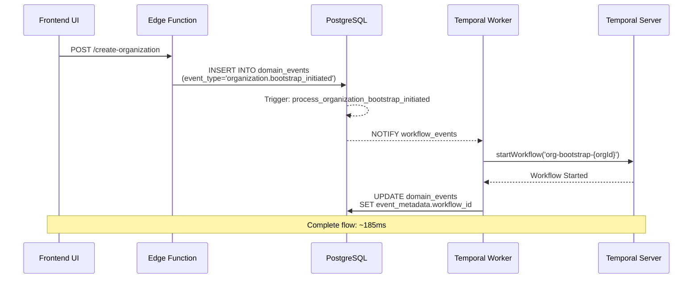

<!-- TL;DR-START -->
## TL;DR

**Summary**: Event-driven workflow triggering guide. Flow: Edge Function → INSERT domain_events → PostgreSQL NOTIFY → Worker LISTEN → startWorkflow(). ~185ms end-to-end. Key event: `organization.bootstrap_initiated` with event_data containing name, slug, owner_email. Generate aggregate_id before INSERT, return 202 Accepted, poll event_metadata.workflow_id for status.

**When to read**:
- Triggering workflows from Edge Functions or frontend
- Understanding event-driven workflow architecture
- Monitoring workflow status via event queries
- Implementing polling for workflow completion

**Prerequisites**: [event-metadata-schema](../reference/event-metadata-schema.md), [temporal-overview](../../architecture/workflows/temporal-overview.md)

**Key topics**: `workflow-triggering`, `domain-events`, `postgres-notify`, `202-accepted`, `polling`, `edge-functions`

**Estimated read time**: 18 minutes
<!-- TL;DR-END -->

# Triggering Temporal Workflows via Events

## Overview

This guide explains how to trigger Temporal workflows in the A4C AppSuite using the event-driven architecture. Workflows are triggered automatically when specific domain events are emitted to the `domain_events` table.

**Architecture**: Database Trigger → PostgreSQL NOTIFY → Worker Listener → Temporal Workflow

**Key Benefits**:
- **Decoupled**: Frontend/Edge Functions don't need Temporal client libraries or credentials
- **Fast**: Sub-200ms end-to-end latency from event emission to workflow start
- **Reliable**: Events persisted before workflow starts; automatic retry on failure
- **Observable**: Complete audit trail via bi-directional event-workflow traceability

## How It Works



### Step-by-Step Flow

1. **Event Emission**: Application code (UI, Edge Function, background job) inserts an event into `domain_events` table
2. **Database Trigger**: PostgreSQL trigger fires on INSERT, emits NOTIFY on channel `workflow_events`
3. **Worker Listening**: Temporal worker receives notification via PostgreSQL LISTEN
4. **Workflow Start**: Worker starts appropriate workflow based on event type
5. **Context Linking**: Worker updates event with workflow context (workflow_id, run_id, etc.)
6. **Activity Execution**: Workflow activities emit new events with workflow context automatically captured

## Triggering Workflows from Code

### From Edge Functions (Recommended)

Edge Functions are the primary interface for triggering workflows from external clients (UI, API, webhooks).

**Example: Organization Bootstrap**

```typescript
// supabase/functions/create-organization/index.ts
import { serve } from 'https://deno.land/std@0.168.0/http/server.ts';
import { createClient } from 'https://esm.sh/@supabase/supabase-js@2';

serve(async (req) => {
  const supabase = createClient(
    Deno.env.get('SUPABASE_URL')!,
    Deno.env.get('SUPABASE_SERVICE_ROLE_KEY')!
  );

  // Parse request body
  const { name, slug, owner_email } = await req.json();

  // Validate input (important!)
  if (!name || !slug || !owner_email) {
    return new Response(
      JSON.stringify({ error: 'Missing required fields' }),
      { status: 400, headers: { 'Content-Type': 'application/json' } }
    );
  }

  // Emit event to trigger workflow
  const { data: event, error } = await supabase
    .from('domain_events')
    .insert({
      event_type: 'organization.bootstrap_initiated',
      aggregate_type: 'organization',
      aggregate_id: crypto.randomUUID(), // Generate org ID
      event_data: {
        name,
        slug,
        owner_email,
        tier: 'free',
        subdomain_enabled: false
      },
      event_metadata: {
        timestamp: new Date().toISOString(),
        tags: ['production', 'ui-triggered']
      }
    })
    .select()
    .single();

  if (error) {
    console.error('Failed to emit event:', error);
    return new Response(
      JSON.stringify({ error: 'Failed to start workflow' }),
      { status: 500, headers: { 'Content-Type': 'application/json' } }
    );
  }

  // Return event ID (client can poll for completion)
  return new Response(
    JSON.stringify({
      event_id: event.id,
      organization_id: event.aggregate_id,
      message: 'Workflow started successfully'
    }),
    { status: 202, headers: { 'Content-Type': 'application/json' } }
  );
});
```

**Key Points**:
- Use `SUPABASE_SERVICE_ROLE_KEY` for Edge Functions (bypasses RLS)
- Generate `aggregate_id` (organization ID) before emitting event
- Return 202 Accepted (workflow executes asynchronously)
- Include meaningful tags in `event_metadata` for debugging

### From Frontend (Direct Database Insert)

Frontend can emit events directly if using Supabase client with service role key (not recommended for production - use Edge Functions instead).

**Example: React Component**

```typescript
// frontend/src/components/OrganizationForm.tsx
import { supabase } from '@/lib/supabase';
import { v4 as uuidv4 } from 'uuid';

async function handleSubmit(formData: OrganizationFormData) {
  const orgId = uuidv4();

  // Emit event to trigger workflow
  const { data: event, error } = await supabase
    .from('domain_events')
    .insert({
      event_type: 'organization.bootstrap_initiated',
      aggregate_type: 'organization',
      aggregate_id: orgId,
      event_data: {
        name: formData.name,
        slug: formData.slug,
        owner_email: formData.ownerEmail,
        tier: formData.tier,
        subdomain_enabled: formData.enableSubdomain
      },
      event_metadata: {
        timestamp: new Date().toISOString(),
        tags: ['production', 'ui-triggered'],
        user_agent: navigator.userAgent
      }
    })
    .select()
    .single();

  if (error) {
    console.error('Failed to start workflow:', error);
    throw new Error('Failed to create organization');
  }

  // Poll for workflow completion (optional)
  await pollWorkflowStatus(event.id);

  return { organizationId: orgId, eventId: event.id };
}

async function pollWorkflowStatus(eventId: string) {
  const maxAttempts = 30; // 30 seconds

  for (let i = 0; i < maxAttempts; i++) {
    const { data: event } = await supabase
      .from('domain_events')
      .select('event_metadata, processing_error')
      .eq('id', eventId)
      .single();

    if (event?.processing_error) {
      throw new Error(`Workflow failed: ${event.processing_error}`);
    }

    if (event?.event_metadata?.workflow_id) {
      // Workflow started successfully
      return event.event_metadata.workflow_id;
    }

    await new Promise(resolve => setTimeout(resolve, 1000));
  }

  throw new Error('Workflow start timeout');
}
```

**Security Note**: Frontend should NOT have service role key. Use Edge Functions as middleware.

### From Background Jobs

Background jobs (cron, scheduled tasks) can emit events directly.

**Example: Daily Cleanup Job**

```typescript
// workflows/src/jobs/daily-cleanup.ts
import { createClient } from '@supabase/supabase-js';

const supabase = createClient(
  process.env.SUPABASE_URL!,
  process.env.SUPABASE_SERVICE_ROLE_KEY!
);

async function runDailyCleanup() {
  // Find inactive organizations
  const { data: inactiveOrgs } = await supabase
    .from('organizations_projection')
    .select('id')
    .eq('status', 'inactive')
    .lt('updated_at', new Date(Date.now() - 90 * 24 * 60 * 60 * 1000));

  // Emit cleanup event for each inactive org
  for (const org of inactiveOrgs || []) {
    await supabase.from('domain_events').insert({
      event_type: 'organization.cleanup_initiated',
      aggregate_type: 'organization',
      aggregate_id: org.id,
      event_data: {
        reason: 'inactive_90_days',
        actions: ['archive_data', 'notify_owner', 'suspend_services']
      },
      event_metadata: {
        timestamp: new Date().toISOString(),
        tags: ['cron', 'daily-cleanup']
      }
    });
  }

  console.log(`Triggered cleanup for ${inactiveOrgs?.length || 0} organizations`);
}

// Run daily at 2 AM UTC
schedule('0 2 * * *', runDailyCleanup);
```

## Supported Workflow Triggers

### Organization Bootstrap

**Event Type**: `organization.bootstrap_initiated`

**Trigger**: Database trigger `process_organization_bootstrap_initiated`

**Workflow**: `organizationBootstrapWorkflow`

**Required Event Data**:
```typescript
{
  event_type: 'organization.bootstrap_initiated',
  aggregate_type: 'organization',
  aggregate_id: string,  // Organization UUID
  event_data: {
    name: string,              // Organization display name
    slug: string,              // URL-safe slug (lowercase, hyphens)
    owner_email: string,       // Owner's email address
    tier: 'free' | 'basic' | 'premium' | 'enterprise',
    subdomain_enabled: boolean // Provision DNS subdomain?
  }
}
```

**Workflow Actions**:
1. Create organization in `organizations_projection`
2. Create owner user account (if doesn't exist)
3. Assign owner to organization
4. Provision DNS subdomain (if enabled)
5. Send welcome email to owner
6. Emit success event (`organization.created`)

**Idempotency**: Workflow ID is `org-bootstrap-${organizationId}`. Duplicate events with same org ID will not start duplicate workflows.

### Future Triggers (Planned)

**User Invitation**:
- Event: `user.invitation_initiated`
- Workflow: `userInvitationWorkflow`
- Actions: Generate invite token, send email, track acceptance

**Subscription Management**:
- Event: `subscription.upgrade_initiated`
- Workflow: `subscriptionUpgradeWorkflow`
- Actions: Update billing, provision resources, notify user

**Data Migration**:
- Event: `migration.started`
- Workflow: `dataMigrationWorkflow`
- Actions: Export data, transform, import, validate, cleanup

## Monitoring Workflow Status

### Query Event Status

Check if workflow has started processing an event:

```sql
-- Check if event has been processed
SELECT
  id,
  event_type,
  event_metadata->>'workflow_id' AS workflow_id,
  event_metadata->>'workflow_run_id' AS workflow_run_id,
  processed_at,
  processing_error,
  retry_count
FROM domain_events
WHERE id = 'event-uuid';
```

**Status Indicators**:
- `processed_at IS NULL` → Event not yet processed
- `processed_at IS NOT NULL` → Workflow started
- `processing_error IS NOT NULL` → Workflow start failed
- `retry_count > 0` → Retried multiple times

### Query Workflow Events

Find all events emitted by a workflow:

```typescript
import { createEventQueries } from '@shared/utils/event-queries';

const queries = createEventQueries();

// Get all events for a workflow
const result = await queries.getEventsForWorkflow('org-bootstrap-abc123');

console.log(`Total events: ${result.total_count}`);
console.log(`Event types: ${result.events.map(e => e.event_type).join(', ')}`);
```

### Trace Complete Lineage

Trace from organization ID back to bootstrap event and workflow:

```typescript
const lineage = await queries.traceWorkflowLineage('org-uuid');

console.log(`Bootstrap Event: ${lineage.bootstrap_event.id}`);
console.log(`Workflow ID: ${lineage.workflow_id}`);
console.log(`Workflow Run ID: ${lineage.workflow_run_id}`);
console.log(`Total Events: ${lineage.events.length}`);
console.log(`Errors: ${lineage.error_count}`);
```

### Temporal Web UI

View workflow execution details in Temporal Web UI:

```bash
# Port-forward to Temporal Web UI
kubectl port-forward -n temporal svc/temporal-web 8080:8080

# Open in browser
open http://localhost:8080

# Search for workflow
# Workflow ID: org-bootstrap-{organizationId}
# Namespace: default
# Task Queue: bootstrap
```

## Error Handling

### Event Processing Failures

If worker fails to start workflow, error is recorded in event:

```sql
SELECT
  id,
  event_type,
  processing_error,
  retry_count,
  created_at,
  processed_at
FROM domain_events
WHERE processing_error IS NOT NULL
ORDER BY created_at DESC;
```

**Common Errors**:
- `Temporal server unavailable` → Worker can't reach Temporal
- `Invalid event data` → Missing required fields in event_data
- `Workflow already running` → Duplicate event (idempotency protection)

**Resolution**:
- Fix error condition (e.g., restart Temporal server)
- Worker will automatically retry on next event polling cycle (future enhancement)
- Or manually reprocess: Update `processed_at = NULL, retry_count = 0`

### Workflow Execution Failures

If workflow fails during execution, check Temporal Web UI for stack traces.

**Common Patterns**:
- Activity timeout → Increase timeout in workflow definition
- Activity failure → Check activity logs for root cause
- Compensation needed → Review saga compensation logic

## Best Practices

### 1. Always Validate Input

Validate event data before insertion to prevent workflow failures:

```typescript
// ✅ Good: Validate before emitting event
function validateOrganizationData(data: any) {
  if (!data.name || data.name.length < 3) {
    throw new Error('Organization name must be at least 3 characters');
  }
  if (!data.slug || !/^[a-z0-9-]+$/.test(data.slug)) {
    throw new Error('Slug must be lowercase alphanumeric with hyphens');
  }
  if (!data.owner_email || !isValidEmail(data.owner_email)) {
    throw new Error('Valid owner email required');
  }
}

// Emit event only after validation
validateOrganizationData(formData);
await supabase.from('domain_events').insert({ ... });
```

### 2. Use Meaningful Tags

Add contextual tags to event metadata for debugging:

```typescript
event_metadata: {
  timestamp: new Date().toISOString(),
  tags: [
    process.env.NODE_ENV, // 'production', 'development'
    'ui-triggered',       // Source of event
    'user-123',           // User who triggered
    'experiment-abc'      // A/B test variant
  ]
}
```

### 3. Generate IDs Upfront

Generate aggregate IDs (org ID, user ID) before emitting event:

```typescript
// ✅ Good: Generate ID first
const orgId = uuidv4();
await supabase.from('domain_events').insert({
  aggregate_id: orgId,
  event_data: { name, slug, owner_email }
});

// Return ID immediately to client
return { organizationId: orgId };

// ❌ Bad: Let workflow generate ID
await supabase.from('domain_events').insert({
  aggregate_id: null, // Workflow will generate
  event_data: { name, slug, owner_email }
});
// Client doesn't know org ID yet!
```

### 4. Return 202 Accepted

For async workflows, return 202 Accepted (not 200 OK):

```typescript
// ✅ Good: 202 Accepted for async processing
return new Response(
  JSON.stringify({ event_id: event.id, organization_id: orgId }),
  { status: 202 } // Accepted, processing asynchronously
);

// ❌ Bad: 200 OK implies synchronous completion
return new Response(
  JSON.stringify({ organization_id: orgId }),
  { status: 200 } // Misleading - workflow still running
);
```

### 5. Implement Polling or Webhooks

For long-running workflows, implement status polling or webhooks:

**Polling**:
```typescript
// Poll event status every 1 second
async function waitForWorkflow(eventId: string) {
  for (let i = 0; i < 60; i++) {
    const { data: event } = await supabase
      .from('domain_events')
      .select('event_metadata, processing_error')
      .eq('id', eventId)
      .single();

    if (event?.event_metadata?.workflow_id) {
      return event.event_metadata.workflow_id;
    }

    await sleep(1000);
  }
  throw new Error('Workflow timeout');
}
```

**Webhooks** (Future Enhancement):
```typescript
// Subscribe to workflow completion
await supabase
  .channel('workflow-completion')
  .on('postgres_changes',
    {
      event: 'INSERT',
      schema: 'public',
      table: 'domain_events',
      filter: `event_type=eq.organization.created`
    },
    (payload) => {
      console.log('Organization created:', payload.new.aggregate_id);
    }
  )
  .subscribe();
```

### 6. Use Service Role Key Carefully

**Edge Functions**: ✅ Safe to use service role key (server-side)

**Frontend**: ❌ NEVER expose service role key (client-side)

```typescript
// ✅ Good: Edge Function with service role key
const supabase = createClient(
  Deno.env.get('SUPABASE_URL')!,
  Deno.env.get('SUPABASE_SERVICE_ROLE_KEY')! // Server-side only
);

// ❌ Bad: Frontend with service role key
const supabase = createClient(
  import.meta.env.VITE_SUPABASE_URL,
  import.meta.env.VITE_SUPABASE_SERVICE_ROLE_KEY // EXPOSED TO CLIENT!
);
```

## Troubleshooting

### Event Emitted But Workflow Not Started

**Check 1: Worker Running?**
```bash
kubectl get pods -n temporal-workers
kubectl logs -n temporal-workers deployment/bootstrap-worker --tail=50
```

**Check 2: Database Connection?**
```bash
# Check worker logs for PostgreSQL connection
kubectl logs -n temporal-workers deployment/bootstrap-worker | grep "database"
```

**Check 3: Trigger Enabled?**
```sql
-- Verify trigger exists
SELECT tgname, tgenabled
FROM pg_trigger
WHERE tgname = 'process_organization_bootstrap_initiated';
```

**Check 4: Event Unprocessed?**
```sql
-- Check for unprocessed events
SELECT id, event_type, created_at, processed_at
FROM domain_events
WHERE event_type = 'organization.bootstrap_initiated'
  AND processed_at IS NULL
ORDER BY created_at DESC;
```

### Workflow Stuck in "Running" State

**Check Temporal Web UI**:
1. Port-forward: `kubectl port-forward -n temporal svc/temporal-web 8080:8080`
2. Open http://localhost:8080
3. Search for workflow ID: `org-bootstrap-{orgId}`
4. Check pending activities, stack traces, errors

**Check Worker Logs**:
```bash
kubectl logs -n temporal-workers deployment/bootstrap-worker --tail=100 | grep "org-bootstrap-{orgId}"
```

### Duplicate Workflows Started

**Root Cause**: Non-deterministic workflow IDs allow duplicate starts.

**Fix**: Ensure workflow ID is deterministic:
```typescript
// ✅ Good: Deterministic workflow ID
const workflowId = `org-bootstrap-${organizationId}`;

// ❌ Bad: Random workflow ID
const workflowId = `org-bootstrap-${uuidv4()}`;
```

**Verify**:
```sql
-- Check for duplicate workflow IDs
SELECT
  event_metadata->>'workflow_id' AS workflow_id,
  COUNT(*) AS count
FROM domain_events
WHERE event_type = 'organization.bootstrap_initiated'
GROUP BY workflow_id
HAVING COUNT(*) > 1;
```

## Performance Considerations

### Expected Latency

**Event Emission → Workflow Start**: ~185ms
- Edge Function validation: ~50ms
- Event INSERT: ~20ms
- PostgreSQL NOTIFY: ~10ms
- Worker receives notification: ~5ms
- Workflow start: ~100ms

**Workflow Execution Time**: Varies by workflow
- Organization Bootstrap: 2-5 seconds (DNS provisioning is slowest)
- User Invitation: 500ms-1s
- Data Migration: Minutes to hours

### Throughput Limits

**PostgreSQL NOTIFY**: 1000+ notifications/second (well above our needs)

**Worker Throughput**: 100+ workflow starts/second per worker

**Expected Load**: 10-50 organizations/hour (peak)

**Scaling**: Add more workers if throughput becomes bottleneck:
```bash
kubectl scale deployment/bootstrap-worker --replicas=3 -n temporal-workers
```

### Database Storage

**Event Retention**: Recommend 2-year retention
- 10 orgs/day × 50 events/org = 500 events/day
- 500 events/day × 365 days × 2 years = ~365,000 events
- ~1KB/event = ~365MB total

**Cleanup Query** (run monthly):
```sql
-- Archive events older than 2 years
DELETE FROM domain_events
WHERE created_at < NOW() - INTERVAL '2 years';
```

## Related Documentation

- **Architecture Deep-Dive**: `documentation/architecture/workflows/event-driven-workflow-triggering.md`
- **Event Metadata Schema**: `documentation/workflows/reference/event-metadata-schema.md`
- **Edge Functions Deployment**: `documentation/infrastructure/guides/supabase/edge-functions-deployment.md`
- **Integration Testing**: `documentation/workflows/guides/integration-testing.md`
- **Temporal Overview**: `documentation/architecture/workflows/temporal-overview.md`
- **EventQueries API**: `workflows/src/shared/utils/event-queries.ts`

## Support

For issues with workflow triggering:
1. Check worker logs: `kubectl logs -n temporal-workers deployment/bootstrap-worker`
2. Check Temporal Web UI: http://localhost:8080 (via port-forward)
3. Query unprocessed events: `SELECT * FROM domain_events WHERE processed_at IS NULL`
4. Review event processing errors: `SELECT * FROM domain_events WHERE processing_error IS NOT NULL`
